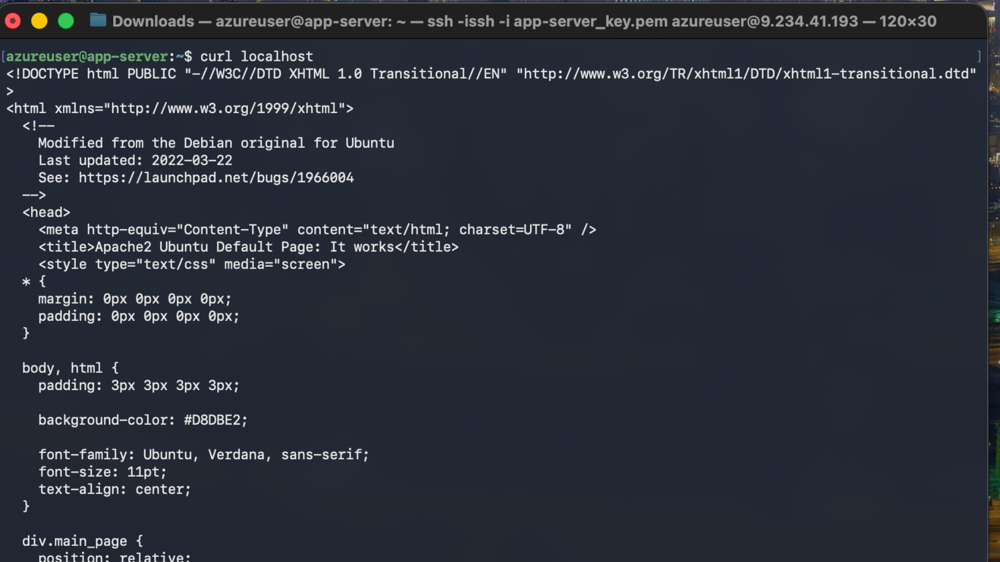
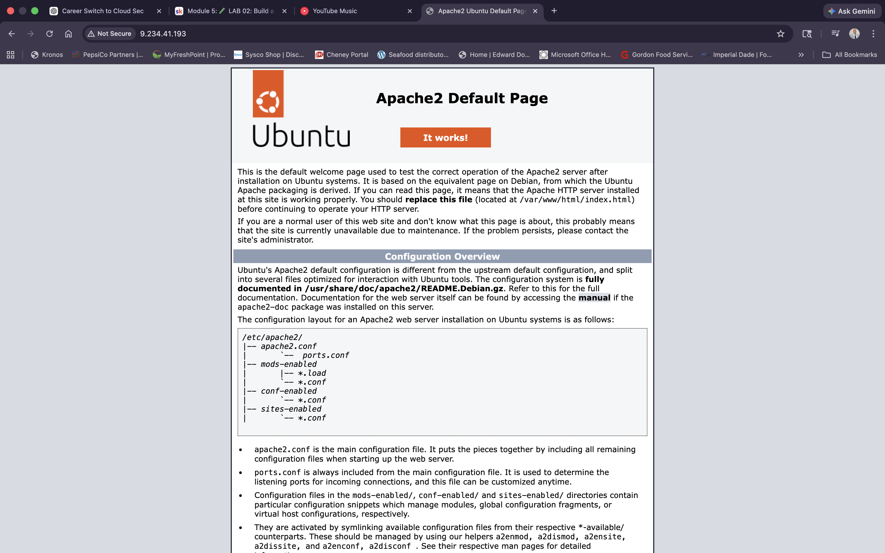

## Cloud Security Projects Portfolio
Hands-on cloud security labs covering networking, IAM, and infrastructure security across AWS and Azure.

# Cybersecurity Learning Notes

This repository documents a transition into cybersecurity with a focus on AWS cloud security. It contains hands-on labs, concise notes, diagrams, and lessons learned.

## Goals
- Build strong cloud security fundamentals
- Gain hands-on AWS IAM, logging, and detection experience
- Transition into a cloud security or SOC role
  
## Projects

### Week 5 — Azure Static Website Hosting

Deployed a static website using Azure Storage Accounts and Blob Storage static website hosting.

Key skills:

- Azure Storage Accounts
- Blob containers
- Static website configuration
- Public web hosting

---

### Week 6 — Azure 2-Tier Cloud Architecture

Designed and deployed a segmented cloud architecture including:

- Azure Virtual Network
- Public and Private Subnets
- Ubuntu Virtual Machines
- Apache Web Server
- Network Security Groups
- SSH administration and troubleshooting

Architecture flow:

Internet → Public IP → App Server → DB Server

Designed and deployed a segmented Azure architecture with a public web server and a private database server using Virtual Networks and Network Security Groups.

### Architecture Diagram

### Deployment Screenshots

Virtual Network and Subnets

Application Server Deployment

Database Server Deployment

Network Security Group Rules

### Verification

Apache was verified running locally and externally.

Local server test:

Public access test:

### Technologies Used

- Microsoft Azure
- Virtual Networks (VNet)
- Subnets
- Network Security Groups (NSG)
- Linux Virtual Machines
- Apache Web Server
- SSH

## Structure
cyber-notes
│
├ week-01-cloud-basics
├ week-02-iam
├ week-03-vpc-networking
├ week-04-active-directory-lab
├ week-05-azure-static-website
└ week-06-azure-2tier-app

Each lab folder contains:

- Project documentation
- Architecture diagrams
- Configuration screenshots
- Step-by-step explanations

<!-- Update this README as you progress; keep examples small and reproducible. -
