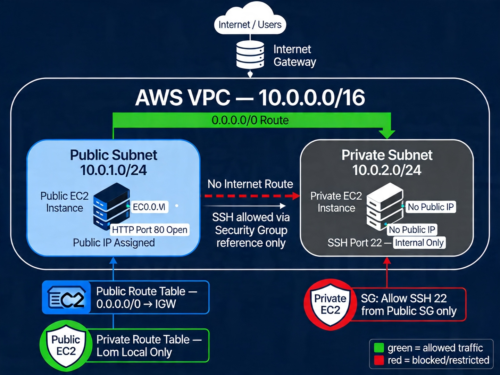

# Week 3 — AWS VPC & Network Security

## 📌 Objective

The goal of this lab was to build a secure AWS network architecture using a Virtual Private Cloud (VPC), public and private subnets, route tables, and security groups. The lab focused on understanding how traffic flows within AWS and how to apply least-privilege network design.

---

## 🎥 Walkthrough

---

## 🛠️ Tools & Technologies

- Amazon Web Services (AWS)
- AWS VPC
- EC2
- Internet Gateway
- Route Tables
- Security Groups
- AWS Management Console

---

## 🧱 Architecture Built

### VPC

- CIDR Block: `10.0.0.0/16`
- Provides isolated private network environment in AWS

---

### Subnets

#### Public Subnet
- CIDR: `10.0.1.0/24`
- Connected to Internet Gateway
- Used for internet-facing resources

#### Private Subnet
- CIDR: `10.0.2.0/24`
- No internet route
- Used for secure internal resources

---

## 🌐 Internet Connectivity

### Internet Gateway

- Created and attached to VPC
- Allows communication between public subnet and internet

### Route Tables

#### Public Route Table
- Route: `0.0.0.0/0` → Internet Gateway
- Associated with public subnet

#### Private Route Table
- No internet route
- Associated with private subnet

---

## 🖥️ EC2 Instances Deployed

### Public Instance
- Located in public subnet
- Auto-assigned public IP
- Accessible from internet via HTTP
- Security Group allowed inbound HTTP (port 80)

> Result: Successfully accessed via browser using public IP.

### Private Instance
- Located in private subnet
- No public IP assigned
- Not reachable from internet

> Result: Confirmed isolation and secure internal placement.

---

## 🔐 Security Group Configuration

### Public Server Security Group
- Allowed inbound HTTP (port 80) from anywhere

### Private Server Security Group
- Allowed inbound SSH (port 22)
- Source restricted to public server security group

This implemented least-privilege internal access control.

---

## 🗺️ Architecture Diagram

---

## 🧠 Key Concepts Learned

- Public vs private subnets depend on routing, not naming
- Internet Gateways provide external connectivity
- Route tables determine traffic flow
- Security groups act as stateful firewalls
- Least-privilege networking reduces attack surface
- Defense-in-depth architecture protects cloud resources

---

## ✅ Outcome

Successfully built a secure multi-tier AWS network architecture demonstrating real-world cloud security practices.

This lab provided hands-on experience with network isolation, access control, and secure infrastructure design.
