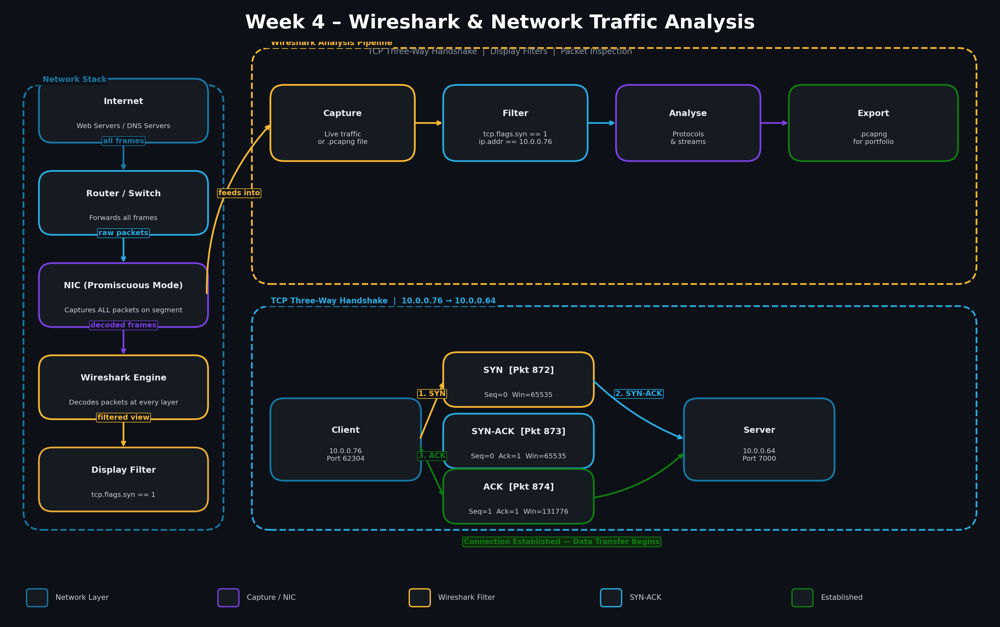
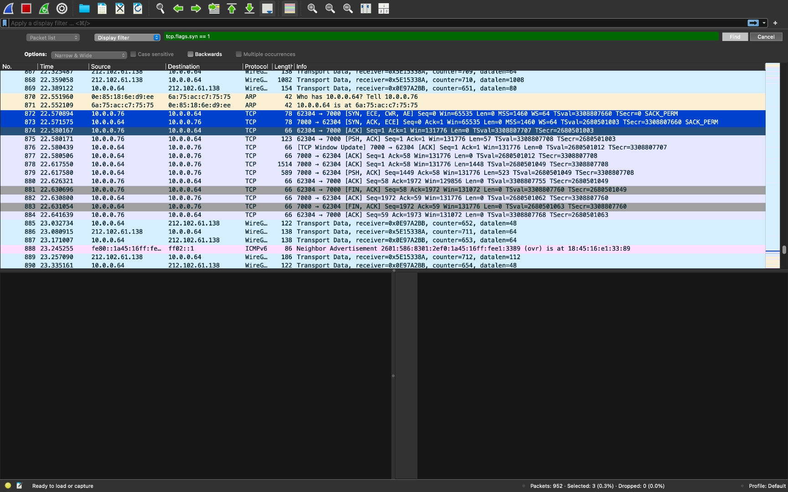

# Week 4 – Wireshark & Network Traffic Analysis


## 📌 Objective

Capture and analyze live network traffic using Wireshark to understand how data moves across a network at the packet level. This lab focuses on identifying the TCP three-way handshake, applying display filters, and recognizing real protocol behavior — foundational skills for network engineering, SOC analysis, and cloud security.

---

## 🎥 Walkthrough

[](https://loom.com)

---

## 🛠️ Tools & Technologies

- Wireshark (free & open source)
- TCP / IP Protocol Suite
- DNS (Domain Name System)
- HTTP / HTTPS
- Local Machine (macOS)

---

## 🧱 Lab Scope

| Field | Value |
|-------|-------|
| Certification Alignment | CompTIA Network+ · Security+ · CySA+ |
| Tools Used | Wireshark — free, no account required |
| Time to Complete | 2–4 hours |
| Estimated Cost | $0 |
| Career Relevance | Network Engineer · SOC Analyst · Cloud Security Engineer · Incident Responder |

---

## ⚙️ Key Configuration

- **Client IP:** `10.0.0.76`
- **Server IP:** `10.0.0.64`
- **Port:** `7000 → 62304` (ephemeral)
- **Filter Used:** `tcp.flags.syn == 1`
- **Packets Captured:** 952 total
- **Handshake Packets:** 872 (SYN) · 873 (SYN-ACK) · 874 (ACK)

---

## 🔧 Implementation Steps

### 🔹 1. Install & Launch Wireshark

Downloaded and installed Wireshark on macOS. Enabled **ChmodBPF** to allow interface access without root. Launched Wireshark and selected the active network interface (Wi-Fi) to begin live capture.

---

### 🔹 2. Start a Live Capture

Started a live capture on the active interface. Navigated to several websites to generate traffic. Wireshark captured all frames passing through the NIC in real time — 952 packets total across the session.

---

### 🔹 3. Apply Display Filters

Used display filters to isolate specific traffic from the full capture:

```
tcp.flags.syn == 1       # Isolate TCP SYN packets (connection requests)
ip.addr == 10.0.0.76     # Filter by client IP
tcp                      # Show all TCP traffic
```

Filters reduced hundreds of packets down to only the relevant handshake sequence.

---

### 🔹 4. Identify the TCP Three-Way Handshake

Filtered for `tcp.flags.syn == 1` and identified the full three-way handshake between the client and server:

| Packet | Time | Source | Destination | Flags | Description |
|--------|------|--------|-------------|-------|-------------|
| 872 | 22.570894 | `10.0.0.76` | `10.0.0.64` | `[SYN]` | Client initiates connection |
| 873 | 22.571575 | `10.0.0.64` | `10.0.0.76` | `[SYN, ACK]` | Server acknowledges and responds |
| 874 | 22.580167 | `10.0.0.76` | `10.0.0.64` | `[ACK]` | Client confirms — connection established |

**Sequence & Acknowledgement Numbers observed:**
- SYN: `Seq=0 Win=65535 Len=0 MSS=1460`
- SYN-ACK: `Seq=0 Ack=1 Win=65535 Len=0 MSS=1460`
- ACK: `Seq=1 Ack=1 Win=131776 Len=0`

---

### 🔹 5. Observe Full TCP Session

After the handshake, observed the complete data exchange session through to teardown:

- Packets 875–879: Data transfer (PSH, ACK) — application payload exchanged
- Packets 881–882: FIN/ACK — client initiates graceful connection close
- Packets 883–884: FIN/ACK — server confirms close

This confirmed a complete, clean TCP session lifecycle: **connect → transfer → close**.

---

## 🗺️ Architecture Diagram



---

## 📸 Screenshots

### 🦈 Wireshark Capture — TCP Three-Way Handshake

**Filter: `tcp.flags.syn == 1` — Packets 872, 873, 874 highlighted**


---

## 🧠 Key Concepts Learned

- **TCP Three-Way Handshake** — SYN → SYN-ACK → ACK establishes a stateful, reliable connection before any data is sent
- **Display Filters** — Essential for isolating signal from noise in large captures; `tcp.flags.syn == 1` is a foundational SOC filter
- **Packet Anatomy** — Every TCP packet carries Seq/Ack numbers, window size, flags, and timestamps — all readable in Wireshark
- **Promiscuous Mode** — Wireshark captures all frames on the segment, not just packets addressed to your machine
- **TCP Session Lifecycle** — A full session includes handshake → data transfer → graceful teardown (FIN/ACK)
- **SYN without SYN-ACK** — If you see SYN but no response, the connection was refused or the server is unreachable — a critical diagnostic signal

---

## 💼 Real-World Application

| Role | How This Lab Applies |
|------|---------------------|
| Network Engineer | Diagnose connectivity failures by identifying where SYN packets go unanswered |
| SOC Analyst | Identify port scans, SYN floods, and incomplete handshakes as malicious traffic patterns |
| Cloud Security Engineer | Mental model transfers directly to Azure Network Watcher and AWS VPC Flow Logs |
| Incident Responder | Follow TCP streams to reconstruct full conversations between hosts during investigation |

---

## 📂 Project Structure

```text
week-04-wireshark-network-analysis/
├── README.md
├── diagrams/
│   └── week-04-architecture.png
└── screenshots/
    └── week-04-tcp-handshake.jpg
```

---

## ✅ Outcome

Successfully captured and analyzed live network traffic using Wireshark by:

- Applying display filters to isolate TCP SYN packets from 952 total captured frames
- Identifying the complete **TCP three-way handshake** (SYN → SYN-ACK → ACK) between `10.0.0.76` and `10.0.0.64`
- Observing the full session lifecycle through data transfer and graceful connection teardown
- Building foundational packet analysis skills applicable to **network engineering, SOC analysis, and incident response**
