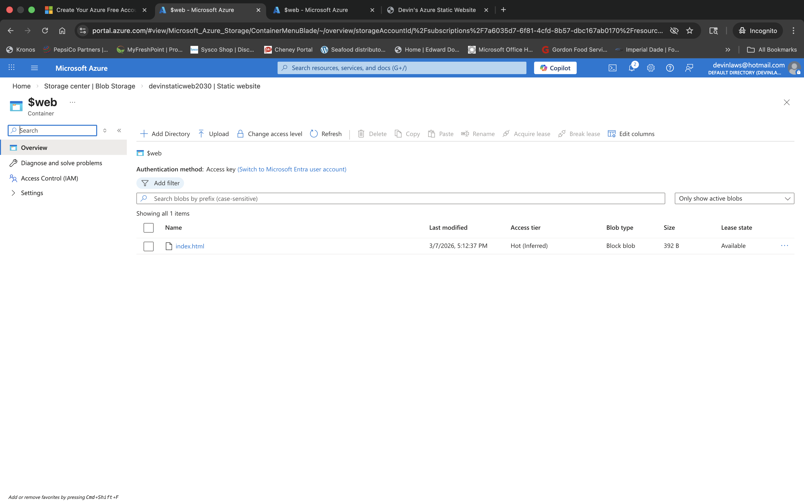

# Week 5 – Azure Static Website (Blob Storage)

## Overview
This lab demonstrates how to host a static website using Azure Blob Storage. The project shows how Azure Storage Accounts can serve static web content directly without requiring a traditional web server.

## Technologies Used
- Microsoft Azure
- Azure Storage Account
- Azure Blob Storage
- Static Website Hosting
- HTML
- JavaScript

## Architecture
```
User Browser → Azure Storage Account → Blob Container ($web) → Static Website
```

## Steps Performed
1. Created an Azure Resource Group
2. Deployed an Azure Storage Account
3. Enabled Static Website hosting
4. Created a static HTML website
5. Uploaded website files to the `$web` container
6. Verified the public endpoint and confirmed website accessibility

## Results
Successfully deployed a static website hosted entirely through Azure Blob Storage.

## Screenshots

| Screenshot | Description |
|-----------|-------------|
|  | Storage Account Overview |
|  | Static Website Enabled |
|  | Blob Container Upload |
|  | Website Live |

## Key Takeaways
- Azure Blob Storage can host static websites without requiring a VM
- Static website hosting uses the `$web` container
- Public endpoints enable direct browser access to hosted content
