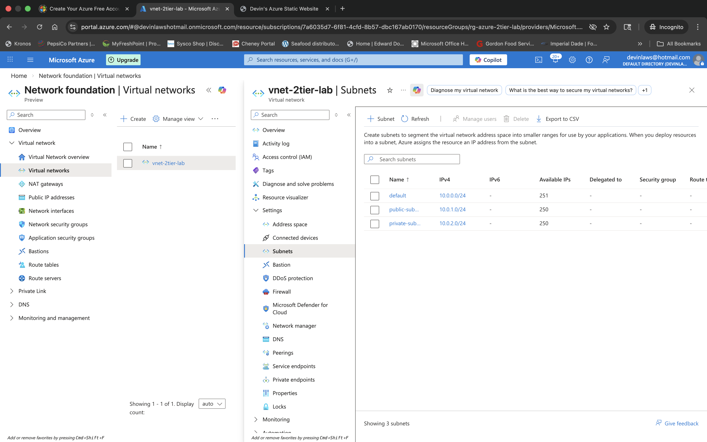
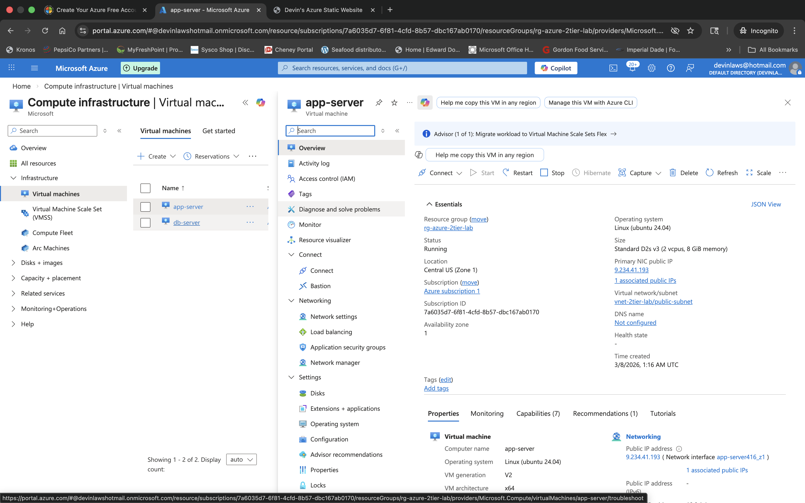

# Azure 2-Tier Infrastructure Deployment

## Overview

This project demonstrates how to deploy a secure **2-tier architecture in Microsoft Azure** using:

- Azure Virtual Machines
- Azure Virtual Network
- Public and Private Subnets
- Network Security Groups
- Ubuntu Linux
- Apache Web Server

The architecture separates the **web tier** and **database tier** to improve security and reflect real-world cloud infrastructure design.

---

## Architecture Diagram


The environment consists of:

- Azure Virtual Network (10.0.0.0/16)
- Public Subnet (10.0.1.0/24)
- Private Subnet (10.0.2.0/24)
- App Server VM running Apache
- DB Server VM in a private subnet
- Network Security Groups controlling traffic

**Traffic Flow:**

Internet → Public IP → App Server → DB Server

---

## Virtual Network and Subnet Configuration

The Virtual Network was configured with two separate subnets:

- **Public Subnet**: for the web server
- **Private Subnet**: for the database server



---

## Virtual Machine Deployment

### App Server

The App Server was deployed with Ubuntu Linux and placed in the **public subnet**.



### DB Server

The DB Server was deployed in the **private subnet** without a public IP address.


---

## Network Security Groups

### App Server NSG

The App Server NSG allows:

- SSH (Port 22)
- HTTP (Port 80)


### DB Server NSG

The DB Server NSG restricts traffic and isolates the database tier from the public internet.


---

## Apache Installation

Apache was installed on the App Server using:

```bash
sudo apt update
sudo apt install apache2 -y
```