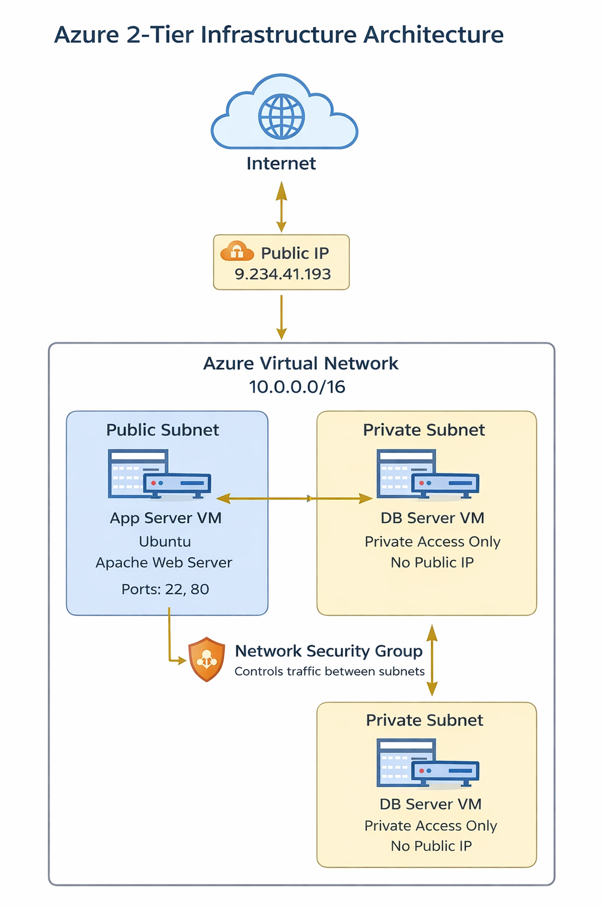
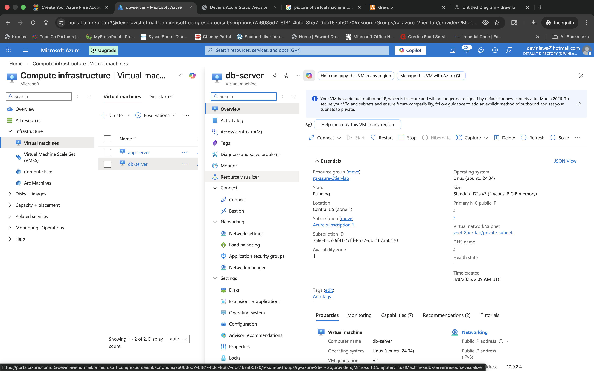
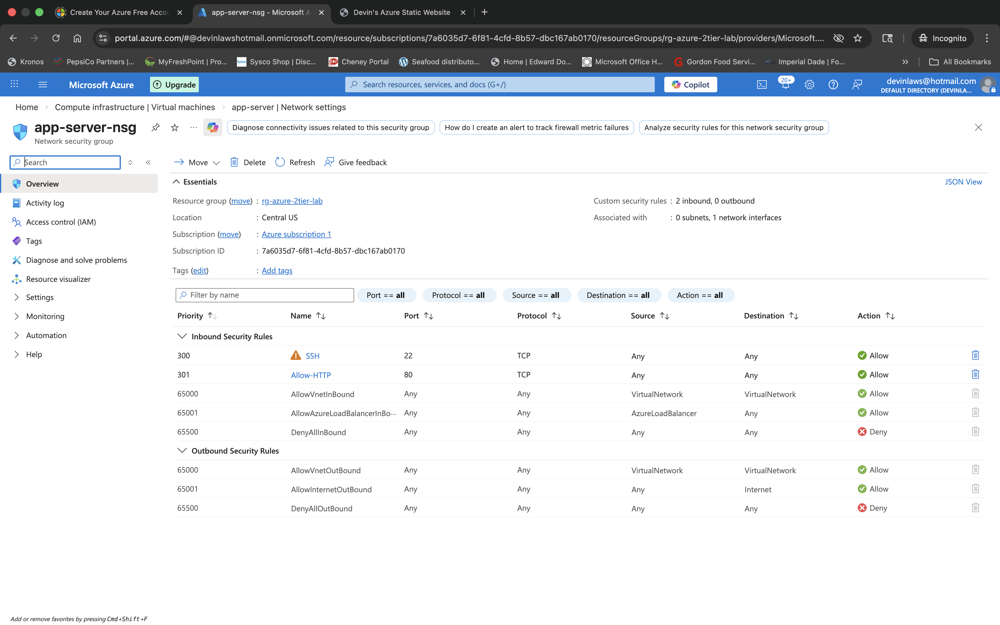
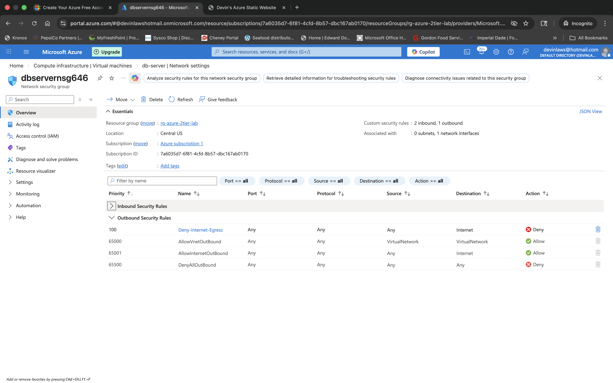

# Week 6 — Azure 2-Tier Infrastructure Deployment


## 📌 Objective

Deploy a secure 2-tier architecture in Microsoft Azure, separating the web tier and database tier to improve security and reflect real-world cloud infrastructure design patterns.

---

## 🛠️ Tools & Technologies

- Microsoft Azure
- Azure Virtual Machines
- Azure Virtual Network (VNet)
- Network Security Groups (NSGs)
- Ubuntu Linux
- Apache Web Server
- Azure Portal

---

## 🧱 Infrastructure Deployed

- Azure Virtual Network (`10.0.0.0/16`)
- Public Subnet (`10.0.1.0/24`) — for the web/app server
- Private Subnet (`10.0.2.0/24`) — for the database server
- App Server VM running Apache (Ubuntu Linux)
- DB Server VM in private subnet (no public IP)
- Network Security Groups controlling inbound/outbound traffic

**Traffic Flow:**

```
Internet → Public IP → App Server → DB Server
```

---

## 🗺️ Architecture Diagram



---

## ⚙️ Configuration Details

### Virtual Network & Subnets

The VNet was configured with two separate subnets for tier isolation.


### App Server

Deployed with Ubuntu Linux in the **public subnet** with Apache installed.


### DB Server

Deployed in the **private subnet** without a public IP address.



---

## 🔐 Network Security Groups

### App Server NSG

Allows inbound:
- SSH (Port 22)
- HTTP (Port 80)



### DB Server NSG

Restricts traffic and isolates the database tier from the public internet.



---

## ⚙️ Apache Installation

Apache was installed on the App Server using:

```bash
sudo apt update
sudo apt install apache2 -y
```

---

## 🧠 Key Concepts Learned

- Network segmentation improves security by isolating tiers
- Private subnets prevent direct internet exposure of backend services
- NSGs act as stateful firewalls for Azure VMs
- 2-tier architecture mirrors real-world cloud deployment patterns

---

## ✅ Outcome

Successfully deployed a secure 2-tier Azure infrastructure with a public-facing web server and a private database server, demonstrating network isolation, access control, and cloud security best practices.
