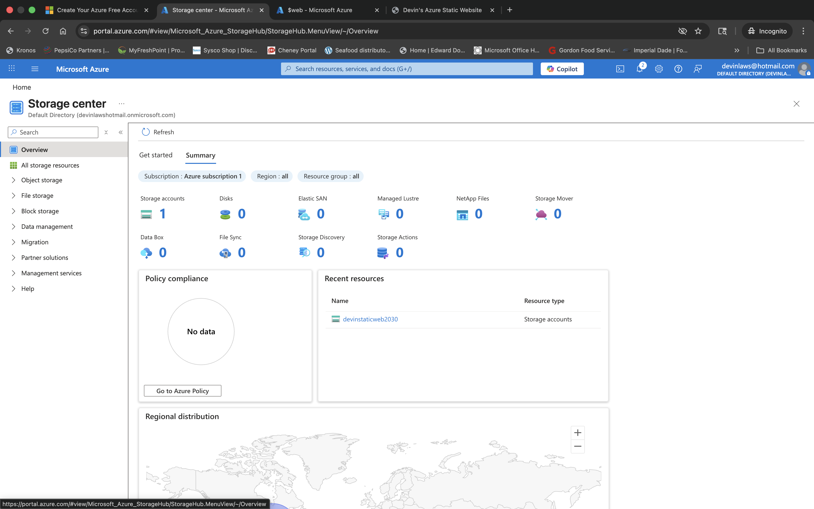
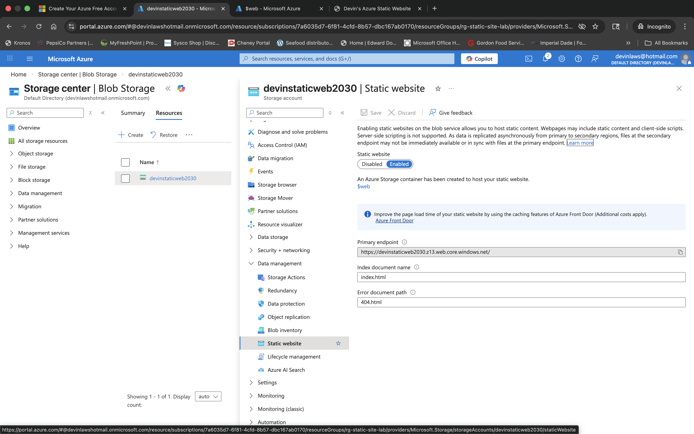
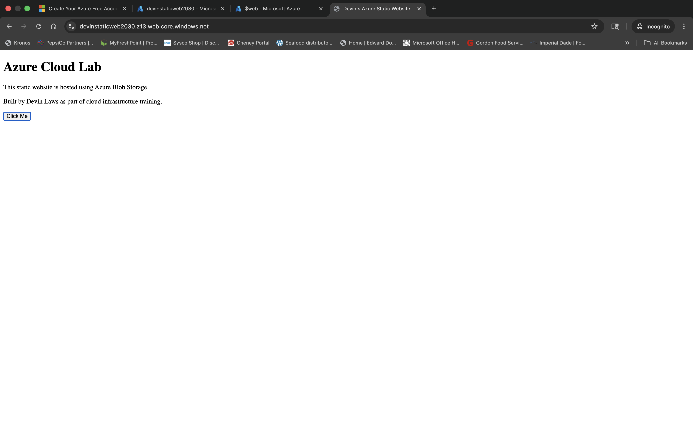

# Week 6 — Azure Static Website (Blob Storage)


## 📌 Objective

Demonstrate how to host a static website using Azure Blob Storage, showing how Azure Storage Accounts can serve static web content directly without requiring a traditional web server or VM.

---

## 🛠️ Tools & Technologies

- Microsoft Azure
- Azure Storage Account
- Azure Blob Storage
- Static Website Hosting
- HTML
- JavaScript
- Azure Portal

---

## 🧱 Architecture

```
User Browser → Azure Storage Account → Blob Container ($web) → Static Website
```

---

## ⚙️ Steps Performed

1. Created an Azure Resource Group
2. Deployed an Azure Storage Account
3. Enabled Static Website hosting on the storage account
4. Created a static HTML website
5. Uploaded website files to the `$web` container
6. Verified the public endpoint and confirmed website accessibility

---

## 📸 Screenshots

| Screenshot | Description |
|-----------|-------------|
|  | Storage Account Overview |
|  | Static Website Enabled |
|  | Blob Container Upload |
|  | Website Live |

---

## 🧠 Key Concepts Learned

- Azure Blob Storage can host static websites without requiring a VM
- Static website hosting uses the `$web` container as the origin
- Public endpoints enable direct browser access to hosted content
- Blob Storage is a cost-effective alternative to full web server deployments for static content

---

## ✅ Outcome

Successfully deployed a static website hosted entirely through Azure Blob Storage, demonstrating a serverless, low-cost approach to web hosting on Azure.
