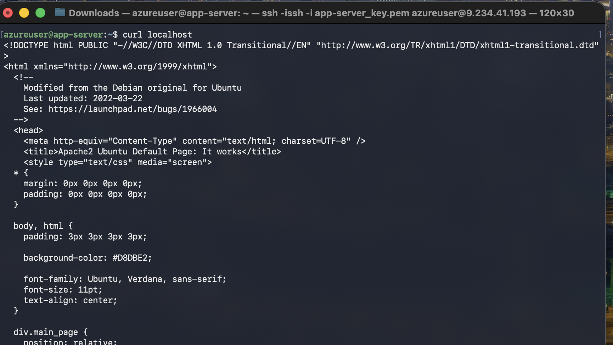
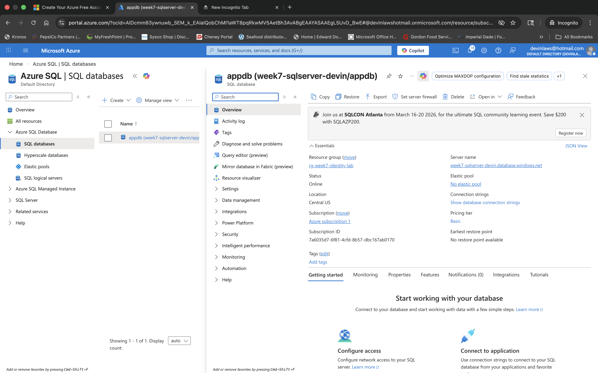
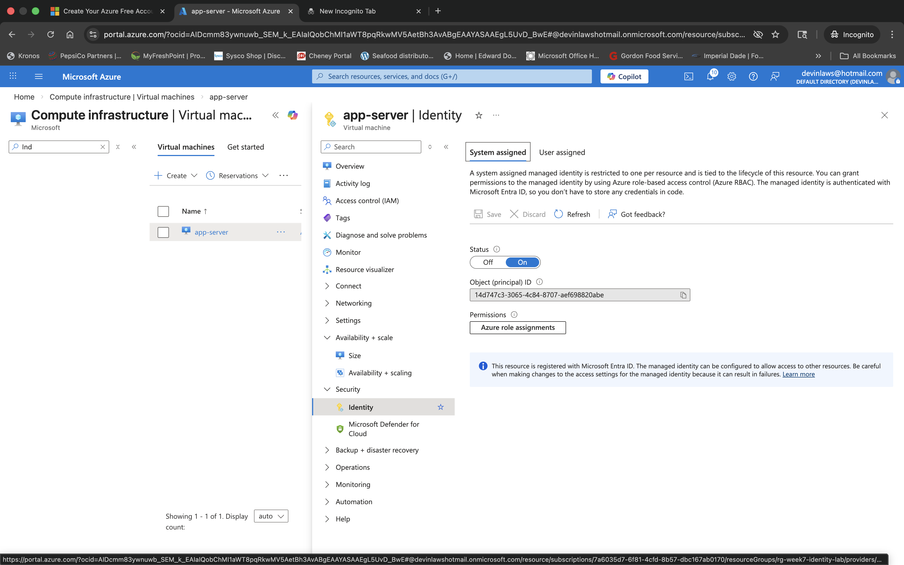
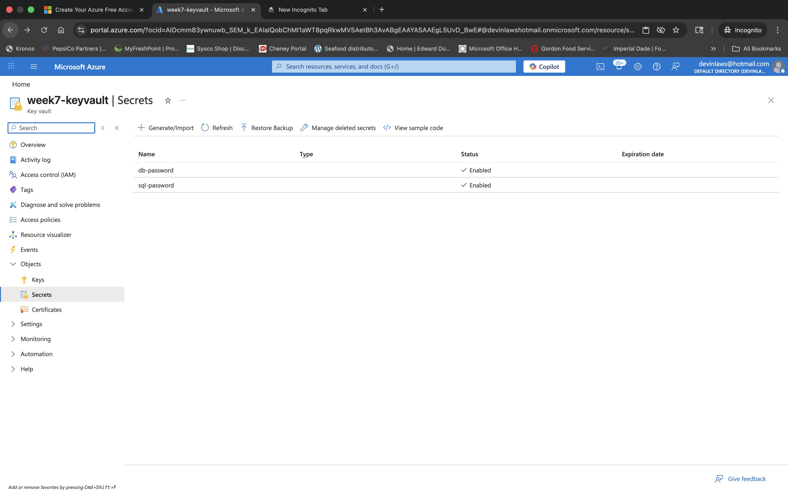
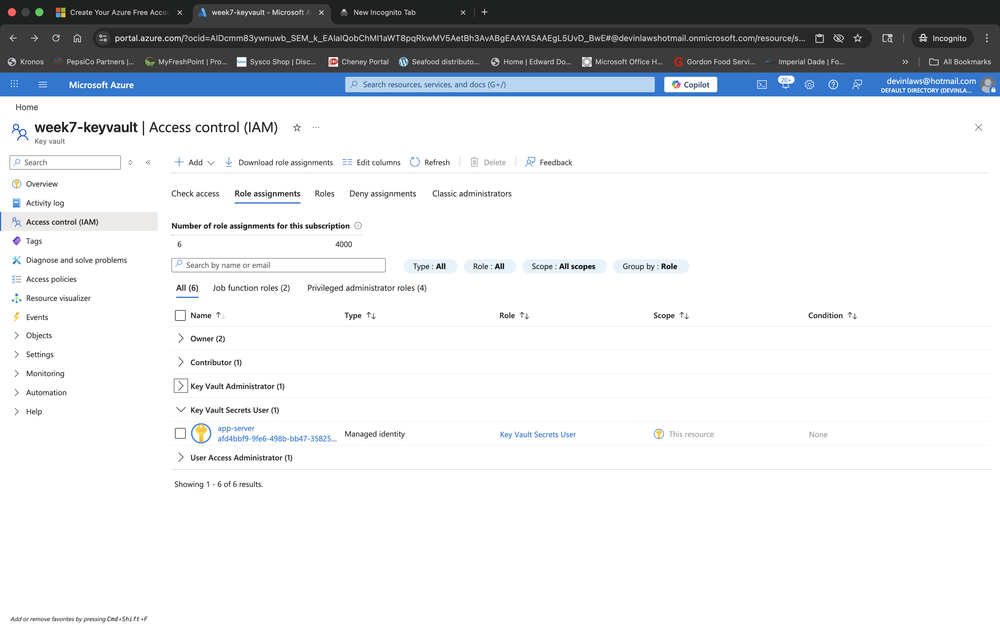
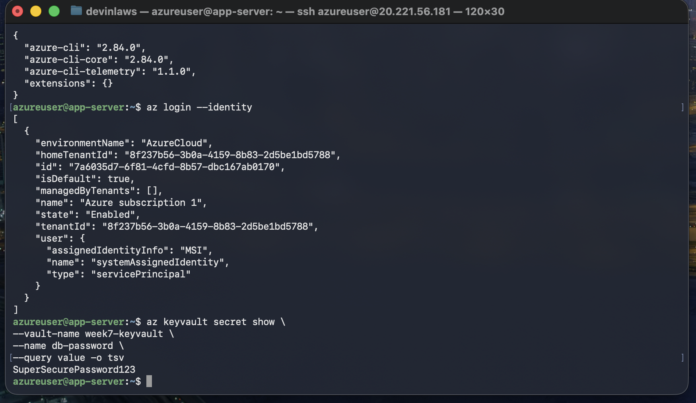

# Week 7 — Azure Key Vault + Managed Identity


## 📌 Objective

Demonstrate how to securely manage and retrieve secrets in Azure using Azure Key Vault and Managed Identity — eliminating hardcoded credentials by using identity-based access control through Microsoft Entra ID.

---

## 🛠️ Tools & Technologies

- Microsoft Azure
- Azure Key Vault
- Azure Managed Identity (System-Assigned)
- Microsoft Entra ID (Azure AD)
- Azure RBAC
- Azure Virtual Machine
- Azure SQL Server & SQL Database
- Azure CLI

---

## 🧱 Architecture

```
Application VM
    ↓
System-Assigned Managed Identity
    ↓
Azure Key Vault
    ↓
Secure Secret Retrieval
```

---

## ⚙️ Resources Created

- Azure Virtual Machine (`app-server`)
- Azure SQL Server
- Azure SQL Database (`appdb`)
- Azure Key Vault (`week7-keyvault`)
- System-Assigned Managed Identity on the VM
- RBAC role assignment (Key Vault Secrets User)
- Key Vault secret for database credentials

---

## 🚀 Lab Steps

### 1. Deploy Azure SQL Server

An Azure SQL Server instance was created to host the database used by the application.



---

### 2. Create Azure SQL Database

A database named **appdb** was created on the SQL Server instance.



---

### 3. Enable Managed Identity on the VM

A **system-assigned managed identity** was enabled on the `app-server` VM, allowing it to authenticate to other Azure services without storing credentials.



---

### 4. Create a Secret in Azure Key Vault

A secret named **db-password** was stored inside Azure Key Vault, keeping sensitive data out of application configuration files.



---

### 5. Assign RBAC Access to the VM

The VM's managed identity was granted the **Key Vault Secrets User** role via Azure RBAC, allowing it to retrieve secrets from Key Vault.



---

### 6. Retrieve the Secret from the VM

Using the Azure CLI and Managed Identity authentication, the VM successfully retrieved the secret from Key Vault.

```bash
az keyvault secret show \
  --vault-name week7-keyvault \
  --name db-password \
  --query value -o tsv
```



---

## 🔐 Security Concept Demonstrated

Instead of storing passwords inside the VM or application code:

- The VM authenticates using its **Managed Identity**
- Azure verifies the identity using **Microsoft Entra ID**
- Access to Key Vault is controlled through **Azure RBAC**

This design eliminates the need to manage credentials manually.

---

## 🧠 Key Concepts Learned

- Eliminates hardcoded credentials from VMs and application code
- Reduces risk of secret exposure
- Centralized secret management via Azure Key Vault
- Identity-based authentication between Azure services
- RBAC-controlled access permissions

---

## ✅ Outcome

Successfully configured Azure Key Vault and Managed Identity to enable secure, credential-free secret retrieval from an Azure VM — demonstrating a critical component of modern cloud security architecture.
