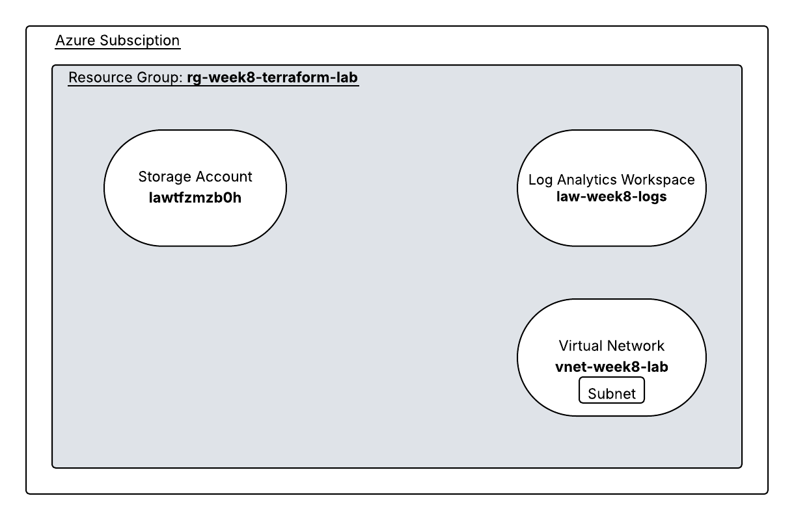

# Week 8: Terraform Azure Infrastructure Deployment

## 📌 Objective
The objective of this lab was to deploy a complete Azure infrastructure stack using Terraform, manage local state, and understand infrastructure lifecycle operations.

---

## 🛠️ Tools & Technologies
- Terraform
- Microsoft Azure
- Azure CLI
- VS Code
- Lucid (Architecture Diagram)

---

## 🧱 Infrastructure Deployed
Using Terraform, the following resources were created:

- Azure Resource Group
- Storage Account
- Log Analytics Workspace
- Virtual Network (VNet)
- Subnet
- Random string resource (for unique naming)

---

## 📂 Project Structure
week-08-terraform-azure-stack/
├── main.tf
├── outputs.tf
├── terraform.tfvars
├── .terraform/
├── terraform.tfstate
├── .gitignore
├── diagrams/
│   └── week8-architecture-diagram.png

---

## ⚙️ Key Terraform Commands Used

Initialize Terraform: terraform init
Preview changes: terraform plan
Deploy infrastructure: terraform apply
Destroy infrastructure: terraform destroy

---

## 🧠 Key Concepts Learned

- Infrastructure as Code (IaC)
- Azure Provider configuration in Terraform
- Local state management (`terraform.tfstate`)
- Resource dependency handling
- Authentication using Azure CLI
- Full infrastructure lifecycle (create → manage → destroy)

---

## 🗺️ Architecture Diagram

---

## 📸 Verification

Resources were successfully deployed and verified in the Azure Portal within the resource group:

`rg-week8-terraform-lab`

---

## ⚠️ Notes

- Local state was intentionally used for learning purposes
- Sensitive files are excluded using `.gitignore`
- In production environments, remote state storage (e.g., Azure Storage backend) is recommended

---

## ✅ Outcome

Successfully deployed and managed Azure infrastructure using Terraform, demonstrating real-world cloud engineering and DevOps practices.