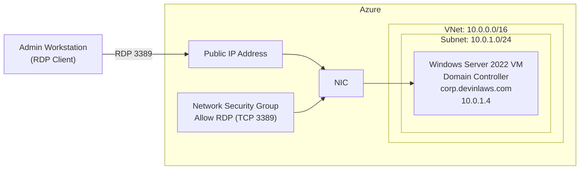
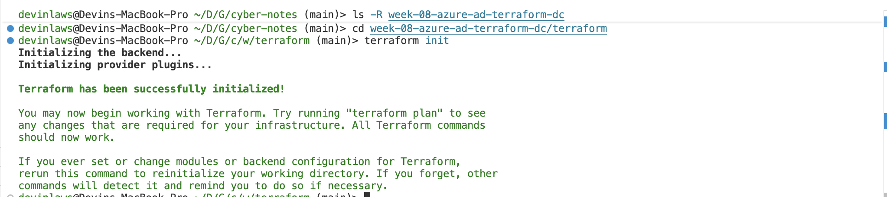
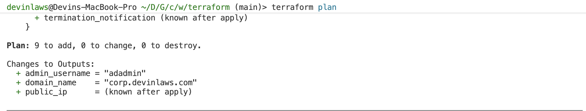
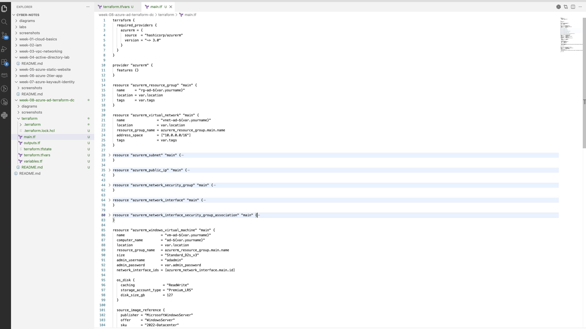
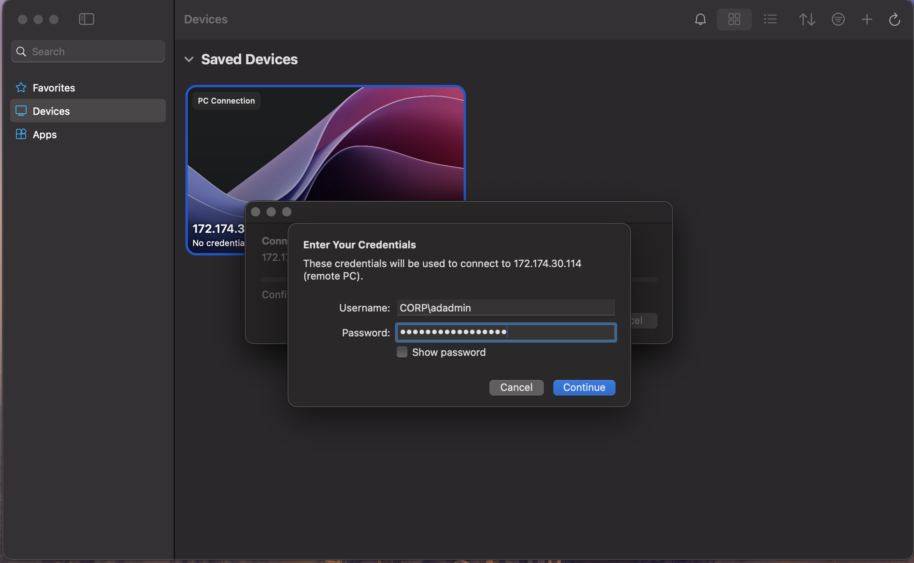
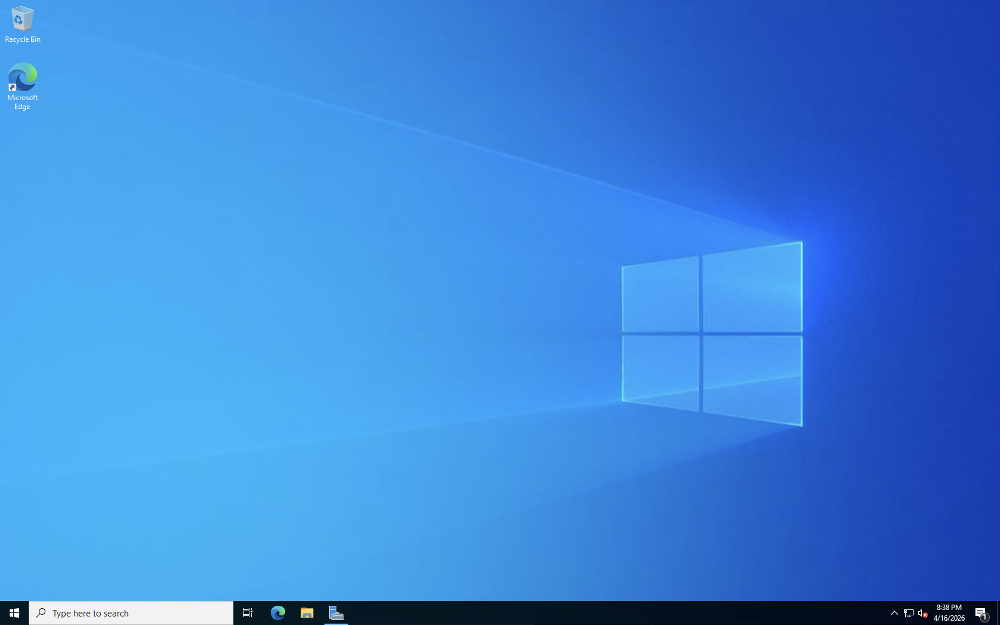
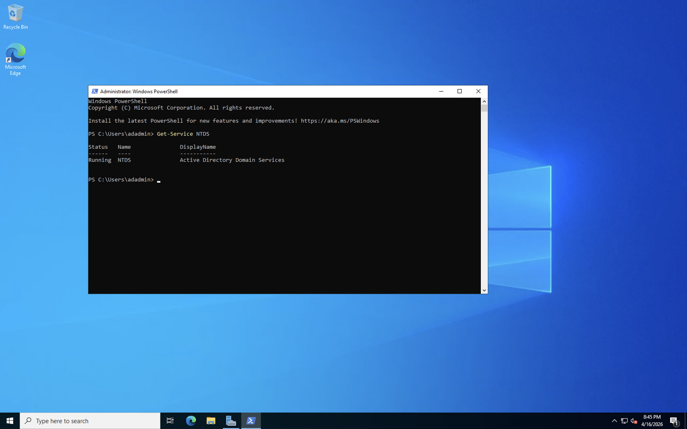
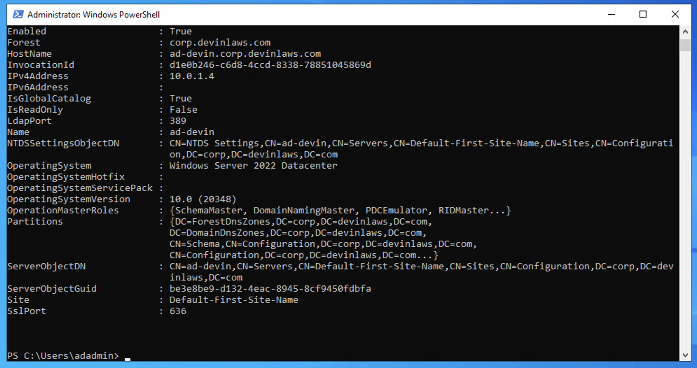
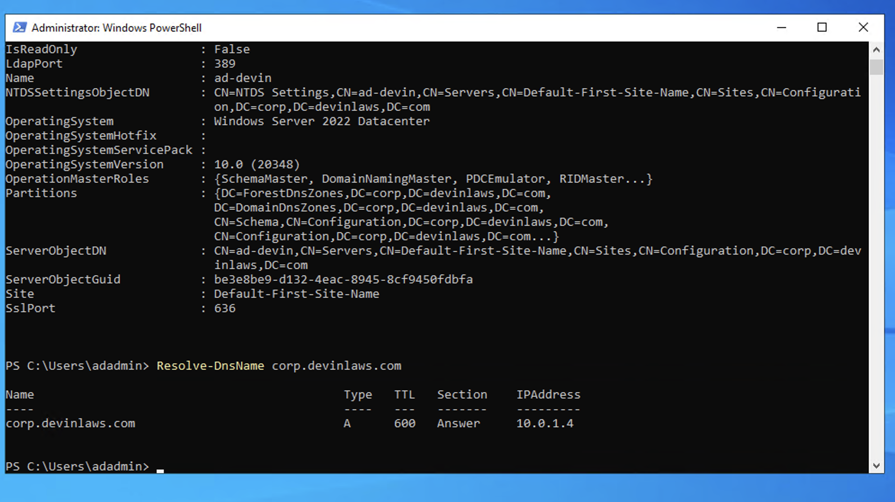
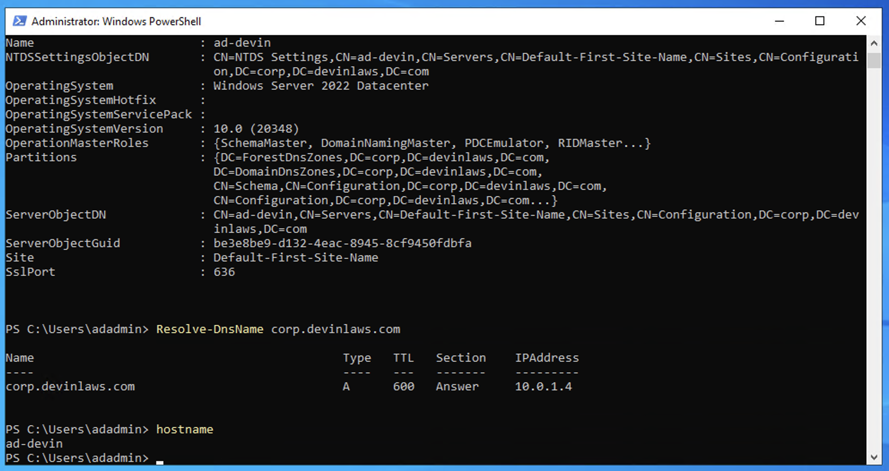

# Week 9 – Azure Active Directory Domain Controller (Terraform)


## 📌 Objective

Deploy a Windows Server 2022 virtual machine in Microsoft Azure and automatically configure it as an Active Directory Domain Controller using Terraform and an Azure VM Custom Script Extension.

This lab builds on Week 8 by extending Infrastructure as Code (IaC) into identity management, simulating a real-world enterprise scenario where infrastructure and directory services are deployed together and managed as code.

---

## 🛠️ Tools & Technologies

- Terraform
- Microsoft Azure
- Azure CLI
- Windows Server 2022
- Active Directory Domain Services (AD DS)
- Azure VM Custom Script Extension
- Visual Studio Code
- Microsoft Remote Desktop (RDP)

---

## 🧱 Infrastructure Deployed

Using Terraform, the following resources were provisioned in Azure:

- Resource Group  
- Virtual Network (VNet)  
- Subnet  
- Network Security Group (NSG)  
- Public IP Address  
- Network Interface (NIC)  
- Windows Server 2022 Virtual Machine  
- Custom Script Extension (AD DS installation, domain creation, DNS configuration)

---

## ⚙️ Key Configuration

- **VNet CIDR:** `10.0.0.0/16`  
- **Subnet CIDR:** `10.0.1.0/24`  
- **VM Size:** `Standard_D2s_v3`  
- **Operating System:** Windows Server 2022 Datacenter  
- **NSG Rule:** Allow RDP (TCP 3389) inbound  
- **Domain Name:** `corp.devinlaws.com`  
- **NetBIOS Name:** `CORP`  

---

## 🚀 Deployment Process

From the `terraform/` directory:

### 1. Initialize Terraform

```bash
terraform init
```

### 2. Review the Execution Plan

```bash
terraform plan
```

### 3. Deploy the Infrastructure

```bash
terraform apply
```

Terraform performs the following:

- Creates the Azure resource group, network stack, and Windows Server 2022 VM  
- Attaches a Custom Script Extension to the VM  
- Installs Active Directory Domain Services (AD DS)  
- Promotes the server to a new forest/domain  
- Installs and configures DNS  
- Triggers a reboot to complete domain controller promotion  

> Note: The VM automatically reboots after AD DS installation and promotion. Attempting to RDP too early can result in failed logons or a black screen.

---

## 🔐 Remote Access

After `terraform apply` completes and the VM finishes rebooting:

1. Retrieve the public IP:

   ```bash
   terraform output public_ip
   ```

2. Connect via RDP using Microsoft Remote Desktop and the public IP.

3. Authenticate with domain credentials:

   - **Preferred:** `CORP\adadmin`  
   - **Alternative UPN:** `adadmin@corp.devinlaws.com`  

> After domain promotion, domain credentials should be used instead of local `.\adadmin` where possible.

---

## 🧪 Validation & Verification

Once connected to the VM, the following PowerShell commands were run to validate the deployment:

```powershell
# AD DS service status
Get-Service NTDS | Select-Object Name, Status

# Domain configuration
Get-ADDomain

# Domain controller discovery
Get-ADDomainController -Filter *

# DNS resolution for the AD domain
Resolve-DnsName corp.devinlaws.com
```

These checks confirmed:

- AD DS is installed and running  
- The domain and forest were created successfully  
- The machine is functioning as a domain controller  
- DNS is correctly resolving the AD domain to the domain controller  

---

## 📂 Project Structure

```text
week-09-azure-ad-domain-controller-terraform/
├── terraform/
│   ├── main.tf
│   ├── variables.tf
│   ├── outputs.tf
│   ├── terraform.tfvars.example
├── screenshots/
├── diagrams/
└── README.md
```

---

## 🗺️ Architecture Diagram




---

## 📸 Screenshots

## 📸 Screenshots

### 🏗️ Terraform Deployment

**Terraform Initialization**


**Execution Plan**


**Successful Deployment**


---

### 🧱 Project Configuration

**Terraform Configuration (main.tf)**


---

### 🔐 Remote Access (RDP)

**RDP Connection**


**Successful RDP Session**


---

### 🧪 Active Directory Validation

**NTDS Service Running**


**Domain Verification**


**DNS Resolution**


---

### 🖥️ System Verification

**Server Hostname**


## 🧠 Key Concepts Learned

- Automating Active Directory deployment with Terraform  
- Using Azure VM extensions for post-deployment configuration  
- Promoting a Windows Server to a domain controller via PowerShell automation  
- Integrating DNS with Active Directory Domain Services  
- Combining infrastructure provisioning and identity management in the cloud  
- Performing post-deployment validation using PowerShell and RDP  

---

## ⚠️ Notes & Best Practices

- The VM automatically reboots after AD DS installation and promotion  
- Domain authentication replaces local login for standard management after promotion  
- RDP may fail if attempted before AD DS and related services fully initialize  
- In production, sensitive values (admin and DSRM passwords) should be stored in a secure secret store (e.g., Azure Key Vault) instead of plain-text `terraform.tfvars`  

---

## 🔁 How to Reuse This Lab

You (or anyone else) can reuse this lab to stand up a fresh AD DS environment in Azure:

1. **Clone the repository**

   ```bash
   git clone <your-repo-url>
   cd week-09-azure-ad-domain-controller-terraform/terraform
   ```

2. **Configure Azure authentication**

   - Install the Azure CLI if needed.  
   - Log in and select the correct subscription:

     ```bash
     az login
     az account set --subscription "<your-subscription-id-or-name>"
     ```

3. **Update `terraform.tfvars`**

   Edit `terraform.tfvars` and set values appropriate for your environment:

   ```hcl
   yourname       = "your-name-or-alias"
   location       = "eastus"
   admin_password = "YourSecurePassword123!"
   dsrm_password  = "YourSecureDSRMPassword123!"
   domain_name    = "corp.yourdomain.com"
   domain_netbios = "CORP"
   ```

   - Ensure passwords meet Azure’s complexity requirements.  
   - Optionally change the region and domain naming to match your use case.

4. **Initialize and deploy**

   ```bash
   terraform init
   terraform plan
   terraform apply
   ```

5. **Connect and validate**

   - Retrieve the public IP:

     ```bash
     terraform output public_ip
     ```

   - Connect via RDP using the public IP and domain credentials.  
   - Re-run the validation PowerShell commands in the “Validation & Verification” section.

6. **Clean up when finished**

   ```bash
   terraform destroy
   ```

   This removes all lab resources from the subscription.

---

## 🧹 Teardown

To remove all deployed resources:

```bash
terraform destroy
```

This command deletes the resource group and all associated resources, including the VM, disks, NIC, public IP, NSG, VNet, and subnet.

---

## ✅ Outcome

Successfully deployed and validated an Azure-based Active Directory Domain Controller using Terraform, demonstrating:

- Infrastructure as Code  
- Identity and access integration  
- Automation of Windows Server role configuration  
- End-to-end verification of a cloud-hosted domain controller  