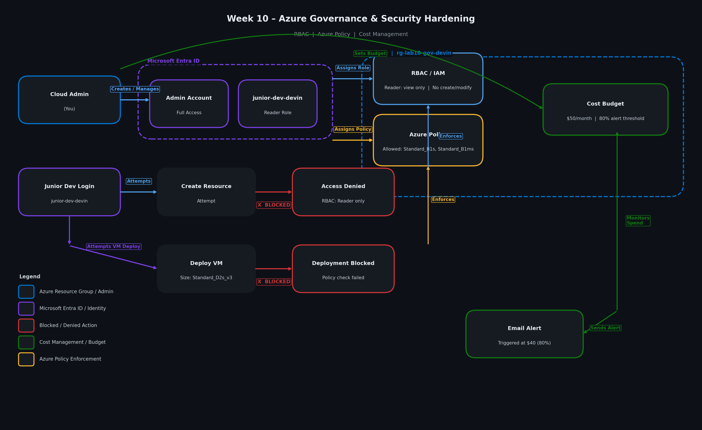
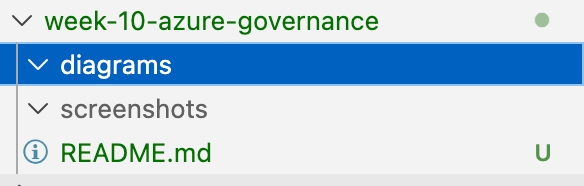
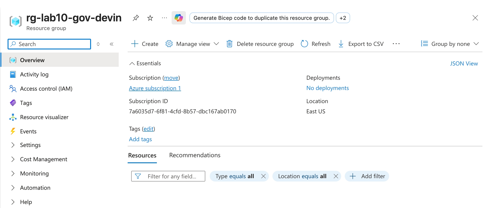
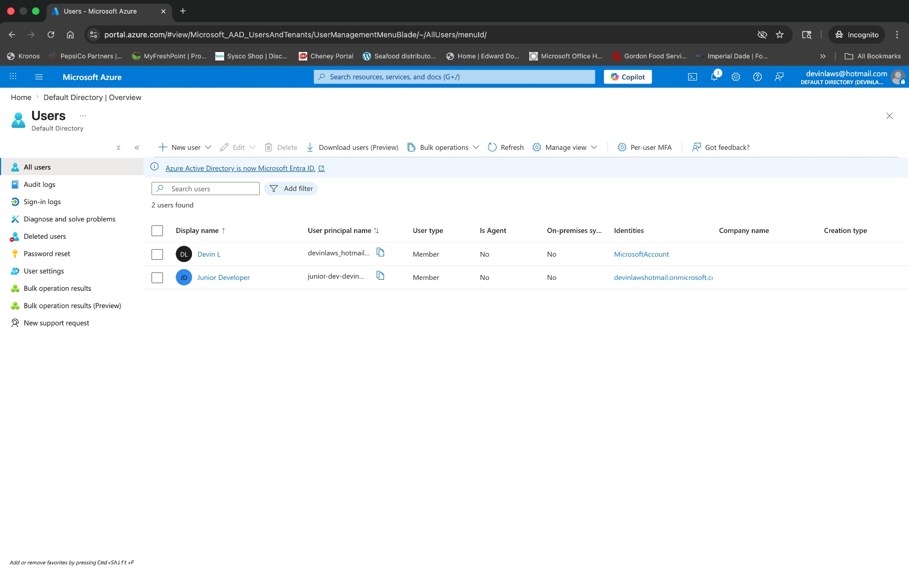
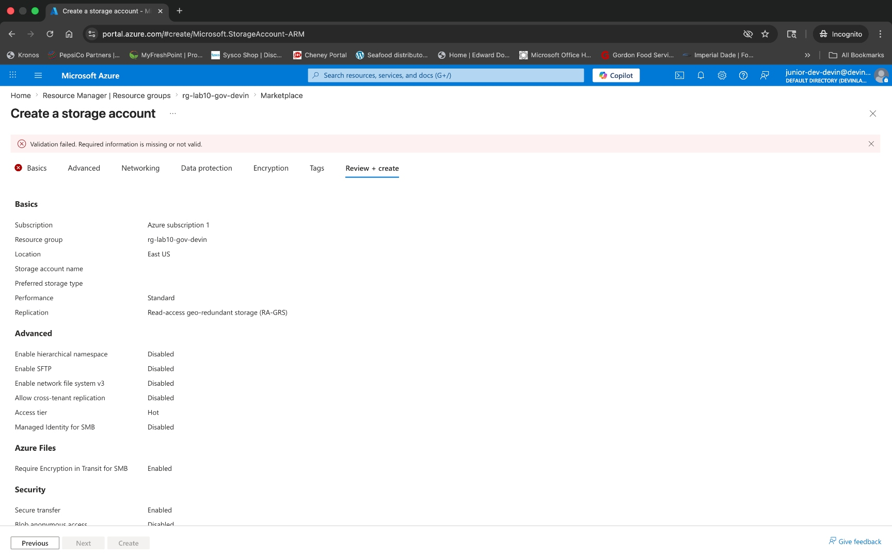
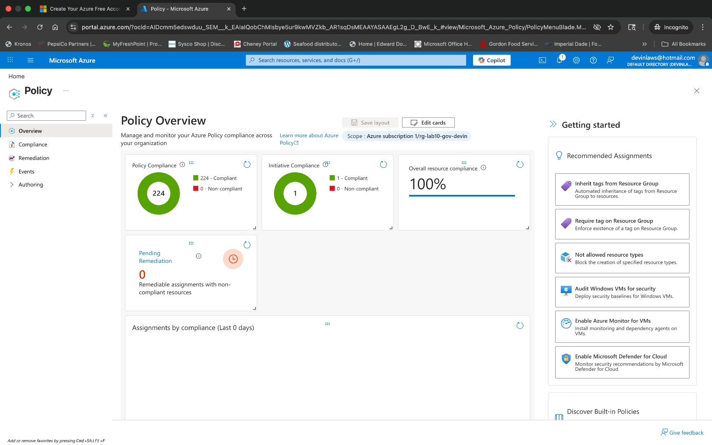
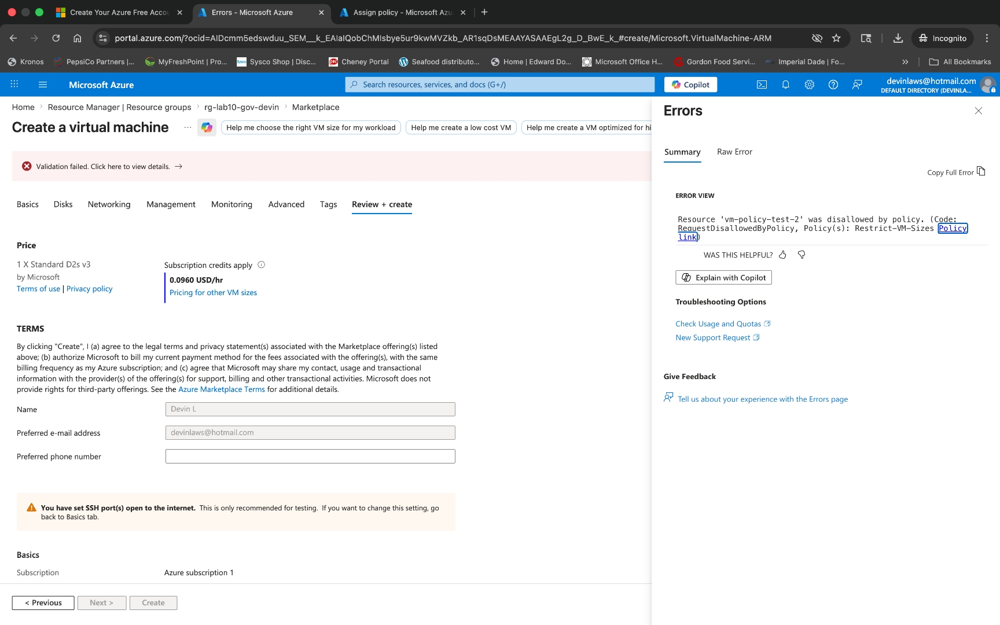

# Week 11 – Azure Governance & Security Hardening


## 📌 Objective

Transition from deploying cloud infrastructure to governing and securing it. This lab implements Role-Based Access Control (RBAC), Azure Policy enforcement, and Cost Management budgets to simulate real-world cloud administration — where controlling access, enforcing standards, and managing costs are equally as important as provisioning resources.

---

## 🎥 Walkthrough

[](https://loom.com)

---

## 🛠️ Tools & Technologies

- Microsoft Azure
- Microsoft Entra ID (Azure AD)
- Azure Role-Based Access Control (RBAC / IAM)
- Azure Policy
- Azure Cost Management (Budgets & Alerts)
- Azure Portal

---

## 🧱 Infrastructure & Governance Deployed

The following controls were configured in Azure:

- Resource Group (`rg-lab10-gov-devin`)
- Test User (`junior-dev-devin`) via Microsoft Entra ID
- RBAC Role Assignment (Reader — resource group scope)
- Azure Policy (Allowed VM Size SKUs — `Standard_B1s`, `Standard_B1ms`)
- Cost Management Budget ($50/month, 80% alert threshold)

---

## ⚙️ Key Configuration

- **Resource Group:** `rg-lab10-gov-devin`
- **Test User:** `junior-dev-devin`
- **RBAC Role:** Reader (resource group scope)
- **Policy:** Allowed Virtual Machine Size SKUs
- **Allowed Sizes:** `Standard_B1s`, `Standard_B1ms`
- **Blocked Size (test):** `Standard_D2s_v3`
- **Monthly Budget:** $50
- **Alert Threshold:** 80% ($40)
- **Notification:** Email alert

---

## 🔧 Implementation Steps

### 🔹 1. Resource Group Setup

Created a dedicated resource group to scope all governance controls:

```
rg-lab10-gov-devin
```

---

### 🔹 2. User Creation (Microsoft Entra ID)

Created a test user to simulate a junior developer with limited access:

- **Username:** `junior-dev-devin`
- **Role:** Reader (limited access)

---

### 🔹 3. RBAC Implementation (Access Control)

Assigned the **Reader** role to `junior-dev-devin` at the resource group level:

- ✅ Allows viewing resources
- ❌ Prevents creating or modifying resources

---

### 🔹 4. RBAC Validation (Access Denied Test)

Logged in as `junior-dev-devin` and attempted to create a resource.

**Result:**
- ❌ Access denied
- ❌ Unable to create resources

---

### 🔹 5. Azure Policy Implementation

Created a built-in policy to restrict VM sizes across the resource group:

- **Policy:** Allowed Virtual Machine Size SKUs
- **Allowed Sizes:** `Standard_B1s`, `Standard_B1ms`

---

### 🔹 6. Policy Validation (Governance Enforcement)

Attempted to deploy a VM using a disallowed size (`Standard_D2s_v3`).

**Result:**
- ❌ Deployment blocked
- ❌ Policy check failed

---

### 🔹 7. Cost Management (Budget Setup)

Configured a monthly budget with email alerting:

- **Budget:** $50/month
- **Alert Threshold:** 80%
- **Notification:** Email alert triggered at $40

---

## 🗺️ Architecture Diagram



---

## 📸 Screenshots

### 🏗️ Project Structure

**Lab Overview — Week 11 Project Structure**


---

### 🗂️ Resource Group

**Resource Group Created: rg-lab10-gov-devin**


---

### 👤 User Creation

**Junior Developer User Created (Microsoft Entra ID)**


---

### 🔐 RBAC Assignment

**Reader Role Assigned at Resource Group Scope**


---

### 🚫 RBAC Validation

**Access Denied — Junior User Blocked from Creating Resources**


---

### 📋 Azure Policy Assignment

**Policy Assignment — Allowed VM Size SKUs**


---

### 🚫 Policy Enforcement

**Deployment Blocked — Disallowed VM Size Rejected by Policy**


---

### 💰 Cost Management

**Budget Setup — $50/month with 80% Alert**

> 📷 Screenshot coming soon

---

## 🧠 Key Concepts Learned

- **RBAC** enforces *who* can access resources
- **Azure Policy** controls *what* can be deployed
- **Budgets** manage *how much* can be spent
- Azure Policy enforcement may take time to propagate after assignment
- Correct scoping (resource group vs. subscription) is critical for effective governance
- Governance controls must be validated through real-world testing, not assumed to be active

---

## 🚧 Challenges & Troubleshooting

### Issue 1: Policy Not Enforcing Immediately

- **Problem:** Initial deployment succeeded despite the policy being assigned
- **Root Cause:** Incorrect scope and policy propagation delay
- **Fix:** Reassigned the policy directly to the resource group and waited for propagation before retesting

### Issue 2: VM Size / Zone Availability Error

- **Problem:** Encountered an Azure availability zone restriction error during validation
- **Fix:** Adjusted the availability zone setting before proceeding with the policy enforcement test

---

## 💼 Real-World Application

This lab reflects real-world cloud operations where:

- Engineers must limit access based on role and least-privilege principles
- Organizations enforce deployment standards to prevent misconfigurations and cost overruns
- Teams actively monitor and control cloud spending with automated alerts

---

## 📂 Project Structure

```text
week-11-azure-governance/
├── README.md
├── diagrams/
│   └── week-10-architecture.png
└── screenshots/
    ├── week10-01-project-structure.jpg
    ├── week10-02-resource-group-created.jpg
    ├── week10-03-junior-user-created.jpg
    ├── week10-04-rbac-reader-assigned.jpg
    ├── week10-05-rbac-access-denied.jpg
    ├── week10-06-policy-assigned.jpg
    └── week10-11-policy-enforced.jpg
```

---

## 🧹 Cleanup

- Deleted resource group: `rg-lab10-gov-devin`
- Removed test user `junior-dev-devin` from Microsoft Entra ID

---

## ✅ Outcome

Successfully implemented cloud governance controls in Azure by:

- Restricting user permissions with **RBAC** (Reader role)
- Enforcing infrastructure rules using **Azure Policy** (VM size restrictions)
- Managing costs with **budgets and alerts** ($50/month, 80% threshold)

This lab represents a shift from basic cloud usage to real-world **cloud administration and security hardening** — a critical skill set for any cloud or security professional.
