# Linux Security Monitoring Dashboard with Splunk Enterprise on Azure

[](./)
[](https://azure.microsoft.com)
[](https://ubuntu.com)
[](https://www.splunk.com)
[](./)

> **Week 12 Lab** · SOC Skills · SIEM · SPL · Ubuntu · Auth Log Analysis  
> **Platform:** Microsoft Azure · **OS:** Ubuntu Server 24.04 LTS · **Tool:** Splunk Enterprise 9.4.2

---

## Azure VM Overview

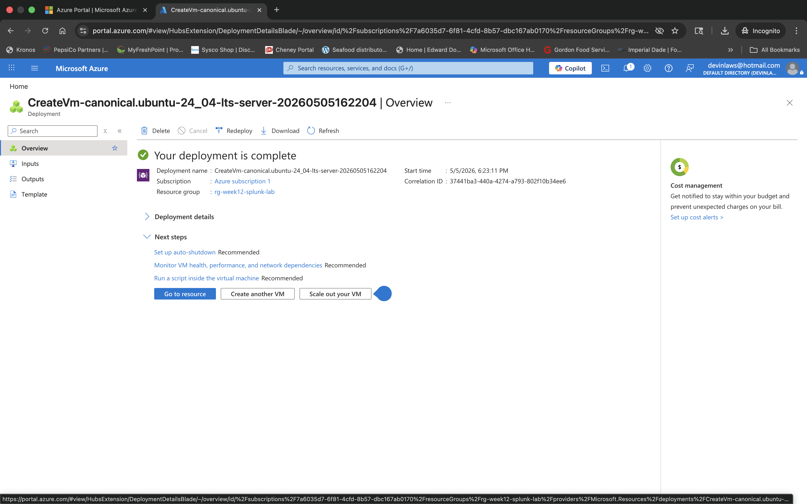

---

## Project Overview

This project demonstrates a Linux security monitoring environment deployed on Microsoft Azure using Ubuntu Server 24.04 LTS and Splunk Enterprise. The goal was to build a cloud-hosted monitoring solution capable of ingesting Linux authentication logs, detecting security-relevant activity, and visualizing events through a SOC-style dashboard.

The environment was designed to monitor and analyze:

- Authentication events from `/var/log/auth.log`
- Failed login and failed privilege escalation attempts
- Sudo and administrative activity
- Linux user management events
- Security monitoring dashboards in Splunk

This lab simulates foundational Security Operations Center (SOC) workflows commonly used in cybersecurity and cloud security roles.

---

## Technologies Used

| Technology                | Purpose                                    |
|---------------------------|--------------------------------------------|
| Microsoft Azure           | Cloud infrastructure hosting              |
| Ubuntu Server 24.04 LTS   | Linux server environment                  |
| Splunk Enterprise         | SIEM and log analysis platform            |
| SSH                       | Remote server administration              |
| Linux auth logs           | Security event monitoring                 |
| Azure NSG                 | Network access control for Splunk and SSH |

---

## Environment Architecture

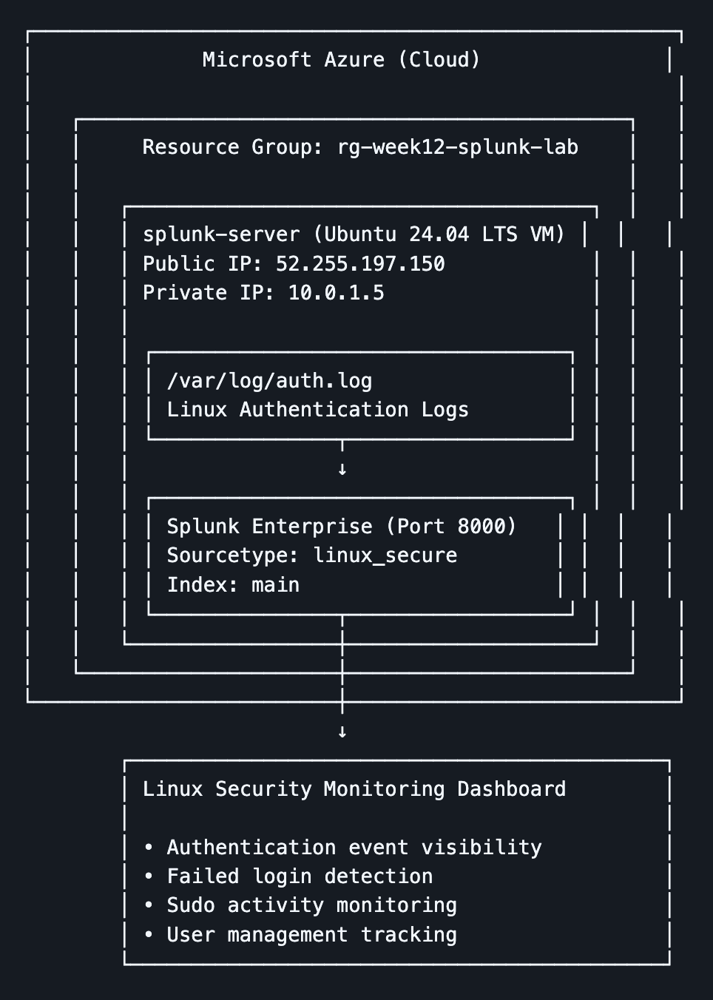

```text
┌─────────────────────────────────────────────────────┐
│              Microsoft Azure (Cloud)               │
│                                                    │
│   ┌─────────────────────────────────────────────┐   │
│   │     Resource Group: rg-week12-splunk-lab    │   │
│   │                                             │   │
│   │   ┌──────────────────────────────────────┐  │   │
│   │   │ splunk-server (Ubuntu 24.04 LTS VM) │  │   │
│   │   │ Public IP: 52.255.197.150           │  │   │
│   │   │ Private IP: 10.0.1.5                │  │   │
│   │   │                                      │  │   │
│   │   │ ┌──────────────────────────────────┐ │  │   │
│   │   │ │ /var/log/auth.log                │ │  │   │
│   │   │ │ Linux Authentication Logs        │ │  │   │
│   │   │ └───────────────┬──────────────────┘ │  │   │
│   │   │                 ↓                    │  │   │
│   │   │ ┌──────────────────────────────────┐ │  │   │
│   │   │ │ Splunk Enterprise (Port 8000)   │ │  │   │
│   │   │ │ Sourcetype: linux_secure        │ │  │   │
│   │   │ │ Index: main                     │ │  │   │
│   │   │ └───────────────┬──────────────────┘ │  │   │
│   │   └─────────────────┼────────────────────┘  │   │
│   └─────────────────────┼───────────────────────┘   │
└─────────────────────────┼───────────────────────────┘
                          ↓
        ┌────────────────────────────────────────────┐
        │ Linux Security Monitoring Dashboard        │
        │                                            │
        │ -  Authentication event visibility          │
        │ -  Failed login detection                   │
        │ -  Sudo activity monitoring                 │
        │ -  User management tracking                 │
        └────────────────────────────────────────────┘
```

---

## Project Objectives

### 1. Deploy Cloud Infrastructure

- Created an Ubuntu Server VM in Microsoft Azure
- Configured networking, public IP, and NSG rules
- Connected securely via SSH using PEM key authentication

### 2. Install and Configure Splunk Enterprise

- Installed Splunk Enterprise on the Ubuntu server
- Enabled Splunk boot-start services
- Configured Splunk web interface access on port 8000
- Verified successful Splunk deployment

### 3. Configure Security Monitoring

- Ingested Linux authentication logs from `/var/log/auth.log`
- Configured Splunk sourcetype and index for Linux auth logs
- Verified successful event ingestion in Splunk

### 4. Generate Security Events

Simulated multiple security-related events including:

- User creation and deletion
- Password changes
- Sudo usage
- Failed authentication attempts
- Failed `su` privilege escalation attempts

### 5. Build Security Dashboard

Created a Linux Security Monitoring Dashboard in Splunk Dashboard Studio featuring:

- Linux authentication monitoring
- Failed login event tracking
- Security event visibility
- Searchable event tables

---

## Lab Walkthrough

### SSH Access to the Ubuntu Server

After deploying the VM, secure remote access was established using SSH with PEM key authentication.

```bash
chmod 400 splunk-server_key.pem
ssh -i splunk-server_key.pem azureuser@52.255.197.150
```

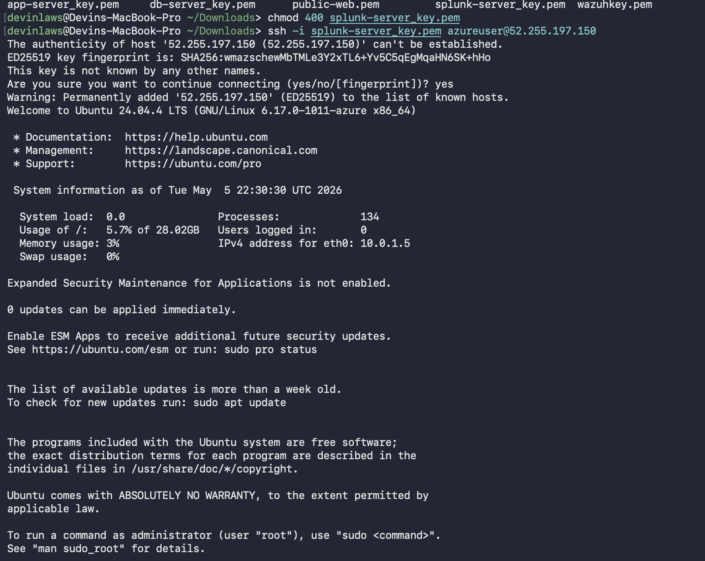

---

### Splunk Boot-Start Configuration

Splunk was configured to start automatically on boot:

```bash
sudo /opt/splunk/bin/splunk enable boot-start
```

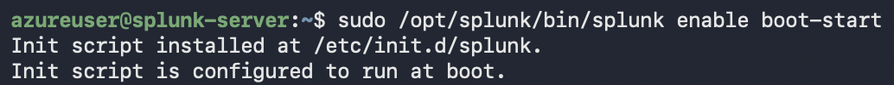

---

### Azure NSG Rule for Port 8000

To access the Splunk web interface, an inbound Network Security Group rule was created to allow TCP port 8000.

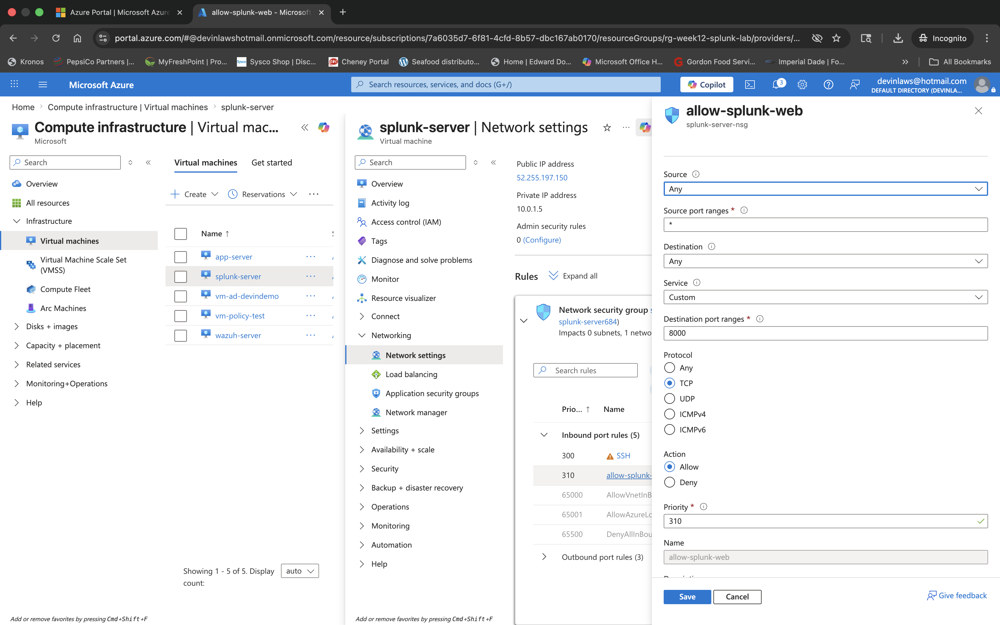

---

### Splunk Login and Home Dashboard

After opening port 8000, the Splunk Enterprise login page was successfully reached in the browser.

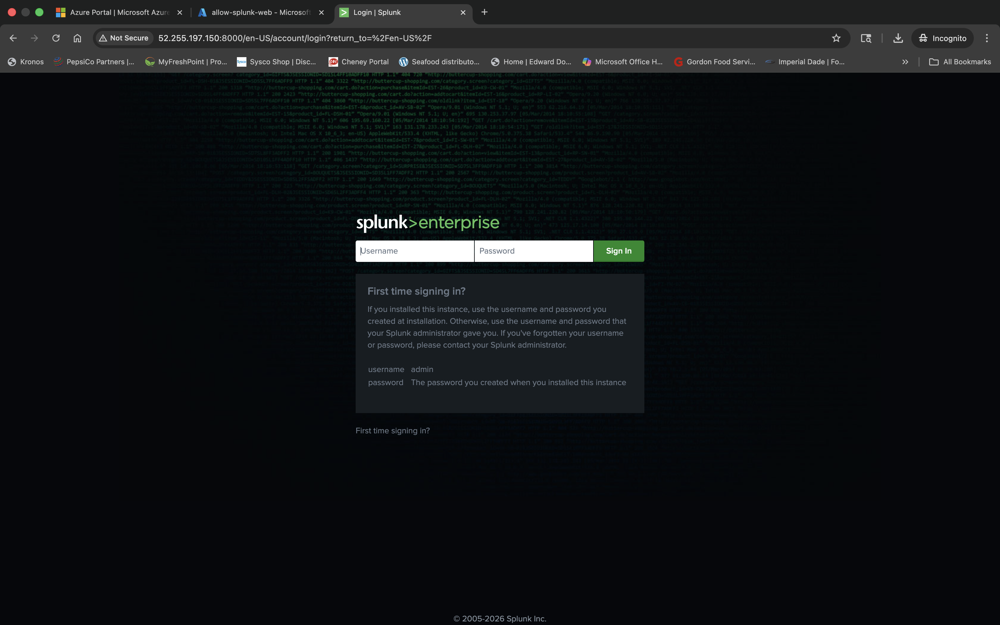

Once authenticated, the Splunk web interface and **Search & Reporting** app were available.

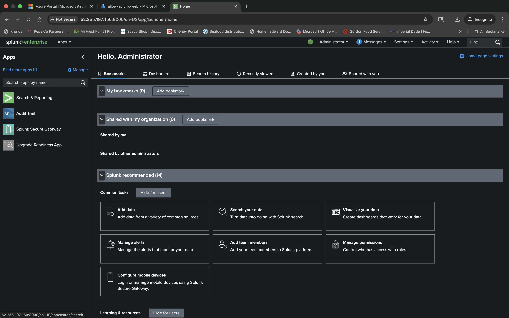

---

### Linux Auth Log Source Type Configuration

The Linux authentication log was added as a monitored input source:

- Source: `/var/log/auth.log`
- Sourcetype: `linux_secure`
- Index: `main`
- Host: `splunk-server`

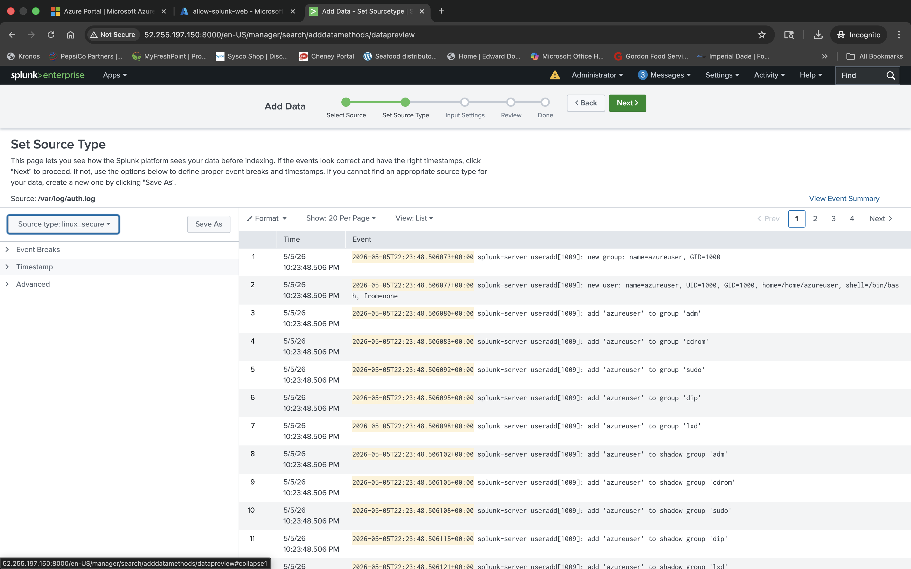

---

### Log Ingestion Verification

Splunk searches confirmed that events from `/var/log/auth.log` were being indexed successfully.

```spl
index=* host=splunk-server
```

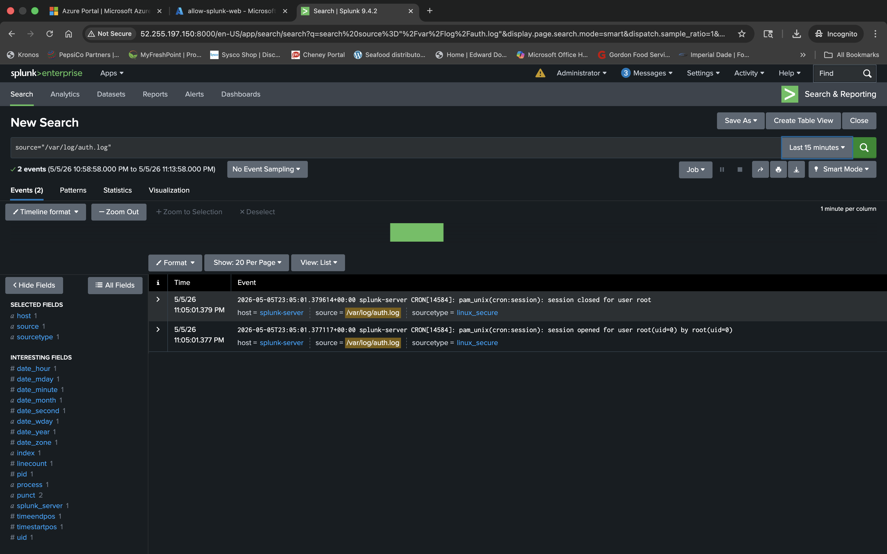

---

### Security Events Generated in Splunk

Multiple security-related events were intentionally generated on the Linux host.

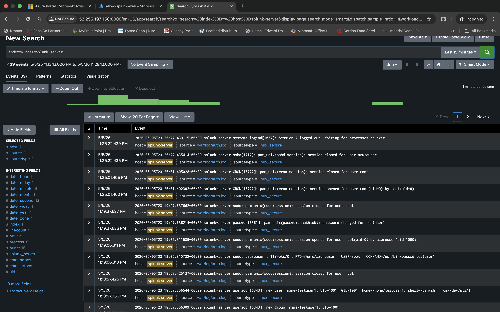

#### User Management Event Generation

User account activity was generated using Linux commands such as `useradd`, `passwd`, and `userdel`.

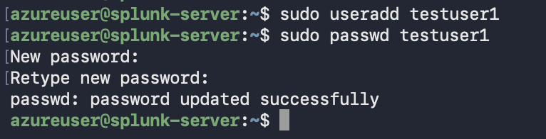

#### Failed Authentication Detection

A failed privilege escalation attempt was detected through Splunk search results.

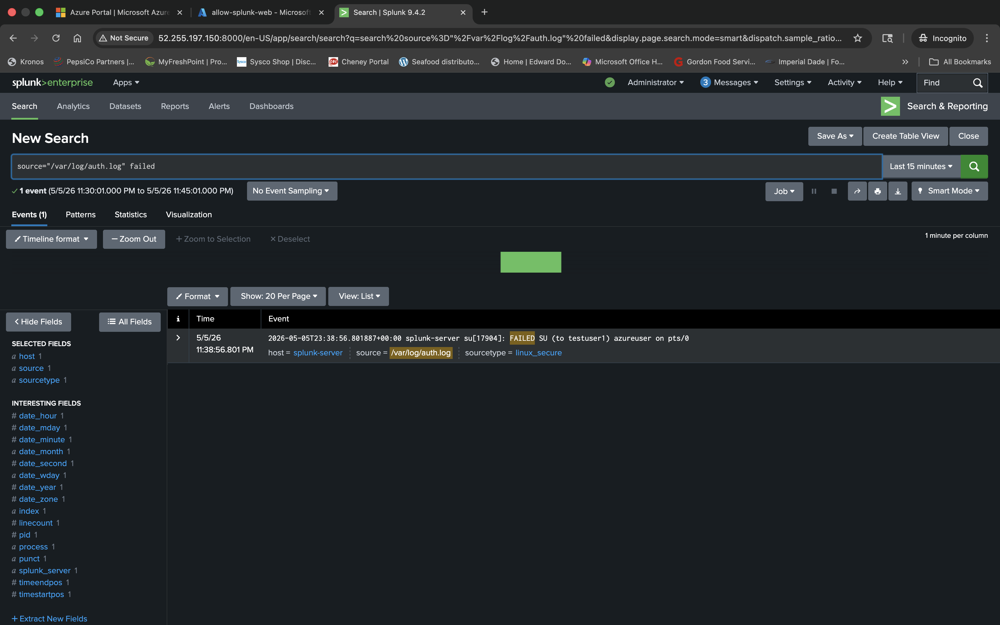

#### Sudo Activity Monitoring

Sudo-related events were captured, including administrative commands and root session activity.

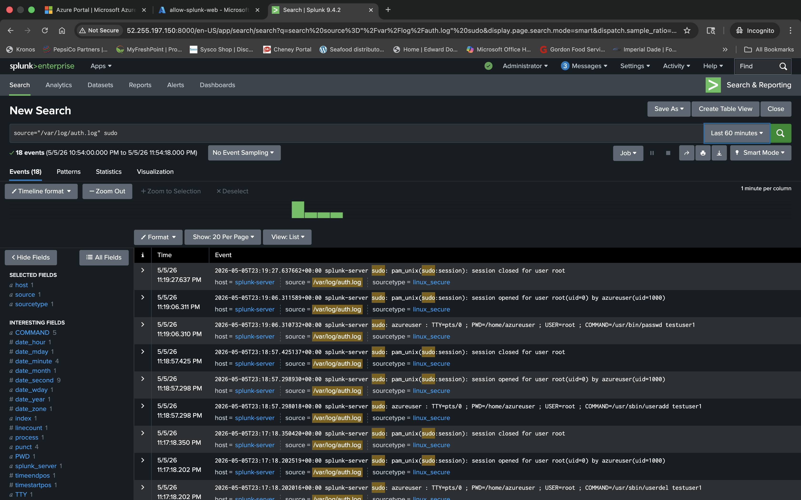

---

### Linux Security Monitoring Dashboards

A dashboard was built to centralize Linux security event visibility.

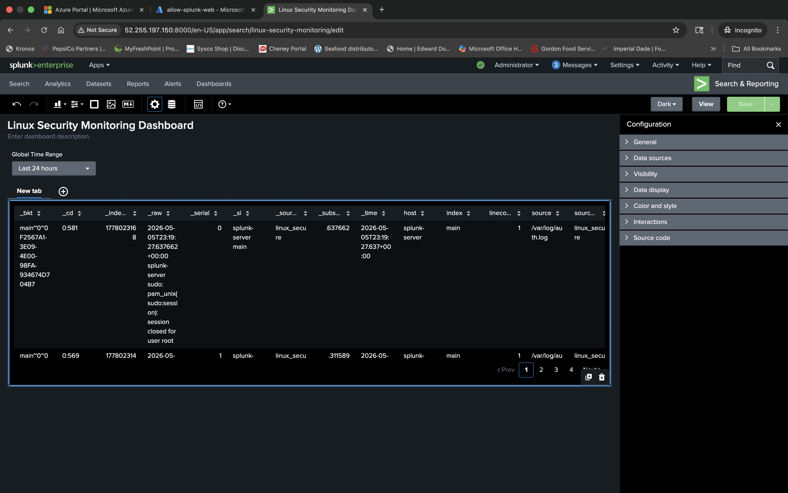

A refined dashboard table was created to improve readability.

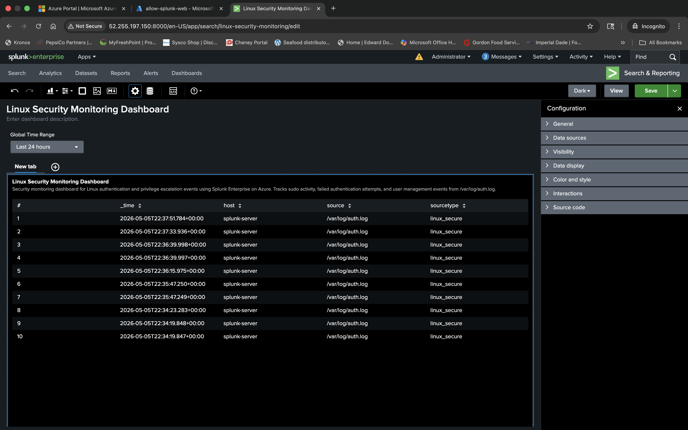

The final dashboard presents authentication and administrative activity in a SOC-style view.

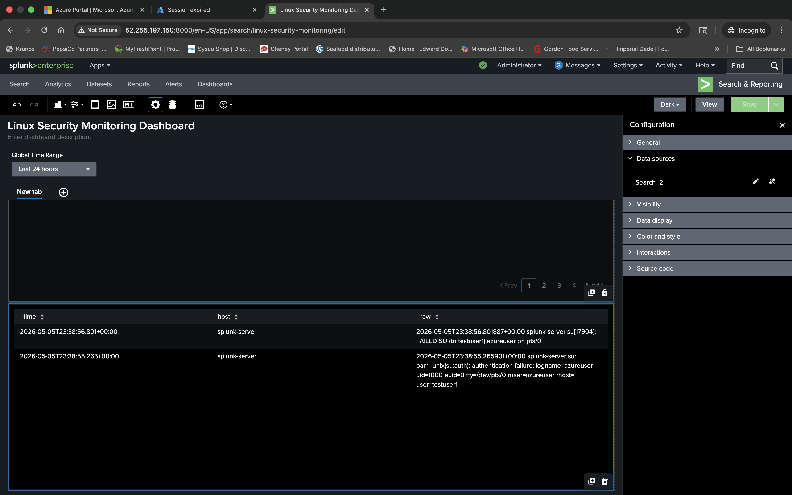

---

## Key Splunk Searches

### Monitor All Authentication Logs

```spl
source="/var/log/auth.log"
```

Displays all authentication-related events being written to `/var/log/auth.log`.

### Monitor Sudo Activity

```spl
source="/var/log/auth.log" sudo
| table _time host source sourcetype _raw
```

Tracks sudo-related activity, including privileged commands and root session activity.

### Monitor Failed Login Attempts

```spl
source="/var/log/auth.log" ("FAILED SU" OR "authentication failure" OR "failed password")
| table _time host _raw
```

Detects failed authentication attempts and failed privilege escalation events.

### Monitor User Management Activity

```spl
source="/var/log/auth.log" (useradd OR userdel OR passwd)
| table _time host _raw
```

Identifies account creation, password changes, and account deletion activity.

---

## Security Events Observed

| Event Type               | Description                          |
|--------------------------|--------------------------------------|
| `FAILED SU`              | Failed privilege escalation attempt  |
| `authentication failure` | Invalid authentication attempt       |
| `sudo session opened`    | Administrative access activity       |
| `sudo session closed`    | End of administrative activity       |
| `passwd changed`         | Password modification event          |
| `useradd`                | User account creation                |
| `userdel`                | User account deletion                |

---

## Dashboard Features

The Splunk dashboard provides:

- Real-time Linux security monitoring
- Authentication log visibility
- Failed login detection
- Sudo monitoring
- Searchable event tables
- SOC-style dashboard visualization

---

## Skills Demonstrated

### Cloud Security

- Azure virtual machine deployment
- Cloud networking configuration
- Public IP and NSG management

### Linux Administration

- SSH remote administration
- User and group management
- Linux authentication systems
- Sudo and privilege management

### SIEM & Log Analysis

- Splunk Enterprise installation and configuration
- Data ingestion and indexing
- SPL (Search Processing Language)
- Security dashboard creation
- Event correlation and monitoring

### Cybersecurity Concepts

- Authentication monitoring
- Privilege escalation monitoring
- Failed login detection
- Security event analysis
- SOC workflow fundamentals

---

## Lessons Learned

During this project, I gained hands-on experience with:

- Deploying cloud-hosted Linux infrastructure
- Installing and configuring Splunk Enterprise
- Monitoring Linux authentication logs
- Building custom security dashboards
- Generating and analyzing security events
- Troubleshooting ingestion and visualization issues

This project strengthened my understanding of cloud security operations, Linux administration, SIEM workflows, and real-world security monitoring.

---

## Future Improvements

Potential future enhancements include:

- Integrating Wazuh with Splunk
- Adding brute-force attack detection
- Configuring alerting and notifications
- Monitoring additional Linux log sources
- Adding visual charts and analytics
- Creating scheduled reports
- Forwarding logs from multiple Linux hosts

---

## Conclusion

This project demonstrates the deployment of a cloud-based Linux security monitoring environment using Splunk Enterprise on Microsoft Azure. It showcases practical experience with cloud infrastructure, Linux administration, SIEM configuration, and security event monitoring, reflecting foundational SOC analyst and cloud security engineering skills through hands-on implementation and real security event analysis.