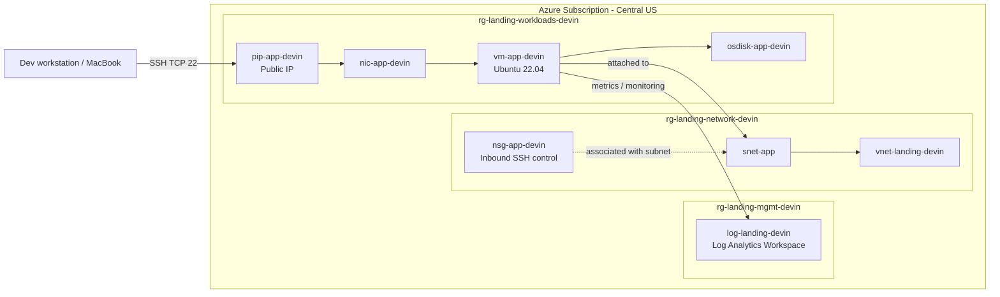
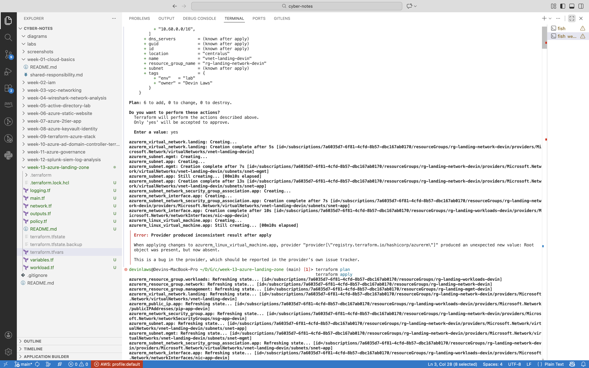
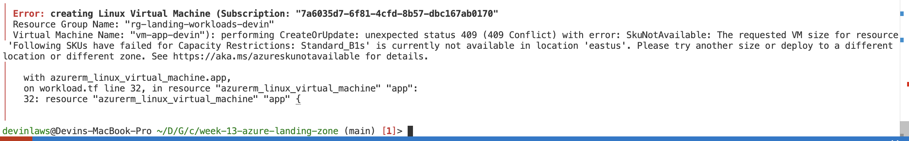
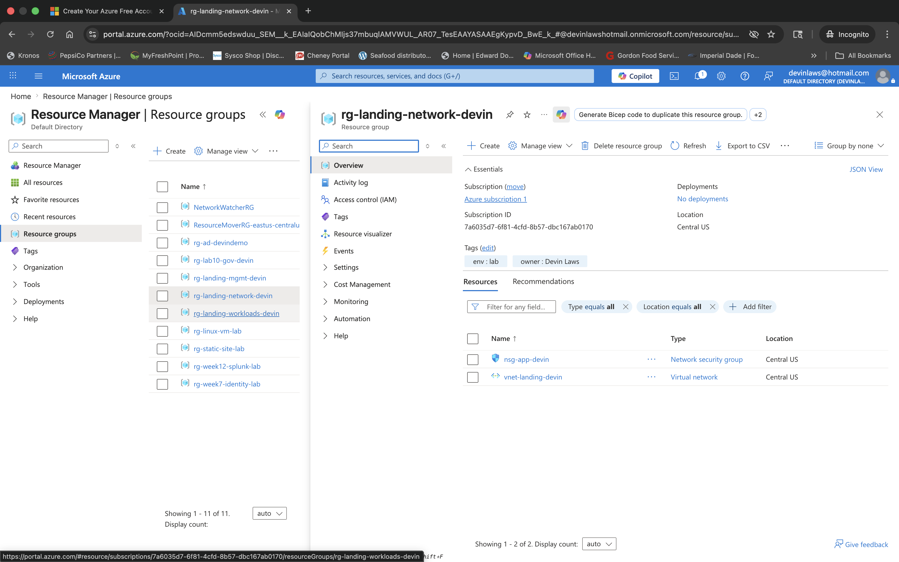
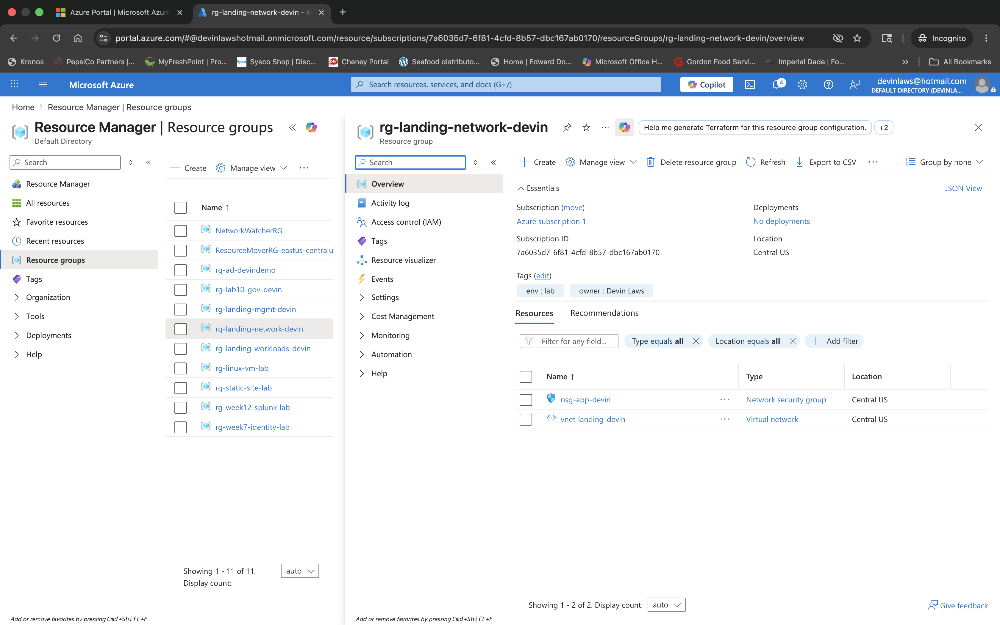
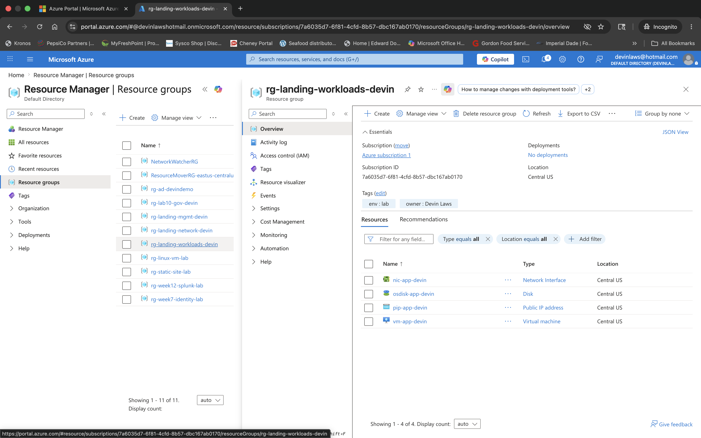
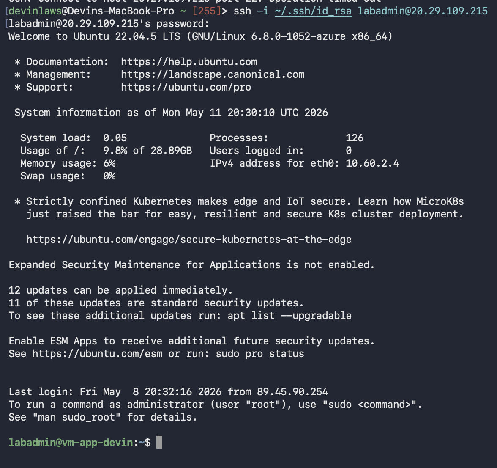
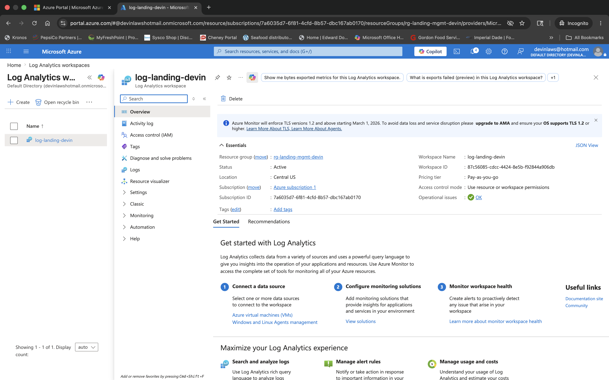
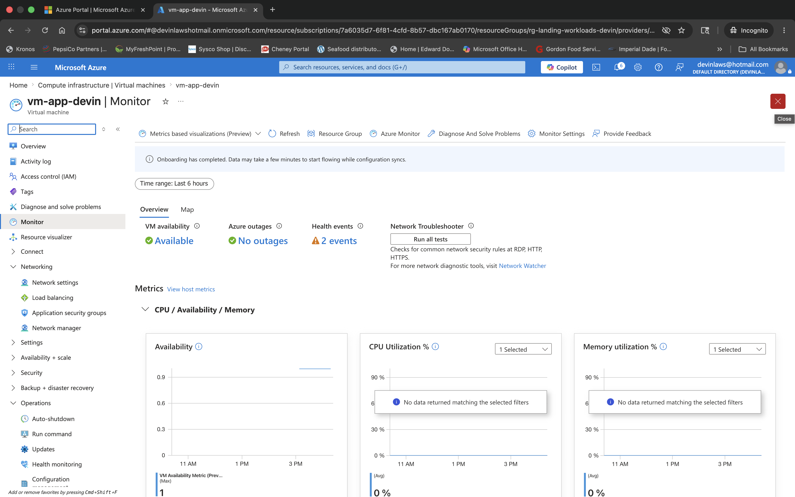

# Week 13 – Azure Landing Zone with Terraform


## Overview

This lab documents the design, deployment, troubleshooting, and validation of a small Azure landing zone built with Terraform. The project uses a segmented resource group model for management, networking, and workloads, then validates the environment through SSH connectivity, NSG rule analysis, and centralized monitoring.

The final solution standardizes the deployment in **Central US**, provisions a Linux application VM, secures administrative access with a subnet-level NSG, and connects observability services through a centralized Log Analytics workspace.

---

## Objectives

- Build an Azure landing zone with Terraform.
- Separate resources into management, network, and workload resource groups.
- Deploy a Linux VM for workload validation.
- Secure SSH access using Azure Network Security Groups.
- Validate infrastructure access from an external workstation.
- Integrate Azure Monitor with Log Analytics.
- Produce portfolio-ready technical documentation with screenshots and architecture.

---

## Skills Demonstrated

- Infrastructure as Code (Terraform)
- Azure Virtual Network design
- Network Security Group configuration
- Linux VM deployment and administration
- SSH troubleshooting
- Azure Monitor and Log Analytics integration
- Cloud troubleshooting and operational validation
- Technical documentation for portfolio use

---

## Environment Summary

| Category | Value |
|---|---|
| Cloud Provider | Microsoft Azure |
| Region | Central US |
| IaC Tool | Terraform |
| VM Name | `vm-app-devin` |
| Operating System | Ubuntu 22.04 LTS |
| VNet | `vnet-landing-devin` |
| Subnet | `snet-app` |
| NSG | `nsg-app-devin` |
| Log Analytics Workspace | `log-landing-devin` |
| Management Resource Group | `rg-landing-mgmt-devin` |
| Network Resource Group | `rg-landing-network-devin` |
| Workload Resource Group | `rg-landing-workloads-devin` |

---

## Architecture



---

## Project Components

### Management Layer
The management layer is hosted in `rg-landing-mgmt-devin` and contains the centralized Log Analytics workspace used for monitoring and observability. This provides a dedicated location for collecting platform telemetry outside the workload resource group.

### Network Layer
The network layer is hosted in `rg-landing-network-devin` and contains the shared Azure network infrastructure. This includes the virtual network, application subnet, and network security controls that protect workload access.

### Workload Layer
The workload layer is hosted in `rg-landing-workloads-devin` and contains the Linux application VM and its supporting resources. These include the NIC, public IP, and managed OS disk used by `vm-app-devin`.

---

## Deployment Narrative

### 1. Terraform build and initial troubleshooting

The lab started with a Terraform project defining Azure resource groups, networking, compute, outputs, policy, and logging resources. During deployment, provider/apply issues surfaced, requiring troubleshooting and validation before a clean deployment could complete.

This step was important because it reinforced that Infrastructure as Code still requires operational testing after templates are written.

### 2. Regional planning and Azure quota review

Before finalizing the deployment, Azure compute usage and quota information were reviewed in East US. That review helped inform the decision to standardize the final landing zone in **Central US**, keeping the environment consistent and easier to manage.

This also reduced regional sprawl and improved the clarity of the final architecture.

### 3. Resource group segmentation

The landing zone was organized into three logical resource groups:

- `rg-landing-mgmt-devin`
- `rg-landing-network-devin`
- `rg-landing-workloads-devin`

This segmentation mirrors common enterprise cloud design by separating management services, shared infrastructure, and application workloads into dedicated scopes.

### 4. Network and security configuration

The networking layer centered on `vnet-landing-devin` and the `snet-app` subnet. Access control was enforced with `nsg-app-devin`, which governed inbound administrative access to the deployed VM.

During testing, SSH access failed because the home public IP had changed and the source-specific NSG rule no longer matched. Reviewing and updating the SSH rule restored access and demonstrated the operational impact of tightly scoped inbound controls.

### 5. VM deployment and access validation

The workload VM `vm-app-devin` was deployed successfully with:

- `nic-app-devin`
- `pip-app-devin`
- `osdisk-app-devin`

After the NSG rule was corrected, SSH access from the MacBook was revalidated using the VM’s public IP address. Successful login confirmed that the VM, NIC, subnet, NSG, and public IP configuration were all functioning together as intended.

### 6. Monitoring and observability

The environment was integrated with Azure monitoring through the `log-landing-devin` Log Analytics workspace. The Monitor view for `vm-app-devin` confirmed that observability features were active and that the VM was visible through Azure Monitor tooling.

This completed the landing-zone story by combining deployment, access control, and centralized monitoring.

---

## Security and Operations Notes

- SSH access was controlled through `nsg-app-devin` rather than left broadly open.
- Restricting access to a home public IP improved security but introduced operational fragility when the public IP changed.
- Access validation was performed from an external workstation using SSH.
- Monitoring was centralized in a dedicated management resource group.
- The final lab demonstrates not only deployment, but also troubleshooting, validation, and operational awareness.

---

## Screenshots

All screenshots for this lab are stored in the `screenshots/` folder.

### Screenshot Index

| # | Filename | Description |
|---|---|---|
| 01 | `01-terraform-apply-provider-error.png` | Terraform deployment troubleshooting and provider/apply error review. |
| 02 | `02-az-vm-list-usage-eastus.png` | Azure usage and vCPU quota validation in East US. |
| 03 | `03-rg-layout-landing-zone.png` | Final landing-zone resource group layout in Central US. |
| 04 | `04-network-rg-vnet-nsg.png` | Network resource group contents showing VNet and NSG resources. |
| 05 | `05-workloads-rg-vm-app-devin.png` | Workload resource group contents for `vm-app-devin` and dependencies. |
| 06 | `06-vm-list-post-cleanup.png` | VM list after cleaning up older lab VMs. |
| 07 | `07-ssh-into-vm-app-devin.png` | Successful SSH session into `vm-app-devin`. |
| 08 | `08-log-workspace-overview.png` | Log workspace overview used to validate centralized monitoring. |
| 09 | `09-vm-app-devin-monitoring.png` | Monitor/Insights view for `vm-app-devin`. |
| 10 | `10-log-analytics-workspace.png` | Log Analytics workspace overview for `log-landing-devin`. |
| 11 | `11-nsg-app-devin-ssh-rule.png` | Detailed inbound SSH rule in `nsg-app-devin`. |
| 12 | `12-nsg-allow-ssh-updated.png` | Updated SSH allow rule after troubleshooting source IP access. |

### Screenshot Gallery

> Update the relative paths only if your local structure differs.

#### Terraform and deployment





#### Networking and workload resources





#### Access validation and NSG troubleshooting




#### Monitoring and observability





---

## Key Outcomes

- Built a functional Azure landing zone with Terraform.
- Organized resources into management, network, and workload boundaries.
- Deployed and validated a Linux workload VM in Azure.
- Implemented and troubleshot NSG-based SSH access control.
- Restored and verified access from an external workstation.
- Integrated Azure Monitor and Log Analytics for centralized observability.
- Produced an advanced GitHub-ready lab artifact for portfolio use.

---

## Lessons Learned

### Infrastructure as Code still needs operational validation

Writing Terraform is only part of the deployment lifecycle. The environment still needs to be validated through real testing, including access control, regional planning, and monitoring verification.

### Security controls can introduce operational edge cases

Restricting inbound SSH access to a single public IP is effective from a security perspective, but it can create access issues when that source IP changes unexpectedly. This lab highlighted the importance of validating security rules in live conditions.

### Observability strengthens the architecture

Adding a centralized Log Analytics workspace made the landing zone more realistic and aligned the project more closely with operational best practices. Monitoring became part of the architecture, not an afterthought.

---

## Repository Structure

```text
week-13-azure-landing-zone/
├── diagrams/
├── screenshots/
├── .terraform.lock.hcl
├── logging.tf
├── main.tf
├── network.tf
├── outputs.tf
├── policy.tf
├── README.md
├── terraform.tfvars
├── variables.tf
└── workload.tf
```

---

## Core Commands Used

```bash
terraform init
terraform plan
terraform apply

az vm list-usage --location eastus -o table

ssh -i ~/.ssh/id_rsa labadmin@<public-ip>
```

---

## Author

**Devin Laws**  
Help Desk Analyst | Cloud & Cybersecurity Transition  
[LinkedIn](https://linkedin.com/in/dlaws2030) | [GitHub](https://github.com/devinlaws50-wq/cyber-notes)