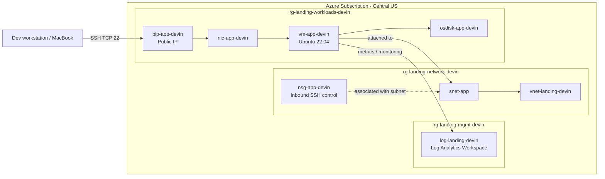
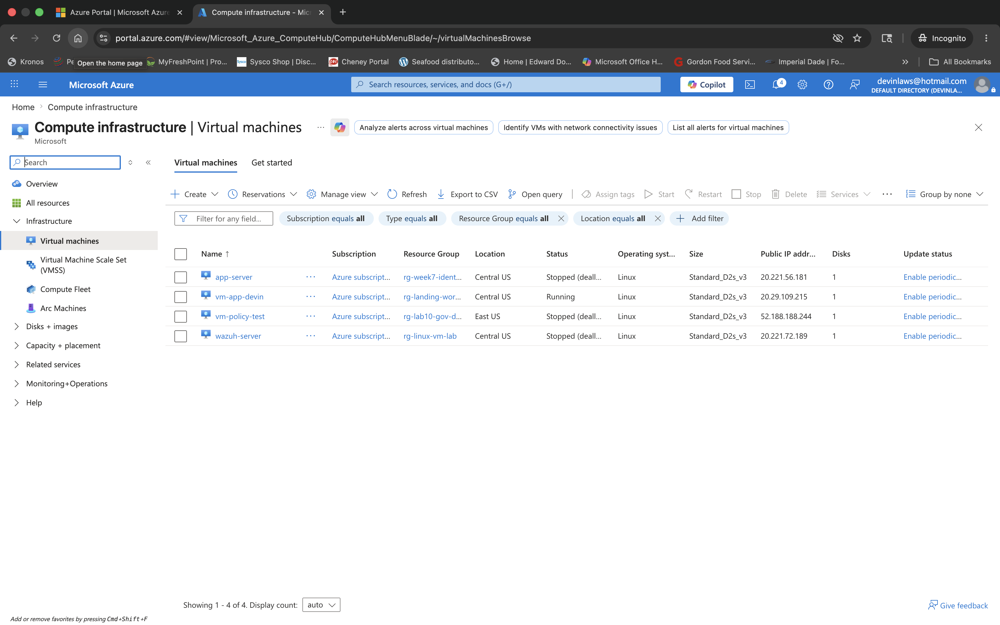
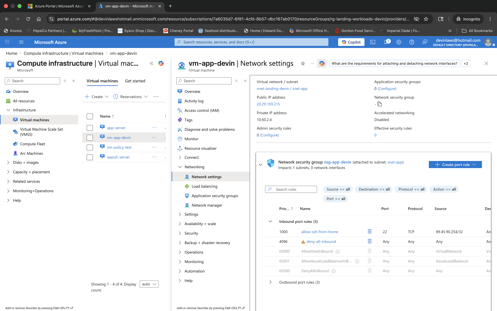
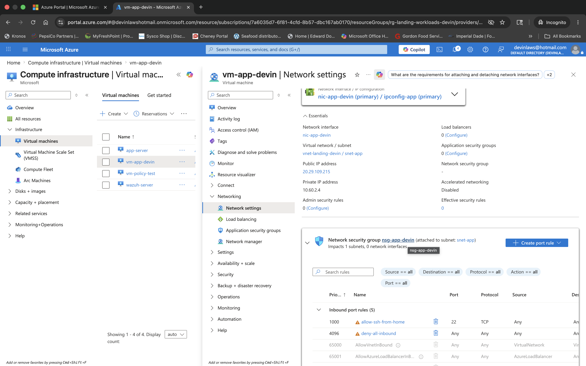
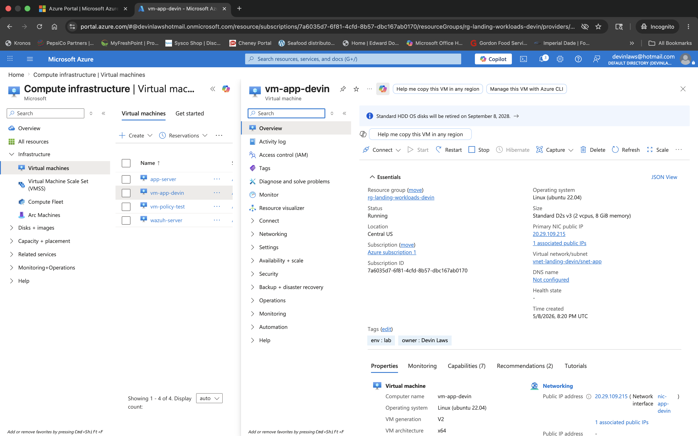

# Week 13 – Azure Landing Zone with Terraform


## Overview

This project documents the design, deployment, and validation of a small Azure landing zone built with Terraform. The environment is structured around dedicated management, networking, and workload resource groups, then validated through SSH access, NSG rule review, and Azure Monitor / Log Analytics integration.

All core resources are standardized in **Central US**, including a Linux application VM, a subnet‑level NSG, and a centralized Log Analytics workspace that receives monitoring data from the workload VM.

---

## Objectives

- Build an Azure landing zone using Terraform.
- Separate resources into management, networking, and workload resource groups.
- Deploy a Linux virtual machine (`vm-app-devin`) as a workload host.
- Control administrative access with a subnet‑associated Network Security Group.
- Validate SSH access from a home workstation.
- Integrate Azure monitoring via a Log Analytics workspace.
- Capture the deployment with an architecture diagram and screenshot gallery.

---

## Environment Summary

| Category                 | Value                         |
|--------------------------|-------------------------------|
| Cloud Provider           | Microsoft Azure               |
| Region                   | Central US                    |
| IaC Tool                 | Terraform                     |
| VM Name                  | `vm-app-devin`                |
| OS                       | Ubuntu 22.04 LTS              |
| Network Security Group   | `nsg-app-devin`               |
| Log Analytics Workspace  | `log-landing-devin`           |
| Management Resource Group| `rg-landing-mgmt-devin`       |
| Network Resource Group   | `rg-landing-network-devin`    |
| Workload Resource Group  | `rg-landing-workloads-devin`  |

---

## Architecture



---

## Deployment Narrative

### 1. Terraform build process

The lab begins from a Terraform project that defines:

- Management, network, and workload resource groups.
- A virtual network, application subnet, and NSG.
- A Linux VM with NIC, public IP, and managed OS disk.
- Logging integration and outputs for key values.

Initial `terraform apply` runs surfaced provider/state issues, which were resolved by re‑initializing and re‑applying until the plan completed successfully. This is captured in the early Terraform screenshots for the lab.

### 2. Regional planning and quota awareness

Before finalizing the deployment, Azure compute usage and vCPU quotas were checked in East US. Based on those results, the design standardized the entire landing zone in **Central US**, keeping management, networking, and workload resources aligned in a single region for simplicity and cost tracking.

### 3. Resource group segmentation

The landing zone uses a three‑tier RG structure:

- **`rg-landing-mgmt-devin`** – centralized monitoring and management (Log Analytics workspace).
- **`rg-landing-network-devin`** – shared network infrastructure (VNet, subnets, NSGs).
- **`rg-landing-workloads-devin`** – application workloads (VM, NIC, public IP, OS disk).

This separation supports clear governance boundaries and maps well to common enterprise landing zone patterns.

### 4. Network and security controls

Networking is built around `vnet-landing-devin` with an application subnet `snet-app`. The subnet is protected by **`nsg-app-devin`**, which contains:

- An inbound rule allowing SSH (TCP 22) from a specific home public IP.
- A default deny rule that blocks unsolicited inbound traffic.

During the lab, a change in the home public IP surfaced how tightly scoped NSG rules can unintentionally break access. The SSH rule was reviewed and updated to restore connectivity while maintaining a restricted surface area.

### 5. VM deployment and validation

The workload VM **`vm-app-devin`** (Ubuntu 22.04) was deployed into `rg-landing-workloads-devin` with:

- Network interface `nic-app-devin`.
- Public IP `pip-app-devin`.
- Managed OS disk `osdisk-app-devin`.

Connectivity validation steps:

- Confirmed VM status as **Running** in the Azure portal.
- Verified NIC attachment to `snet-app` in `vnet-landing-devin`.
- Confirmed the subnet’s association with `nsg-app-devin`.
- Successfully established SSH from the MacBook using:

  ```bash
  ssh -i ~/.ssh/id_rsa labadmin@<public-ip>
  ```

The final SSH session screenshot shows the Ubuntu MOTD, private VNet IP, and shell prompt on `vm-app-devin`.

### 6. Monitoring integration

Monitoring resources live in **`rg-landing-mgmt-devin`**:

- A Log Analytics workspace named `log-landing-devin` in Central US.
- Azure Monitor / Insights enabled for `vm-app-devin`.

The VM’s Monitor view confirms that the VM is sending metrics (availability, CPU, memory) into Azure Monitor, backed by the Log Analytics workspace. This creates a centralized observability plane for the landing‑zone workloads.

---

## Security Notes

- SSH access is controlled via `nsg-app-devin`, not open to “Any” by default.
- The lab highlights the operational realities of IP‑specific NSG rules when a home public IP changes.
- Administrative access was validated end‑to‑end via SSH after NSG updates.
- Monitoring is centralized, improving detection and troubleshooting compared to isolated VM‑only logs.

---

## Screenshots

All screenshots are stored in the `screenshots/` folder for this lab.

### Screenshot index

| #   | Filename                             | Description                                                                 |
|-----|--------------------------------------|-----------------------------------------------------------------------------|
| 01  | `01-terraform-provider-error.png`    | Terraform deployment troubleshooting and provider/apply error review.      |
| 02  | `02-eastus-quota-check.png`         | Azure usage and quota validation used for regional planning.               |
| 03  | `03-resource-groups-overview.png`   | Final landing‑zone resource group layout in Central US.                    |
| 04  | `04-network-rg-resources.png`       | Network resource group contents (VNet, subnet, NSG).                       |
| 05  | `05-workloads-rg-resources.png`     | Workload resource group contents (VM, NIC, public IP, OS disk).           |
| 06  | `06-vm-list-overview.png`           | Azure VM inventory after cleanup and deployment validation.                |
| 07  | `07-vm-overview-running.png`        | VM overview showing `vm-app-devin` in a running state.                     |
| 08  | `08-nsg-ssh-rule.png`               | Initial SSH security rule review for `nsg-app-devin`.                      |
| 09  | `09-ssh-session-success.png`        | Successful SSH login from the MacBook into `vm-app-devin`.                |
| 10  | `10-log-analytics-workspace.png`    | Log Analytics workspace overview for `log-landing-devin`.                  |
| 11  | `11-nsg-app-devin-ssh-rule.png`     | Detailed inbound rule configuration for SSH in `nsg-app-devin`.           |
| 12  | `12-nsg-allow-ssh-updated.png`      | Updated SSH allow rule after troubleshooting home IP access issues.       |

### Screenshot gallery

> Update the relative paths only if your folder layout differs.

#### Terraform and deployment


#### Networking and workloads





#### Access control and validation





#### Monitoring



---

## Key Outcomes

- Built a functional Azure landing zone using Terraform.
- Segmented the environment into management, network, and workload resource groups.
- Deployed and validated a Linux VM for workload testing.
- Implemented and troubleshot NSG‑based SSH access controls.
- Verified administrative access via SSH from an external workstation.
- Integrated centralized monitoring through a Log Analytics workspace.
- Produced a reusable, portfolio‑ready lab artifact.

---

## Lessons Learned

### Infrastructure as Code still requires hands‑on validation

Even when Terraform successfully provisions resources, real validation is essential. Quotas, regional placement, security rules, and monitoring must all be tested from the perspective of an operator, not just a template.

### Network controls are powerful but brittle if assumptions change

Restricting SSH to a single home IP is good security hygiene, but this lab showed how quickly that assumption can break access when the ISP changes the public address. Revisiting and updating NSG rules became an important part of the troubleshooting story.

### Monitoring belongs in the landing zone, not as an afterthought

Building Log Analytics and Azure Monitor into the landing zone from the start created a more realistic environment and a stronger portfolio narrative. Observability became a first‑class design goal rather than a bolt‑on.

---

## Repository Structure

```text
week-13-azure-landing-zone/
├── diagrams/
│   └── architecture.md        # Optional: mermaid diagram or notes
├── screenshots/               # All 12 screenshots for this lab
├── logging.tf
├── main.tf
├── network.tf
├── outputs.tf
├── policy.tf
├── README.md                  # This file
├── terraform.lock.hcl
├── terraform.tfstate*
├── terraform.tfvars
├── variables.tf
└── workload.tf
```

---

## Core Commands Used

```bash
terraform init
terraform plan
terraform apply

az vm list-usage --location eastus -o table

ssh -i ~/.ssh/id_rsa labadmin@<public-ip>
```

---

## Author

**Devin Laws**  
Help Desk Analyst • Cloud & Cybersecurity Transition  
[LinkedIn](https://linkedin.com/in/dlaws2030) • [GitHub](https://github.com/devinlaws50-wq/cyber-notes)