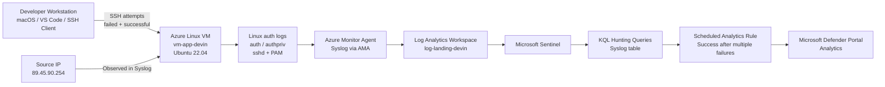
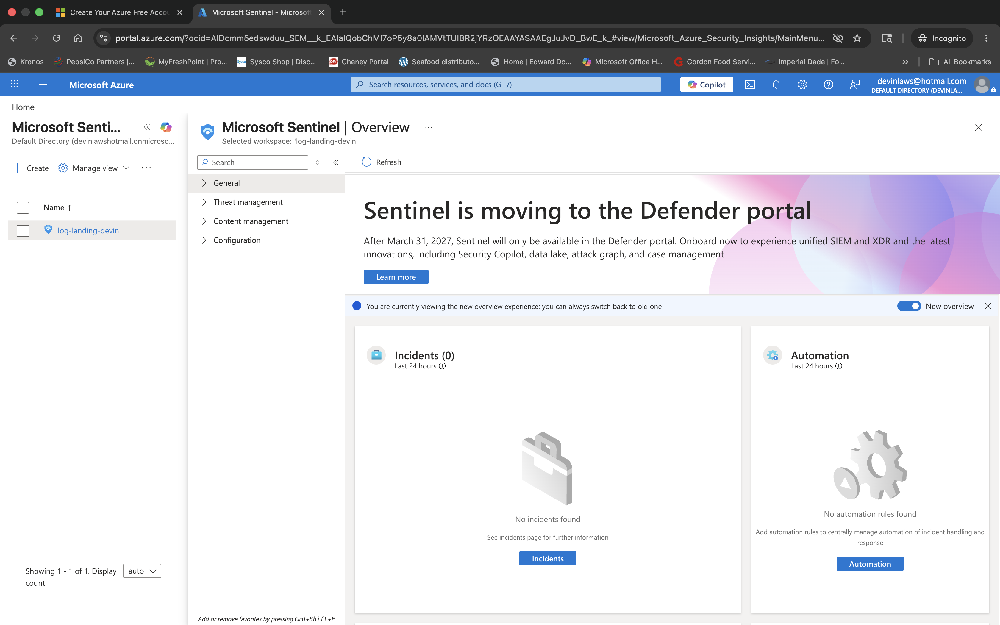
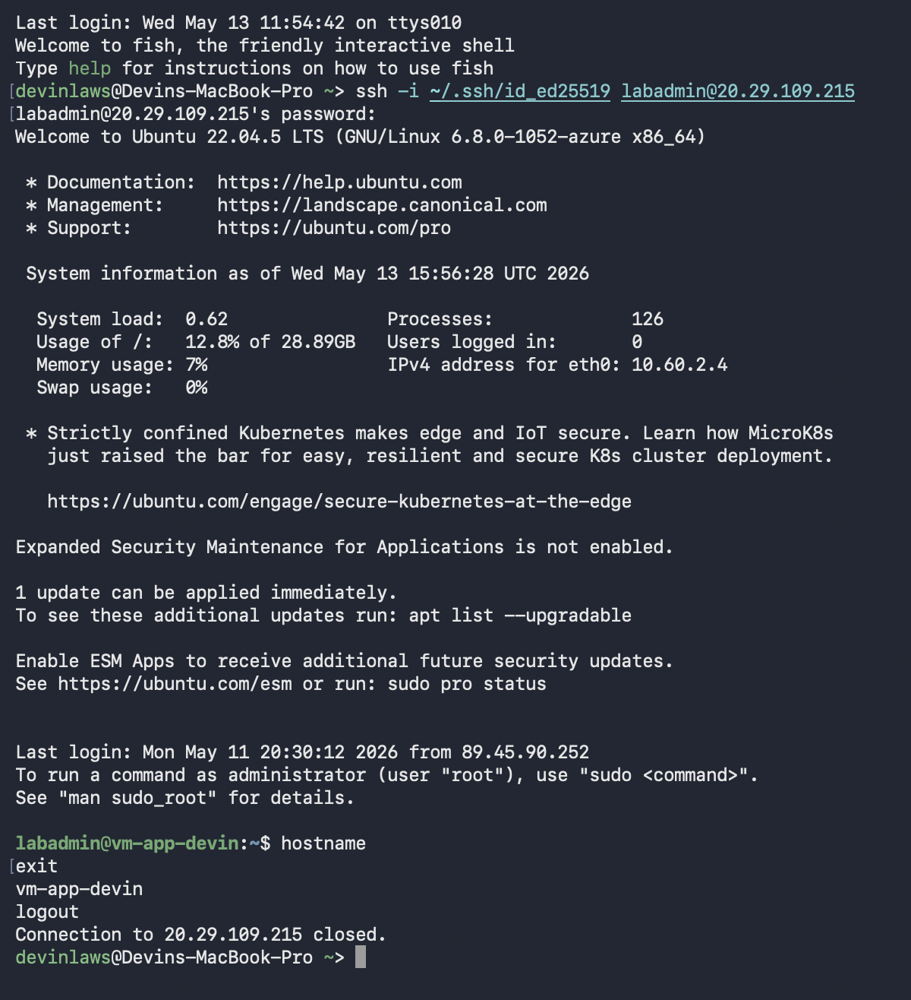
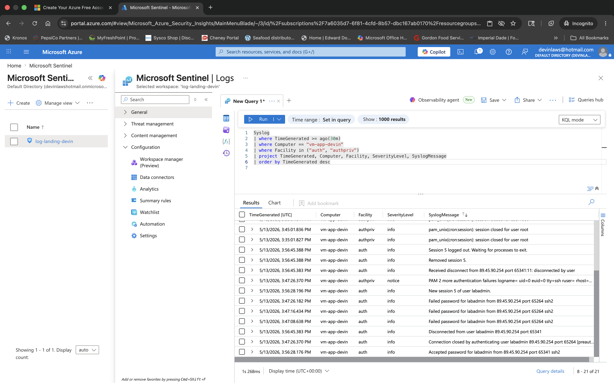
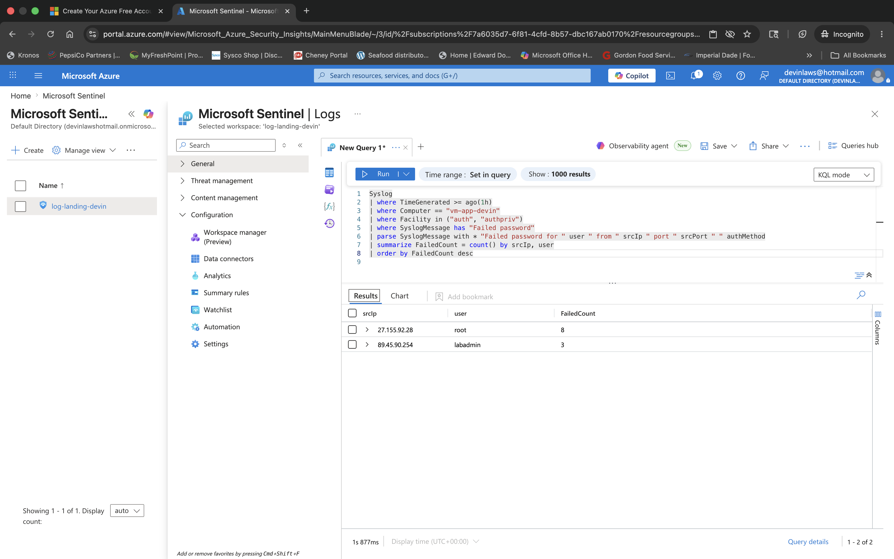
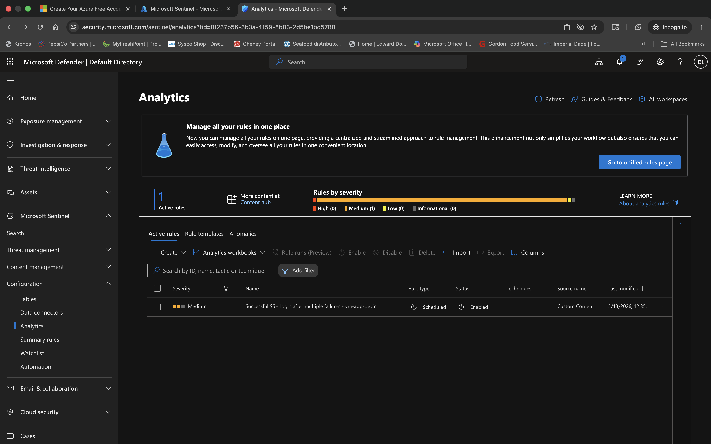

# Week 14: Azure Sentinel Landing Zone


## 📌 Objective

This lab focused on building an Azure Sentinel landing zone on top of an existing Log Analytics workspace, onboarding Linux Syslog authentication data, generating failed and successful SSH activity, and creating a scheduled analytics rule to detect a successful SSH login after multiple failures.[web:617][web:484]

## 🎯 Outcomes

- Enabled Microsoft Sentinel using an existing Log Analytics workspace.[web:617]
- Validated Linux Syslog ingestion for `auth` and `authpriv` events through the Azure Monitor Agent data path.[web:416][web:516]
- Generated controlled SSH failures and a successful login against `vm-app-devin` to produce realistic authentication telemetry.[web:484]
- Queried Sentinel with KQL to identify failed SSH attempts by source IP and successful access after repeated failures.[web:484][web:629]
- Created a scheduled analytics rule in the Defender portal to alert on that pattern.[web:625][web:675]

## 🛠️ Tools & Technologies

- Microsoft Azure
- Microsoft Sentinel
- Log Analytics Workspace
- Azure Monitor Agent (AMA)
- Ubuntu Linux VM
- Terraform
- Kusto Query Language (KQL)
- Microsoft Defender portal
- SSH

## 🧱 Environment

This lab used an existing Azure landing zone and Log Analytics workspace, then layered Sentinel detection capabilities on top for centralized monitoring and analytics.[web:617] SSH authentication events from the Ubuntu VM were ingested into the `Syslog` table, where they were later used for both hunting queries and scheduled detection logic.[web:416][web:678]

## 🗺️ Architecture

The detection flow moved from SSH activity on the Linux VM to Syslog ingestion through AMA, then into Log Analytics and Microsoft Sentinel for KQL analysis and alerting.[web:510][web:516]



## ⚙️ Implementation Walkthrough

### 1. Enabled Sentinel Workspace

Microsoft Sentinel was enabled against the existing Log Analytics workspace so the environment could ingest, query, and alert on security telemetry.[web:617]

### 2. Verified Syslog Collection

Syslog ingestion was validated for Linux authentication facilities, which is the expected path for SSH authentication records collected through AMA.[web:416][web:516]

### 3. Generated SSH Activity

Multiple failed password attempts were created first, followed by a successful SSH login to `vm-app-devin`, producing the exact sequence needed for detection testing.[web:484]

Example successful connection used during validation:

```bash
ssh -i ~/.ssh/id_ed25519 labadmin@20.29.109.215
hostname
exit
```

### 4. Queried Raw Authentication Events

The `Syslog` table was queried for `auth` and `authpriv` records to confirm that both `Failed password` and `Accepted password` events were present for the VM.[web:484][web:678]

```kusto
Syslog
| where TimeGenerated >= ago(30m)
| where Computer == "vm-app-devin"
| where Facility in ("auth", "authpriv")
| project TimeGenerated, Computer, Facility, SeverityLevel, SyslogMessage
| order by TimeGenerated desc
```

### 5. Queried Failed SSH Attempts by Source IP

KQL was used to summarize failed SSH attempts by source IP so the repeated authentication failures could be quickly identified.[web:484]

```kusto
Syslog
| where TimeGenerated >= ago(1h)
| where Computer == "vm-app-devin"
| where Facility in ("auth", "authpriv")
| where SyslogMessage has "Failed password"
| parse SyslogMessage with * "Failed password for " user " from " srcIp " port " srcPort " " authMethod
| summarize FailedCount = count() by srcIp, user
| order by FailedCount desc
```

### 6. Correlated Success After Multiple Failures

A second KQL query was used to correlate a later successful login from the same IP and user after three or more failed attempts within a short time window.[web:629][web:675]

```kusto
let FailedLogons =
    Syslog
    | where TimeGenerated >= ago(1h)
    | where Computer == "vm-app-devin"
    | where Facility in ("auth", "authpriv")
    | where SyslogMessage has "Failed password"
    | parse SyslogMessage with * "Failed password for " user " from " srcIp " port " srcPort " " authMethod
    | summarize FailedCount = count(), FirstFailed = min(TimeGenerated), LastFailed = max(TimeGenerated) by srcIp, user;
let SuccessfulLogons =
    Syslog
    | where TimeGenerated >= ago(1h)
    | where Computer == "vm-app-devin"
    | where Facility in ("auth", "authpriv")
    | where SyslogMessage has "Accepted password" or SyslogMessage has "Accepted publickey"
    | parse SyslogMessage with * "Accepted " authMethod " for " user " from " srcIp " port " srcPort " " *
    | project SuccessTime = TimeGenerated, srcIp, user, authMethod;
FailedLogons
| join kind=inner SuccessfulLogons on srcIp, user
| where SuccessTime >= LastFailed and SuccessTime <= LastFailed + 15m
| where FailedCount >= 3
| project srcIp, user, FailedCount, FirstFailed, LastFailed, SuccessTime, authMethod
| order by SuccessTime desc
```

### 7. Created the Scheduled Analytics Rule

The final detection was built as a scheduled analytics rule in the Microsoft Defender portal, which is now the management path for Sentinel analytics in many tenants.[web:625][web:679] The rule logic alerts when a successful SSH login occurs after three or more failed attempts from the same source IP.[web:617][web:629]

## 📸 Screenshots

> Save all screenshots in: `week-14-azure-sentinel-landing-zone/screenshots/`

### 1. Sentinel workspace enabled



### 2. Successful SSH login to vm-app-devin



### 3. Raw Syslog SSH events in Sentinel Logs



### 4. Failed SSH by source IP query results



### 5. Scheduled analytics rule enabled in Defender portal



## 🧠 What I Learned

This lab tied together infrastructure, telemetry, and detection engineering in a practical way by showing how Linux auth logs can flow from a VM into Sentinel for analysis and alerting.[web:416][web:510] It also reinforced the value of validating detections with controlled test activity instead of assuming a rule works just because it saves successfully.[web:629][web:677]

## 🚧 Challenges & Troubleshooting

- Sentinel analytics management redirected from the Azure portal to the Defender portal, so the scheduled rule had to be completed there instead of the older Azure-only workflow.[web:625][web:679]
- The scheduled rule wizard initially failed validation until the KQL query was cleaned up and the scheduling fields were fully populated.[web:617]
- SSH testing initially failed because the placeholder identity file path was incorrect, but the correct `id_ed25519` key successfully authenticated to the VM after the path was fixed.[web:484]

## ✅ Validation

The lab was considered complete after Syslog showed both failed and successful SSH events, the correlation query returned the expected row for the source IP and user, and the scheduled analytics rule validated successfully in the Defender portal.[web:484][web:617]

## 🧹 Cleanup

After validation and screenshots were complete, the Ubuntu VM could be stopped and deallocated to avoid unnecessary Azure compute charges while preserving the Sentinel configuration and documentation for the lab.[web:678]