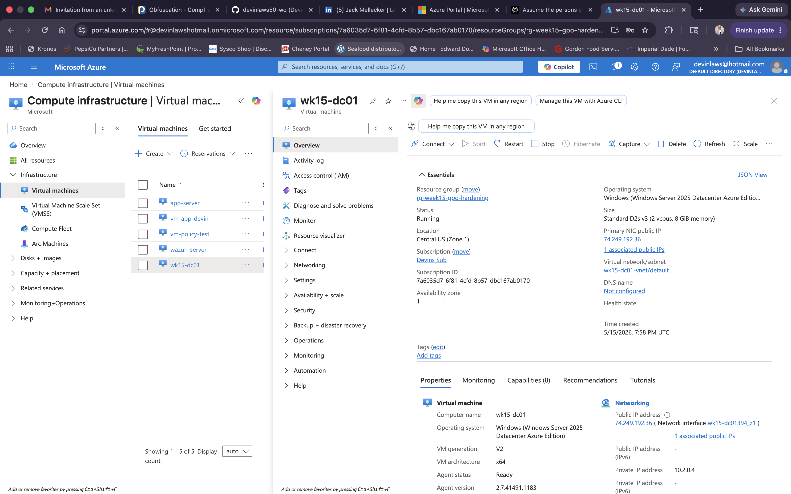
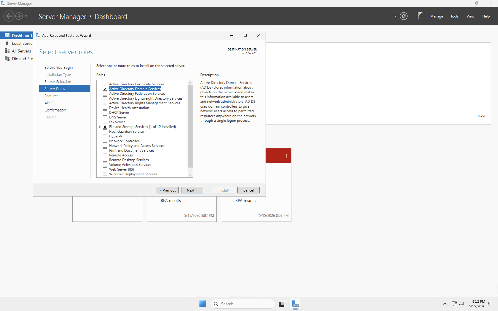
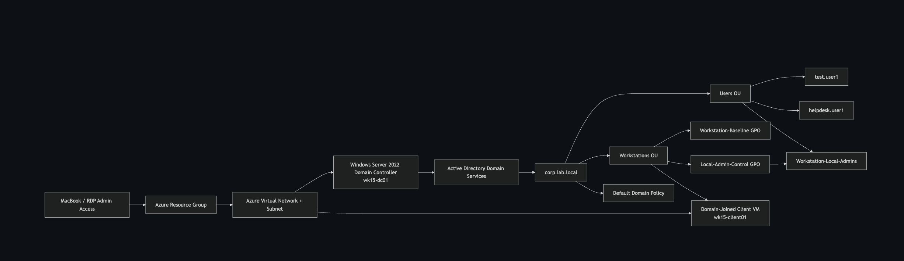

# Windows Server 2022 Group Policy Hardening in Azure

> **Week 15 Lab** · Systems Administration · Active Directory · Group Policy · Windows Security Hardening  
> Platform: Microsoft Azure · OS: Windows Server 2022 · Services: AD DS, Group Policy Management

## 📌 Project Overview

This lab demonstrates the deployment of a Windows Server 2022 virtual machine in Microsoft Azure and its promotion to a Domain Controller using Active Directory Domain Services (AD DS). The lab then applies Group Policy Objects (GPOs) to enforce security controls across a small domain environment.

The focus of this project is to build foundational Windows systems administration skills by creating a lab domain, organizing users and workstations, implementing password and account lockout policies, restricting local administrator access, and validating policy application.

## 🎯 Objectives

- Deploy a Windows Server 2022 VM in Azure
- Install the Active Directory Domain Services role
- Promote the server to a new forest and domain
- Create Organizational Units (OUs), users, and security groups
- Configure password and account lockout policies
- Restrict local administrator membership with domain groups
- Apply workstation security hardening through GPO
- Validate policy application with `gpupdate` and `gpresult`

## 🎥 Walkthrough

Add your Loom walkthrough link here after recording.

[Watch the walkthrough](#)

## 🛠️ Tools & Technologies

- Microsoft Azure
- Windows Server 2022
- Active Directory Domain Services (AD DS)
- Group Policy Management Console (GPMC)
- Active Directory Users and Computers (ADUC)
- Remote Desktop Protocol (RDP)
- Command Prompt / PowerShell
- Event Viewer
- `gpupdate`
- `gpresult`

## 🧱 Lab Environment

| Component | Purpose |
|---|---|
| Azure Resource Group | Contains all Week 15 lab resources |
| Azure Virtual Network | Provides network connectivity for the lab |
| Windows Server 2022 VM | Serves as the Domain Controller |
| Active Directory Domain | Centralized identity and policy management |
| Organizational Units | Organize users and workstations |
| Group Policy Objects | Apply security controls across the domain |
| Domain Users / Groups | Used for access control and testing |
| Domain-joined Client VM | Used to validate policy enforcement |

## ⚙️ Configuration Steps

### 1. Azure VM Deployment

A Windows Server 2022 VM was deployed in Microsoft Azure using a dedicated resource group, virtual network, subnet, and public IP for remote administration.

### 2. Install AD DS

The Active Directory Domain Services role was installed through Server Manager to prepare the server for domain controller promotion.

### 3. Promote to Domain Controller

The server was promoted to a new forest and configured as the first domain controller for the lab domain.

### 4. Create Active Directory Structure

Organizational Units for users and workstations were created, along with test user accounts and security groups for administrative control.

### 5. Configure Group Policy

Group Policy Management was used to create and link GPOs that support domain security and workstation hardening.

### 6. Apply Security Hardening Policies

Security settings were configured to improve baseline protection for domain-joined systems.

### 7. Restrict Local Administrator Access

A domain security group was used to control which users receive local administrator access on managed systems.

### 8. Update and Validate Policy Application

Policy updates were forced and then validated using built-in Windows administrative tools.

### 9. Domain Join Test

A client virtual machine was joined to the domain to test the applied policies and confirm central management was functioning as expected.

## 🔐 GPOs Implemented

| GPO Name | Purpose | Target |
|---|---|---|
| Default Domain Policy Updates | Enforce password and account lockout settings | Domain |
| Workstation Baseline | Apply security hardening settings to domain-joined systems | Workstations OU |
| Local Admin Control | Restrict local Administrators group membership | Workstations OU |

## 🗺️ Architecture Diagram

The following diagram shows the Azure infrastructure and Active Directory components used in this lab.

## 🧠 Key Skills Demonstrated

- Windows Server administration
- Active Directory deployment and management
- Group Policy design and implementation
- Security hardening and access control
- User, group, and OU management
- Domain-based administration
- Policy validation and troubleshooting

## ✅ Outcome

This lab demonstrates hands-on experience deploying and securing a Windows-based Active Directory environment in Azure. It highlights practical systems administration skills and shows how Group Policy can be used to apply centralized security controls in a domain environment.

## 📸 Screenshots

- Azure VM deployment overview
- AD DS role installation
- Domain controller promotion
- Active Directory Users and Computers
- Group Policy Management Console
- GPO security settings
- Local admin restriction policy
- `gpupdate /force` results
- `gpresult` policy results
- Domain users and groups created
- Workstations OU with linked GPO
- Event Viewer policy validation
- Client VM domain join
- Password policy settings
- Account lockout policy settings