# Week 15: Windows Server GPO Hardening Lab in Azure

This lab demonstrates how to build a small Active Directory environment in Azure, create and link Group Policy Objects (GPOs), enforce password and account lockout controls, manage local administrator access with Restricted Groups, and validate policy application on a domain-joined client VM.

## Loom Walkthrough

[Add your Loom walkthrough link here](https://www.loom.com/share/6d6c27c993254649a2ca5d64d586128b)

## Lab Overview

The goal of this project was to simulate a lightweight enterprise Windows administration workflow by deploying a domain controller in Azure, creating a client VM in the same virtual network, applying security-focused Group Policy settings, and confirming those policies applied successfully on the client system.

## Architecture

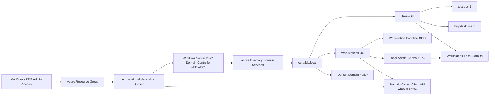

The environment used one Windows Server VM as the domain controller and a second Windows Server VM as a client-style endpoint for domain join and GPO validation. Both systems were deployed in the same Azure virtual network, and the VNet DNS setting was pointed to the domain controller’s private IP so the client could resolve and join `corp.lab.local` correctly.

## Objectives

- Deploy a Windows Server domain controller in Azure.
- Create a new Active Directory forest and domain: `corp.lab.local`.
- Build a simple OU structure for users and workstations.
- Create test users and a delegated local admin group.
- Create and link GPOs for workstation hardening and local admin control.
- Configure password and account lockout policies in the Default Domain Policy.
- Join a client VM to the domain and validate policy application with `gpupdate` and `gpresult`.

## Technologies Used

- Microsoft Azure Virtual Machines
- Windows Server 2022
- Active Directory Domain Services (AD DS)
- Group Policy Management Console (GPMC)
- Active Directory Users and Computers (ADUC)
- Windows Event Viewer
- Remote Desktop Protocol (RDP)

## Environment Details

| Component | Purpose |
|---|---|
| `wk15-dc01` | Domain controller hosting AD DS and Group Policy management |
| `wk15-client01` | Domain-joined client VM used to validate GPO application |
| `corp.lab.local` | Active Directory lab domain |
| `Users` OU | Container for test user accounts and delegated admin group |
| `Workstations` OU | Container for the joined client computer object |
| `Workstation-Baseline` | GPO used for workstation security settings |
| `Local-Admin-Control` | GPO used to manage local administrator membership |
| `Default Domain Policy` | Domain-level password and account lockout settings |

## Implementation Steps

### 1. Deployed the domain controller

A Windows Server 2022 VM was deployed in Azure and promoted to a domain controller for a new forest named `corp.lab.local` using Active Directory Domain Services.

### 2. Built the Active Directory structure

Inside ADUC, the lab domain was organized with two custom OUs: `Users` and `Workstations`. Two test user accounts were created, along with a security group named `Workstation-Local-Admins` for delegated local admin control.

### 3. Created and linked Group Policy Objects

Using the Group Policy Management Console, two GPOs were created and linked to the `Workstations` OU: `Workstation-Baseline` and `Local-Admin-Control`. GPMC is the primary interface used to create, edit, link, and manage GPOs across a domain environment.

### 4. Configured workstation security settings

The `Workstation-Baseline` GPO was used to define baseline security controls, including audit policy settings such as successful and failed logon auditing. This created a basic hardening layer that could later be validated on the client VM through Group Policy refresh and policy results output.

### 5. Configured delegated local administrator control

The `Local-Admin-Control` GPO was configured with Restricted Groups, which allows administrators to centrally control membership of sensitive local groups on domain-joined systems. The domain group `Workstation-Local-Admins` was added so it could be used to manage local administrator access on workstations in a controlled and repeatable way.

### 6. Configured password and account lockout policy

The Default Domain Policy was updated with domain-wide password and lockout controls, including password complexity, minimum password length, password history, account lockout threshold, and lockout duration. These settings were configured at the domain policy level because password and account lockout policies are domain account policies rather than workstation-only settings.

### 7. Deployed and joined the client VM

A second VM, `wk15-client01`, was deployed in the same Azure virtual network and subnet as the domain controller. The Azure VNet DNS setting was changed to use the domain controller’s private IP so the client could resolve the Active Directory domain and join `corp.lab.local` successfully.

### 8. Moved the client into the Workstations OU

After the domain join, the client computer object was moved into the `Workstations` OU so the linked workstation GPOs would apply to it.

### 9. Validated policy application

On the client VM, `gpupdate /force` was used to immediately refresh Group Policy instead of waiting for the normal background cycle. Policy application was then validated with `gpresult /r`, which showed the applied GPOs on the domain-joined client.

## Screenshots

### Domain Controller Build and Promotion

*Azure VM overview for the Windows Server domain controller.*

*Server Manager with Active Directory Domain Services installation workflow.*

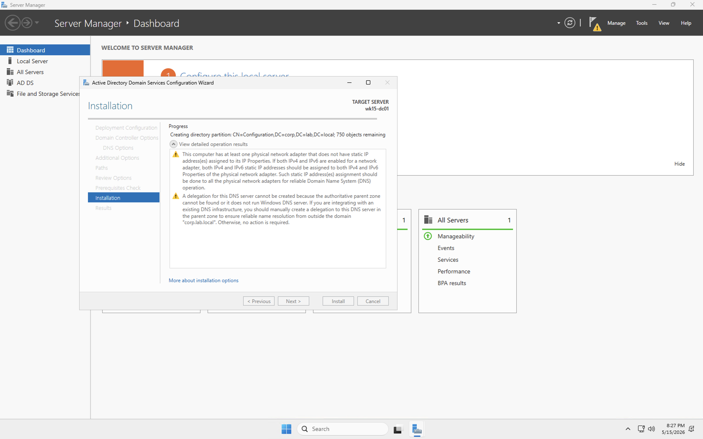
*Domain controller promotion process for the new `corp.lab.local` forest.*

### Active Directory Structure

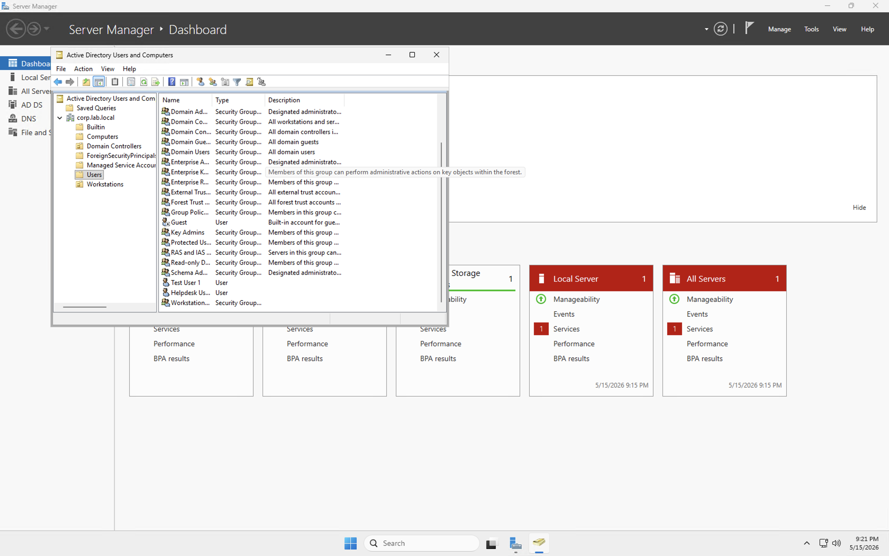
*ADUC showing the `corp.lab.local` domain structure with `Users` and `Workstations` OUs.*

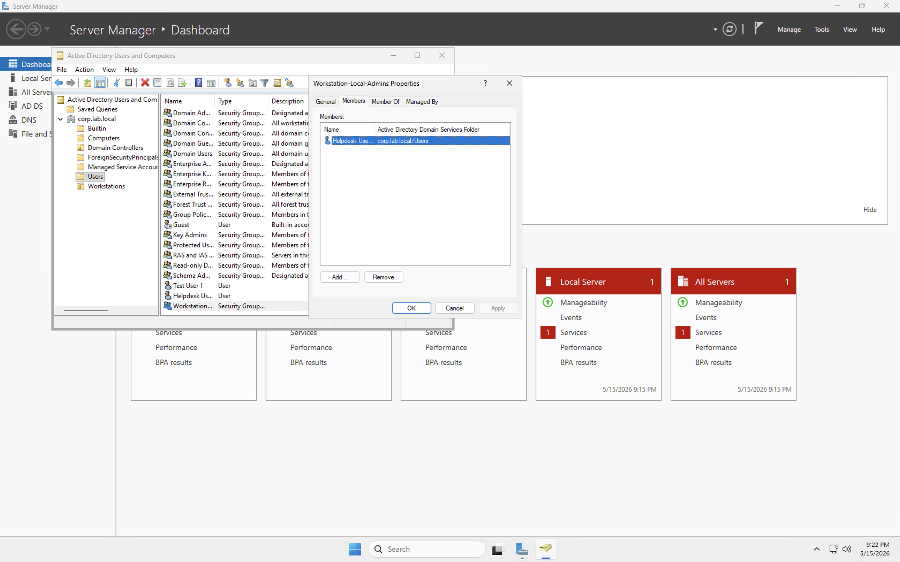
*Test users and the `Workstation-Local-Admins` group created in Active Directory.*

### Group Policy Configuration

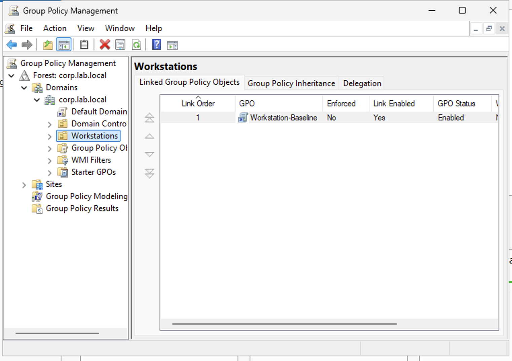
*Group Policy Management Console with workstation-linked GPOs.*

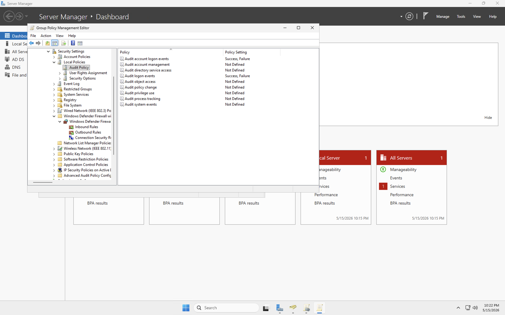
*Security settings configured in the `Workstation-Baseline` GPO.*

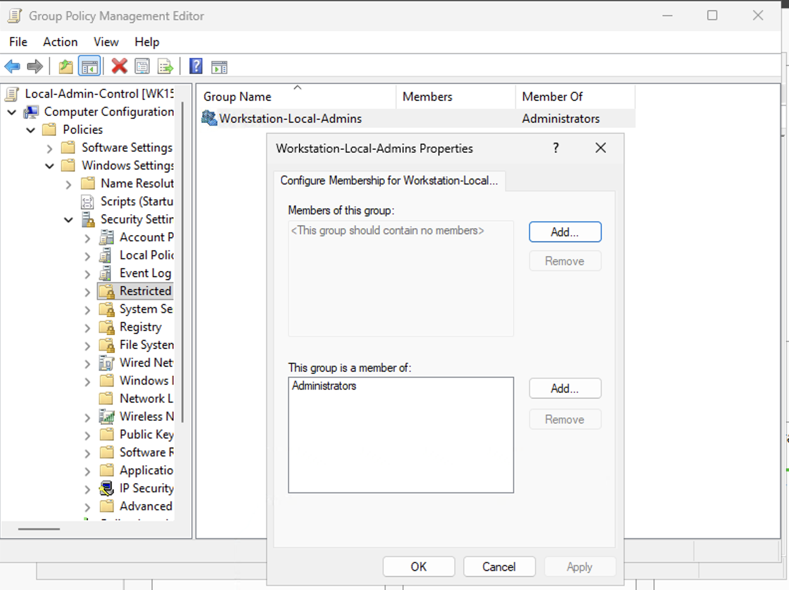
*Restricted Groups configuration for delegated local administrator management.*

### Client Join and Validation

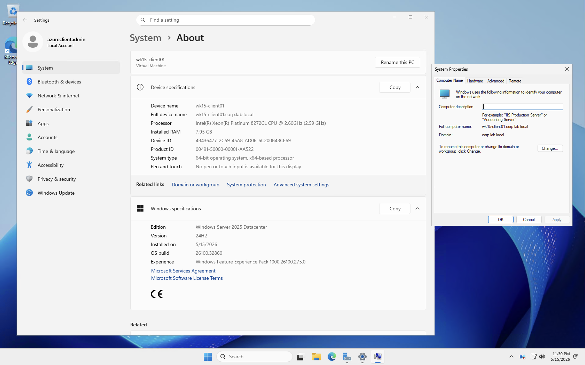
*Client VM successfully joined to the `corp.lab.local` domain.*

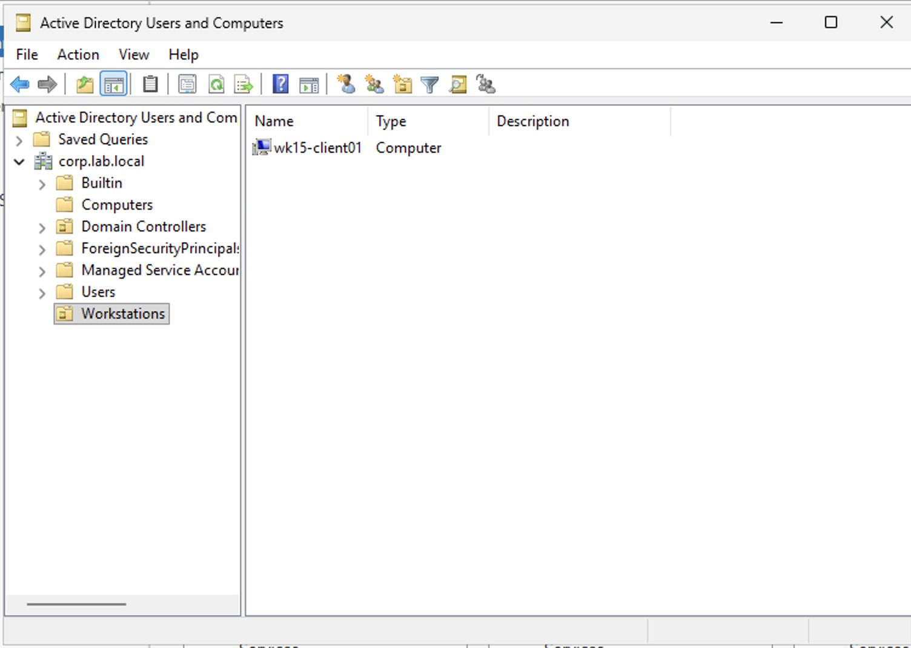
*Client computer object placed in the `Workstations` OU where workstation GPOs are linked.*

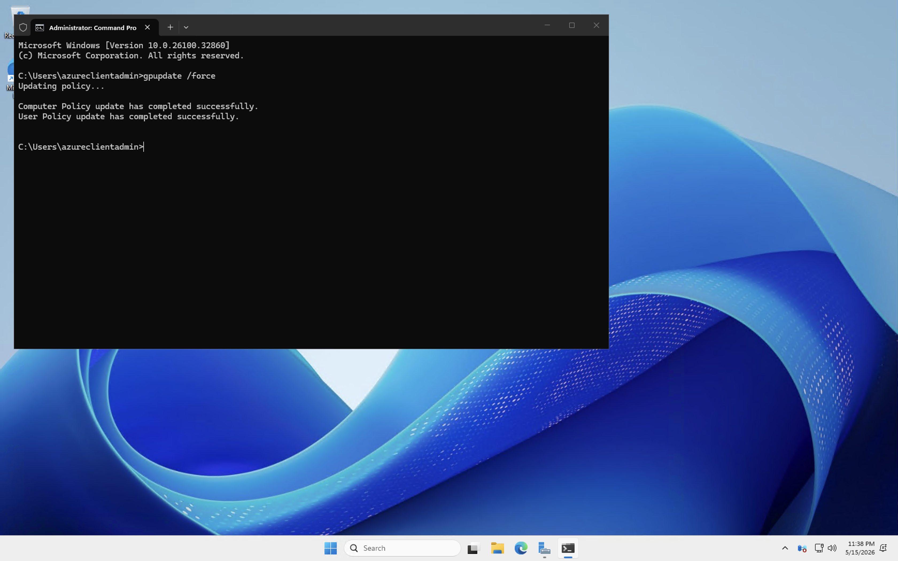
*Forced Group Policy refresh on the client using `gpupdate /force`.*

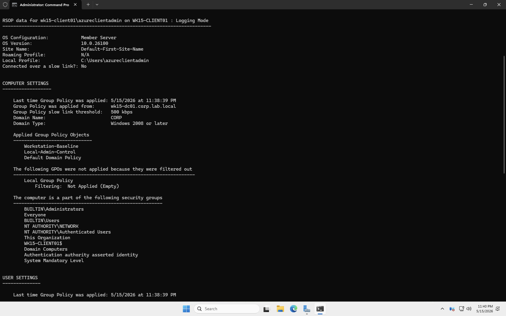
*`gpresult /r` output showing applied Group Policy Objects on the client.*

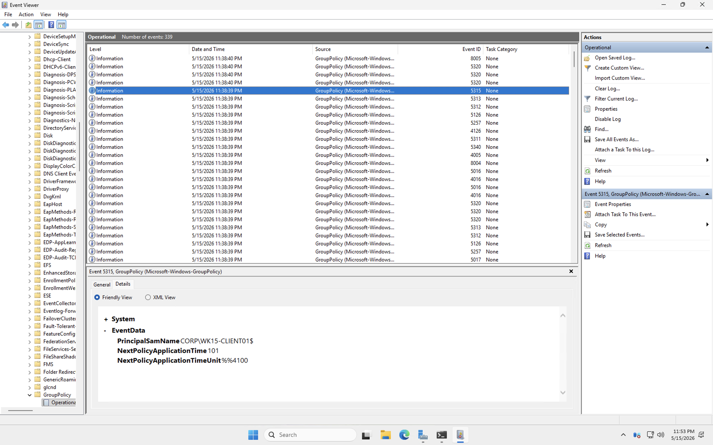
*Event Viewer used to validate Group Policy processing and related system activity on the client.*

### Domain Policy Controls

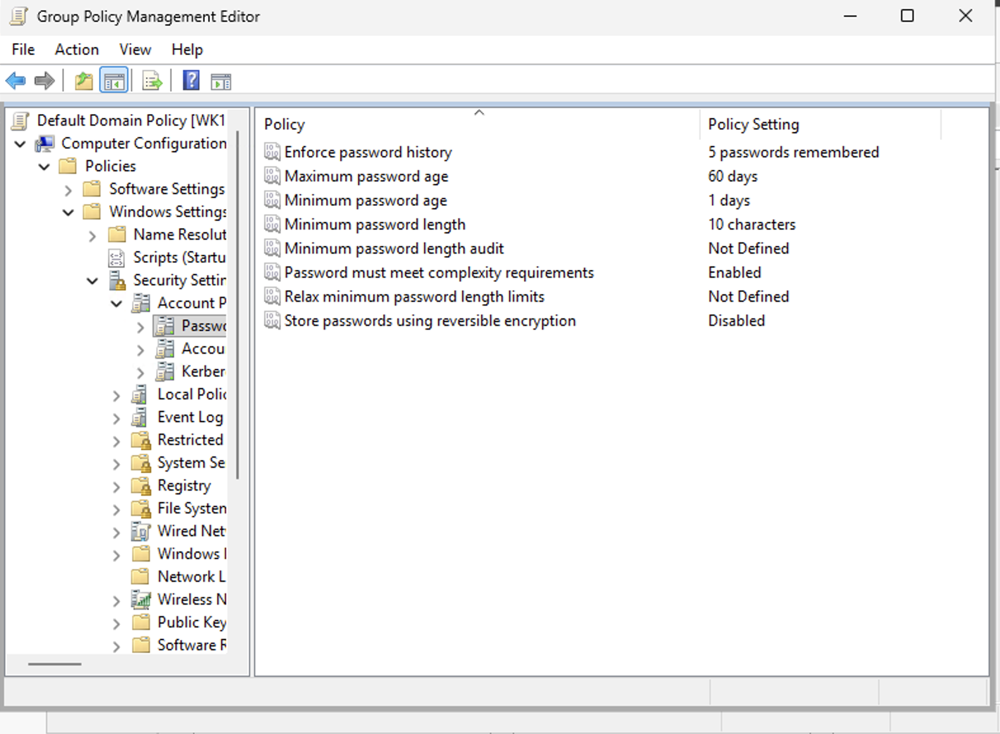
*Password policy configuration in the Default Domain Policy.*

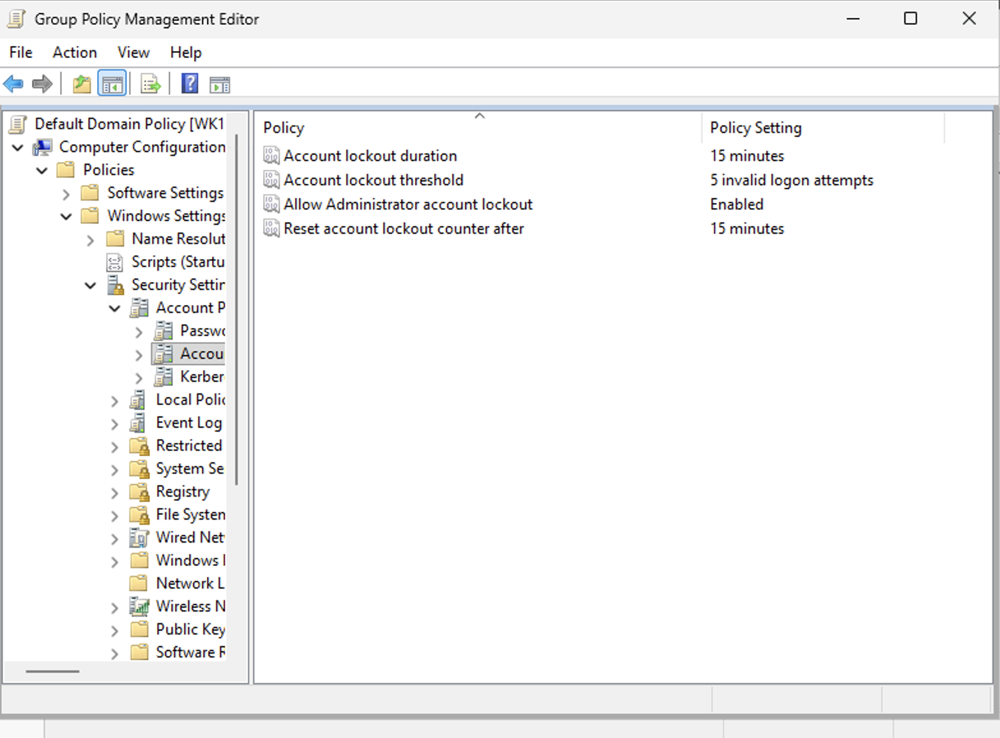
*Account lockout policy configuration in the Default Domain Policy.*

## Key Security Concepts Demonstrated

### Group Policy Centralization

This project shows how Windows administrators can define security settings once and apply them consistently to domain-joined systems through linked GPOs instead of managing each machine manually.

### OU-Based Scope of Management

By separating computers into a `Workstations` OU, the lab demonstrates how policy scope can be controlled through Active Directory structure.

### Restricted Groups for Privileged Access Control

Restricted Groups provides a centralized way to define group membership for security-sensitive groups and reduce inconsistent local administrator assignments across systems.

### Domain Account Protections

Password history, complexity requirements, and account lockout thresholds help reduce weak password usage and limit repeated failed logon attempts.

### Policy Validation and Troubleshooting

`gpupdate`, `gpresult`, and Event Viewer provide a practical validation workflow for confirming that policies were applied and troubleshooting when they were not.

## Challenges and Troubleshooting

Several practical issues were encountered and resolved during the build:

- The Group Policy Management tree initially appeared collapsed, which made OU-linked workflows harder to find until the domain node was expanded.
- Azure networking had to be adjusted so the client VM used the domain controller as its DNS server; without this, domain join would not work correctly.
- The client computer object needed to be moved into the `Workstations` OU before workstation-linked GPOs would apply.
- Restricted Groups required careful placement of the delegated group to avoid unintentionally overwriting local group membership.

## Outcome

The lab successfully demonstrated an end-to-end Windows administration workflow in Azure: domain controller deployment, Active Directory structure creation, GPO management, local admin control, domain policy enforcement, client domain join, and Group Policy validation.

## Skills Demonstrated

- Azure VM deployment and networking
- Windows Server administration
- Active Directory Domain Services
- Organizational Unit design
- Group Policy creation and linking
- Restricted Groups configuration
- Password and account lockout policy configuration
- Domain join troubleshooting
- Group Policy validation with `gpupdate`, `gpresult`, and Event Viewer

## Next Improvements

Possible next iterations for this lab include:

- Adding more workstation hardening settings such as Defender Firewall, advanced audit policy, and user rights assignments.
- Testing additional users and delegated admin scenarios against the local admin control GPO.
- Exporting GPO reports and documenting policy settings in a change-control style format using GPMC reporting features.
- Extending the environment with additional client systems or a second OU to demonstrate policy inheritance and filtering.