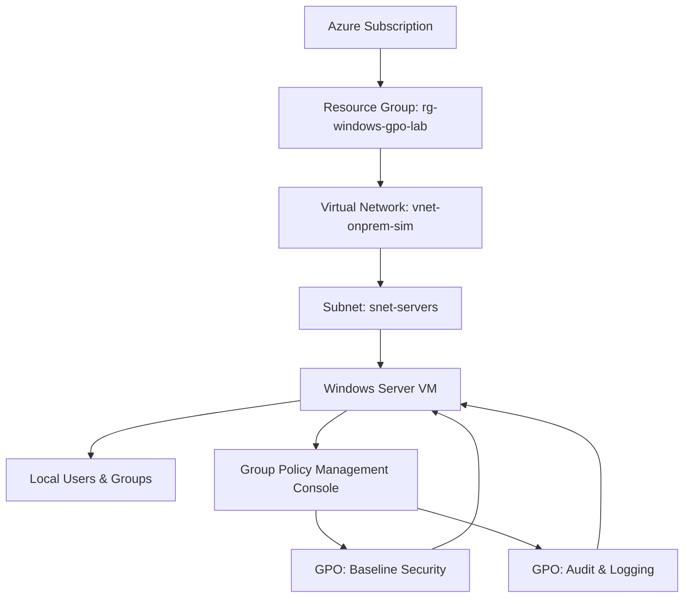

# Week 15 – Windows Server GPO Hardening Lab

This lab walks through building and hardening an on-prem-style Windows Server environment using Group Policy Objects (GPOs) to reduce attack surface and enforce security baselines.

## Lab Objectives

- Deploy a Windows Server virtual machine in Azure to simulate an on-prem server.
- Configure basic server roles and features required for a small environment.
- Create and link Group Policy Objects to harden authentication, auditing, and user rights.
- Validate that GPO settings apply correctly using both GUI and command-line tools.
- Capture evidence screenshots and document the hardening impact.

## Architecture Overview

The following diagram shows the high-level architecture for this lab, including the Azure subscription, resource group, virtual network, and the Windows Server VM.

## Lab Environment

- Cloud provider: Microsoft Azure
- Resource group: `rg-windows-gpo-lab`
- Virtual network: `vnet-onprem-sim`
- Subnet: `snet-servers`
- Windows Server: 2022 Datacenter (Azure Marketplace image)
- VM size: `Standard_D2s_v3`
- Authentication: Local admin account (no domain controller in this lab)

## Prerequisites

- Active Azure subscription with permission to create resource groups and virtual machines.
- Azure Portal access.
- Basic familiarity with:
  - Windows Server administration
  - Group Policy Objects (GPOs)
  - RDP connectivity

---

## Step 1 – Deploy the Windows Server VM

1. Create a resource group for the lab.
2. Create a virtual network and subnet.
3. Deploy a Windows Server 2022 Datacenter VM into the subnet.
4. Allow RDP access (3389) from your IP only using an NSG.
5. Connect to the VM using RDP.

### VM Deployment Screenshot

---

## Step 2 – Initial Server Configuration

1. Rename the server to a meaningful hostname.
2. Configure Windows Update and verify current patch level.
3. Set the correct time zone.
4. Verify local administrator account and create a standard user account for testing.

### Server Manager and Local Configuration

---

## Step 3 – Install Required Roles and Features

1. Use Server Manager or PowerShell to add any roles/features required for the lab.
2. Confirm installation of:
   - Group Policy Management Console (GPMC)
   - Any additional management tools needed.

### Role Installation Screenshot

---

## Step 4 – Create and Configure GPOs

In this lab, you will create at least two GPOs:

- **Baseline Security GPO**  
  Hardens local policies such as password complexity, lockout thresholds, and user rights assignments.

- **Audit and Logging GPO**  
  Enables advanced audit policies and configures log retention for security monitoring.

### Baseline Security GPO

Key settings (examples):

- Enforce password history
- Minimum password length
- Account lockout threshold
- Restrict local logon rights

### Audit and Logging GPO

Key settings (examples):

- Audit logon events (Success/Failure)
- Audit account logon events
- Audit object access
- Security log size and retention

---

## Step 5 – Link GPOs and Force Update

1. Link the GPOs to the appropriate scope (in this lab, the local server or a simulated OU).
2. Run `gpupdate /force` on the server to ensure policies are applied.
3. Use `gpresult /r` or `gpresult /h` to confirm GPO application.

---

## Step 6 – Validate Hardening

1. Attempt to log in with weak passwords or invalid credentials to trigger lockout.
2. Review the Security event log in Event Viewer to verify audit events are generated.
3. Confirm that log sizes and retention match the configured GPO settings.

---

## Lessons Learned

- Centralized control: GPOs allow consistent, repeatable hardening across multiple servers.
- Auditability: Proper audit and logging policies make investigations faster and more reliable.
- Defense in depth: Even in a single-server lab, layered controls (account policies, rights assignments, logging) significantly reduce risk.

---

## Next Steps

- Extend this lab by adding a domain controller and moving these GPOs to an Active Directory environment.
- Integrate the server logs with a SIEM such as Microsoft Sentinel for centralized monitoring.
- Experiment with more advanced GPO settings such as AppLocker, restricted groups, and SMB hardening.