# Week 16 Lab: Windows File Shares, NTFS Permissions, and Auditing


## Overview

This lab configured departmental SMB shares on `wk16-filesrv01` using both share permissions and NTFS permissions to control access.

The file server was joined to the domain, placed in the appropriate organizational unit, and prepared with a departmental folder structure under `C:\Data`.

Active Directory security groups were then used to assign access to HR, IT, and Public resources. Access was validated from the client VM with authorized and unauthorized user accounts, and auditing was enabled to capture file access events in Event Viewer.

## Objectives

- Create departmental folders under `C:\Data`
- Publish folders as SMB shares
- Assign access using AD security groups
- Validate access as HR, IT, and Staff users
- Deny unauthorized department access
- Enable and validate object access auditing in Event Viewer

## Environment

| Component | Hostname | Purpose |
|---|---|---|
| Domain Controller | `wk15-dc01` | Active Directory users and groups |
| File Server | `wk16-filesrv01` | SMB shares, NTFS permissions, auditing |
| Client VM | `wk15-client01` | Access testing with domain users |

## Architecture Diagram

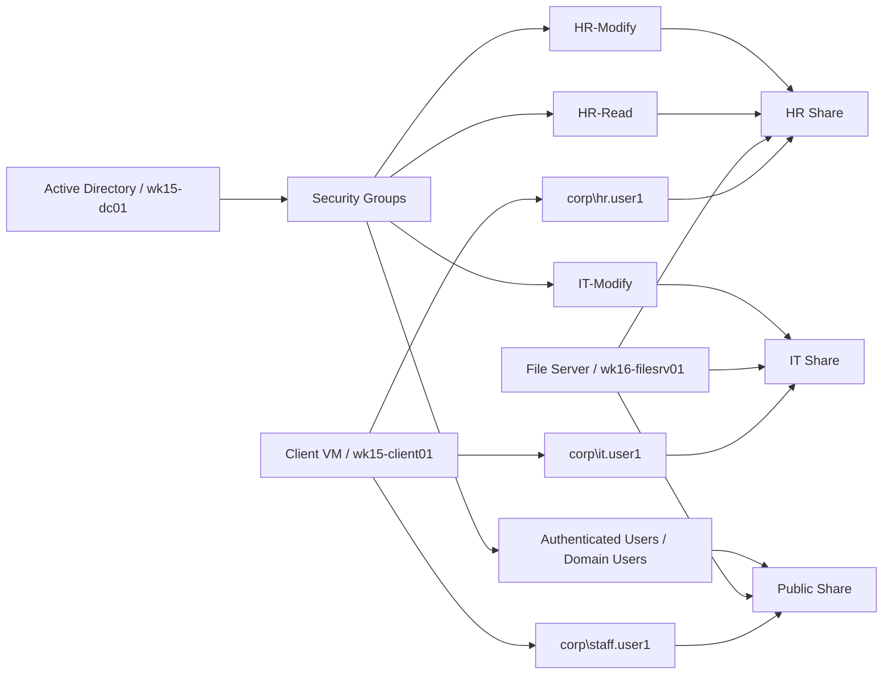

## Folder and Share Design

The file server used a root folder at `C:\Data` with three departmental subfolders. Each folder was shared individually so access could be controlled by department and validated through the client VM.

```text
C:\Data
├── HR
├── IT
└── Public
```

### Share Names

| Folder Path | Share Name | Intended Access |
|---|---|---|
| `C:\Data\HR` | `HR` | HR users modify, staff denied |
| `C:\Data\IT` | `IT` | IT users modify, staff denied |
| `C:\Data\Public` | `Public` | Authenticated users read/write |

## Build and Configuration Screenshots

### 1. Azure file server VM overview

This screenshot shows the deployed Azure virtual machine used as the Windows file server for the lab.

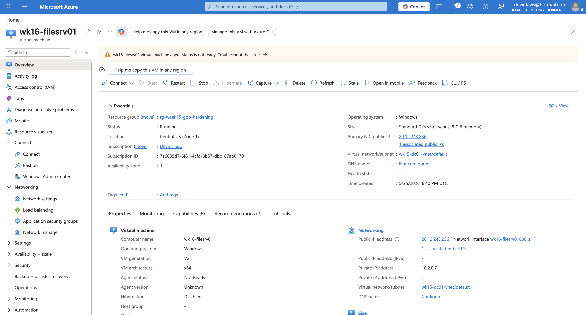

### 2. File server domain join

This screenshot confirms that `wk16-filesrv01` was joined to the domain successfully.


### 3. Servers OU with file server

This screenshot shows the file server object placed in the appropriate Active Directory organizational unit.

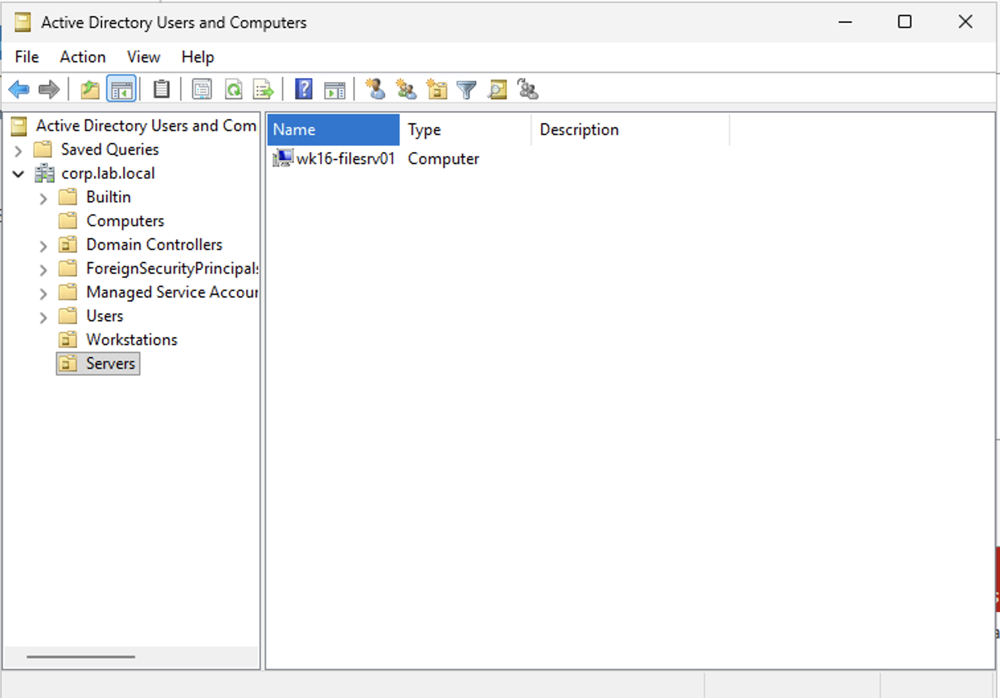

### 4. Data folder structure

This screenshot shows the `C:\Data` folder structure with the departmental folders created for the shares.

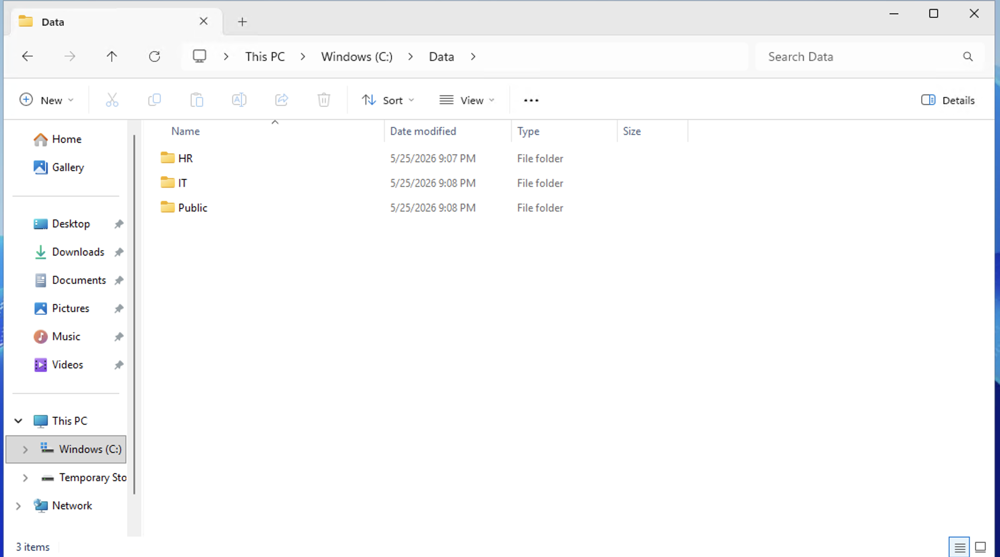

### 5. AD security groups created

This screenshot shows the Active Directory security groups created to manage departmental access.

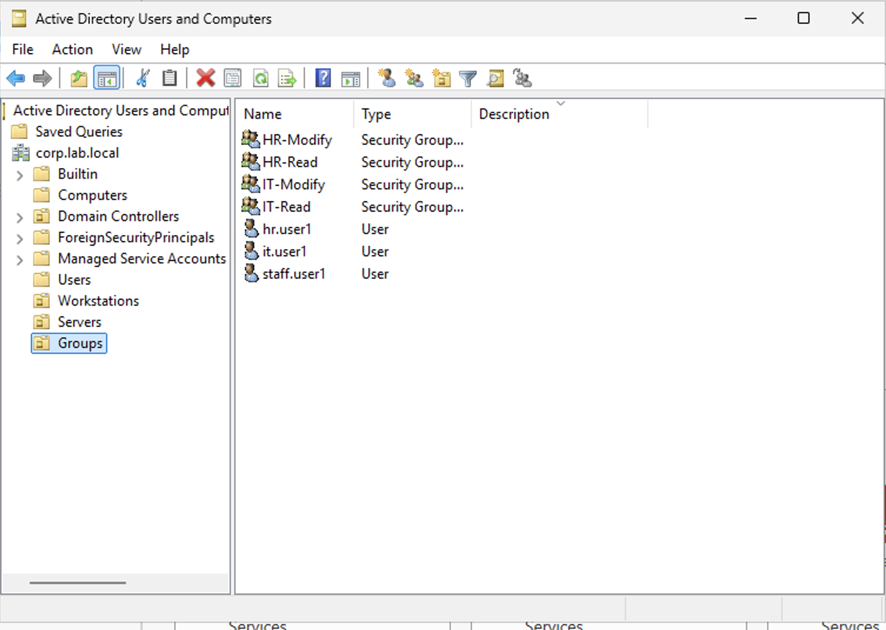

### 6. Group membership for HR modify

This screenshot shows the membership configuration for the HR modify access group.

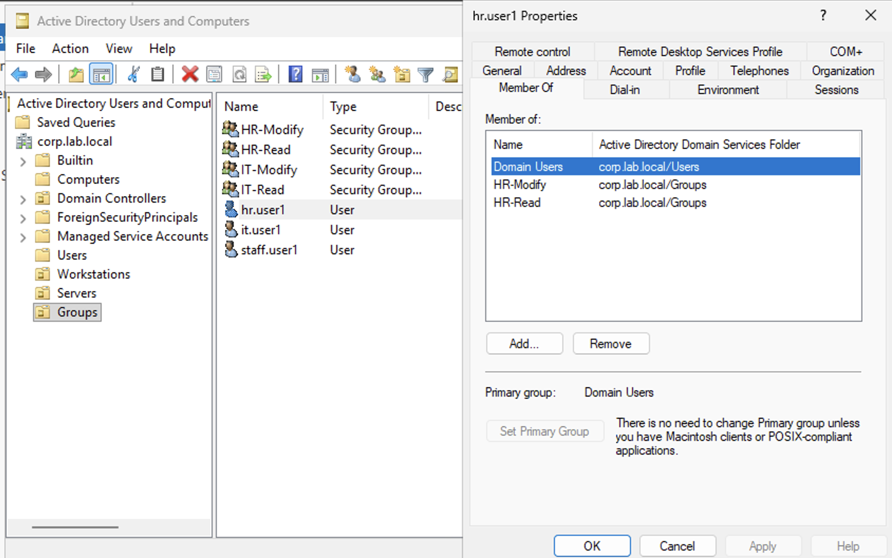

## Permission Model

### HR Share

The HR share was configured with both share and NTFS permissions so only the correct HR group members could access and modify data.

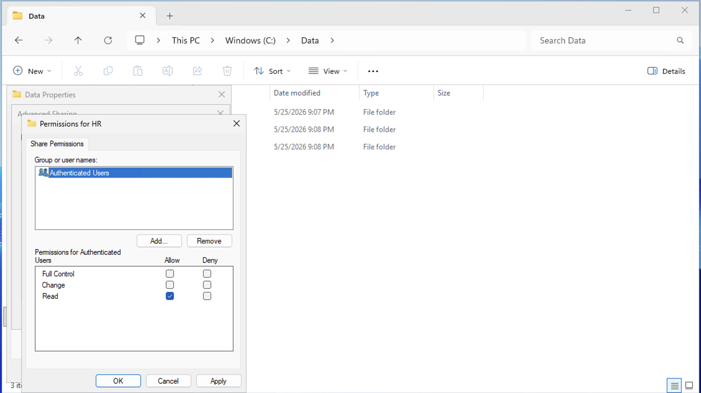

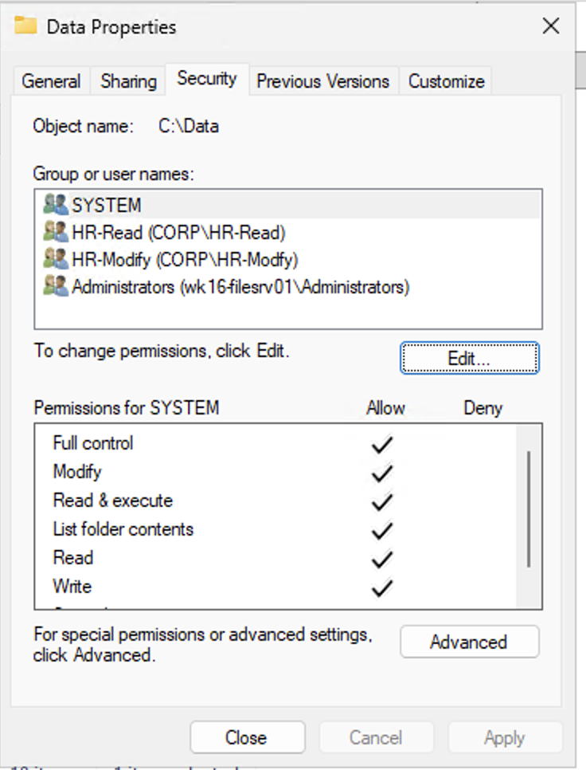

### IT Share

The IT share followed the same design pattern as the HR share. Authorized IT users were granted access through group-based permission assignment.

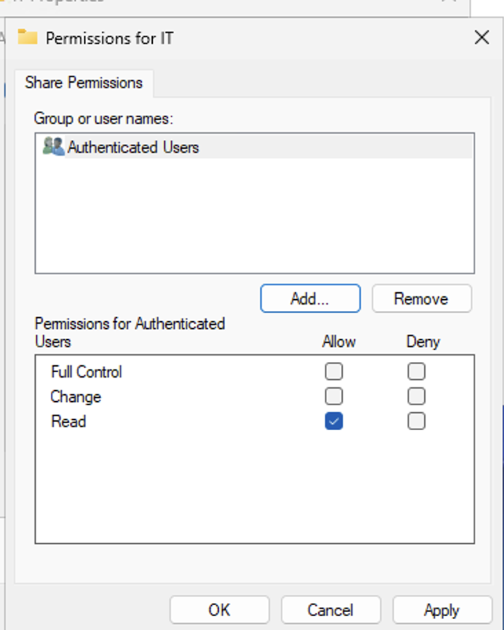

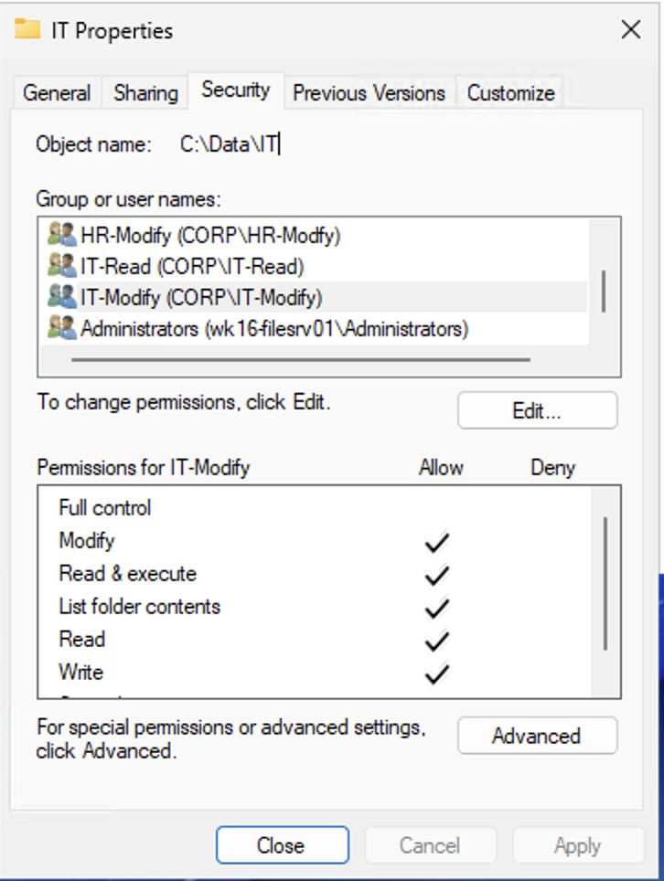

### Public Share

The Public share was configured for broader collaboration. To support file creation and editing, share permissions and NTFS permissions both had to allow write-capable access.

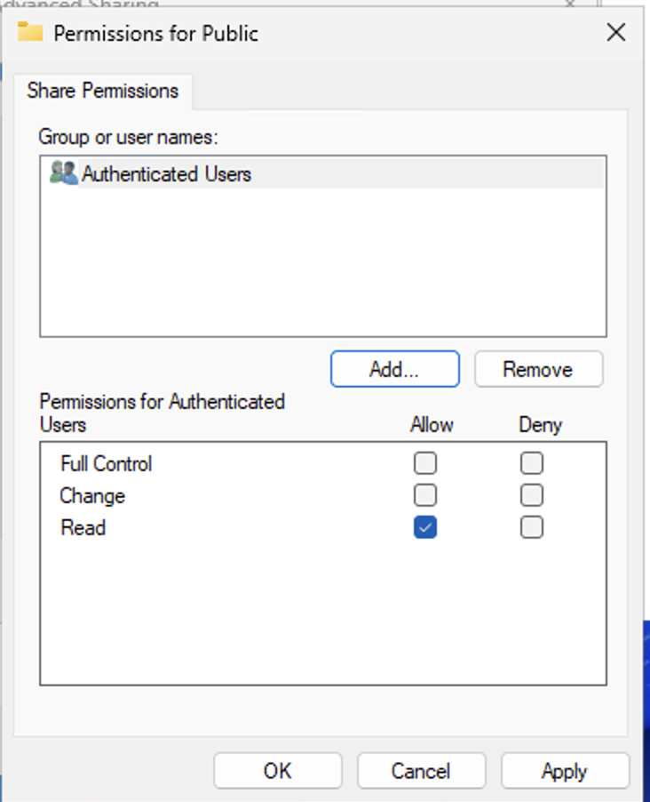

## Access Testing

Testing was performed from the client VM using domain user accounts over SMB paths to the file server.

### Successful HR access

`corp\hr.user1` successfully accessed the HR share and performed file operations as expected.

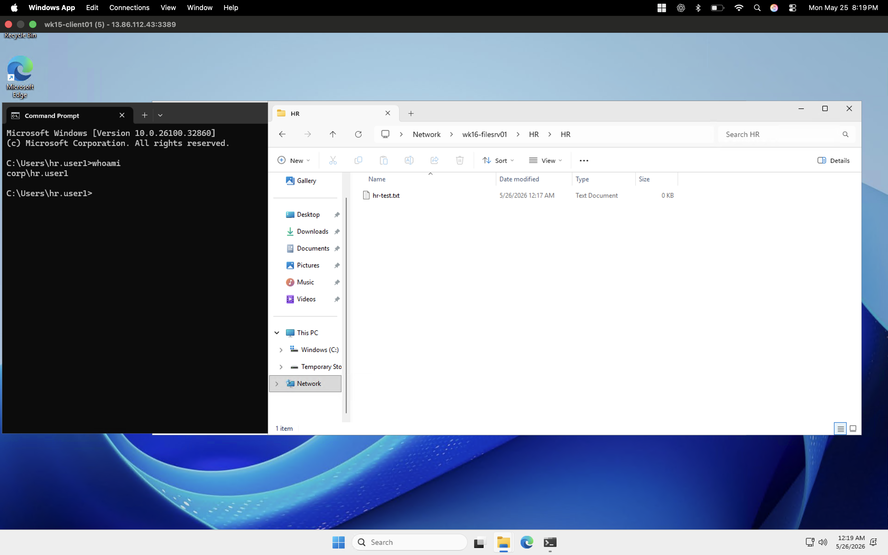

### Successful IT access

`corp\it.user1` successfully accessed the IT share and performed modify actions.

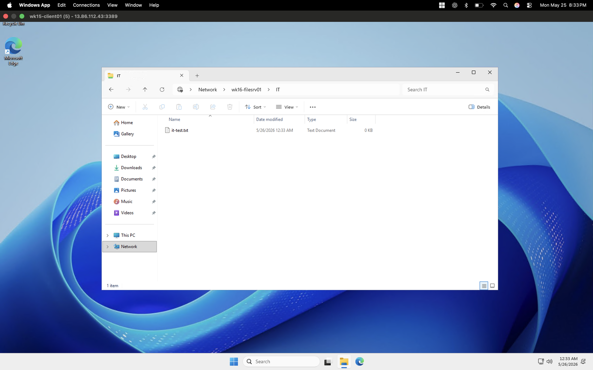

### Denied staff access

`corp\staff.user1` was denied access to restricted departmental shares, confirming that unauthorized access was blocked correctly.

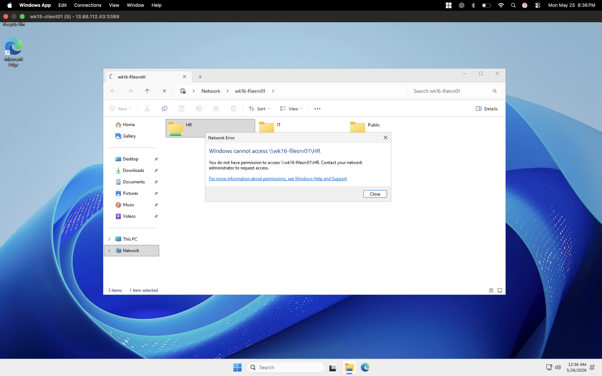

### Public share validation

Public share access was validated after updating permissions to support the intended level of access.

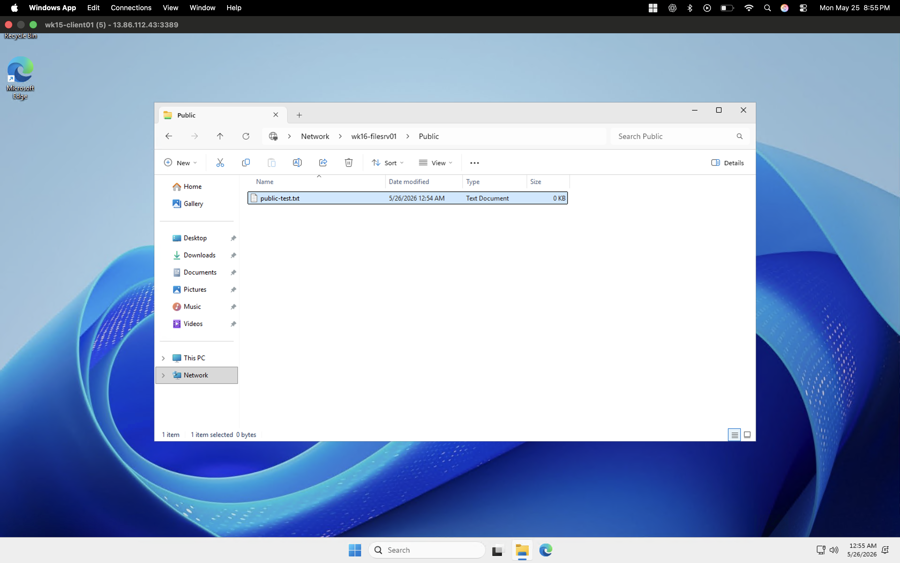

## Auditing Configuration

Object access auditing was enabled on the HR folder to monitor file activity. After access testing was performed, the resulting security events were reviewed in Event Viewer on the file server.

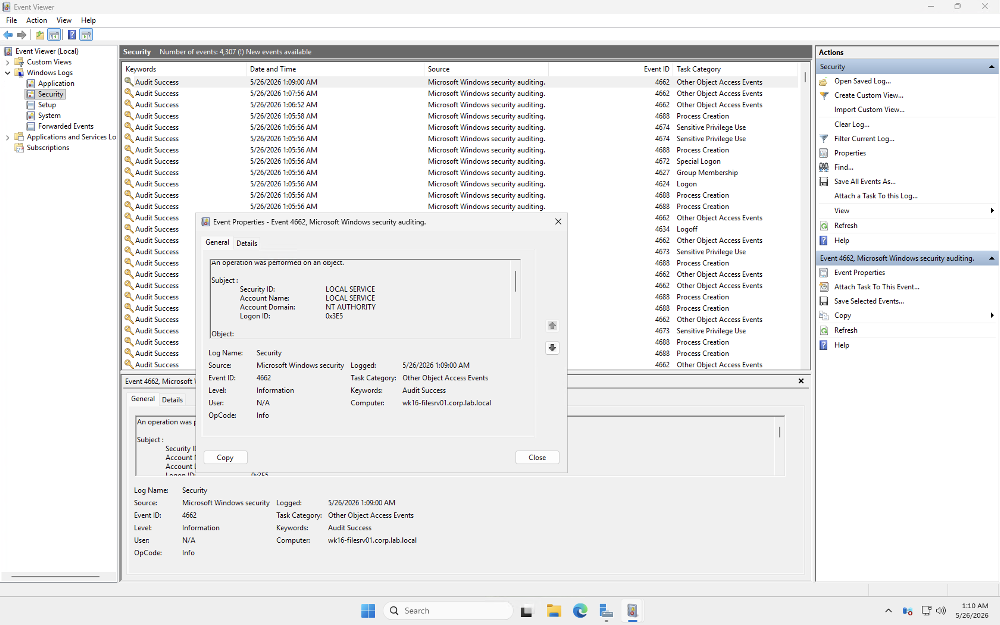

The captured audit log confirmed that file access activity was being recorded after auditing was configured on the target folder.

## Troubleshooting Notes

### README issue in VS Code

The original `README.md` problem was caused by accidentally creating a directory named `README.md` instead of a file. Once that folder was removed and replaced with an actual Markdown file, editing in VS Code worked normally.

### HR share not visible in Shares list

Initially, the folder structure and share state were inconsistent. This was resolved by verifying the folder path, share definition, and both permission layers.

### Access denied even when user was in the right group

The main cause was share permissions set too low. A user can still be blocked from writing if the share allows only Read, even when NTFS permissions allow Modify, because effective access is the most restrictive result across both layers.

### Public share inaccessible

Public access required changes at both layers:

- Share permissions needed `Authenticated Users` with Change
- NTFS needed `Authenticated Users` or another inclusive group with Modify


## ✅ What This Proves

- Configured departmental SMB file shares with layered NTFS and share permissions, applying explicit deny policies for cross-department access
- Assigned access using Active Directory security groups rather than individual user accounts — demonstrating scalable, role-based access control design
- Validated authorized and unauthorized access scenarios from a domain-joined client VM using multiple user identities
- Enabled object access auditing via Group Policy and verified security events in Windows Event Viewer — demonstrating Windows security monitoring skills
- Diagnosed and resolved permission conflicts caused by the interaction between share-level and NTFS-level effective access — a common real-world troubleshooting scenario

## 🔐 Security Relevance

File server access control and auditing are core Windows security administration responsibilities. This lab demonstrates least-privilege file access design, AD group-based authorization, and event log monitoring — all of which appear directly in Systems Administrator and Windows Security Engineer job descriptions. Object access auditing also supports compliance requirements (SOX, HIPAA, etc.) that mandate file access logging.


## Key Lessons Learned

- Share permissions and NTFS permissions must be evaluated together.
- Group-based permission assignment is easier to manage than user-by-user access control.
- A read-only share permission can silently block write operations even when NTFS looks correct.
- Auditing must be configured on the folder object and then validated through the Security log.
- GitHub README screenshots only render when the images are embedded with relative Markdown image paths.

## Conclusion

This lab successfully implemented a Windows file server with departmental shares, role-based access through Active Directory groups, validation of authorized and unauthorized access, and object access auditing through Event Viewer.

The final configuration demonstrated practical administration of SMB shares using layered Windows security controls, along with access testing and audit validation in a domain environment.
