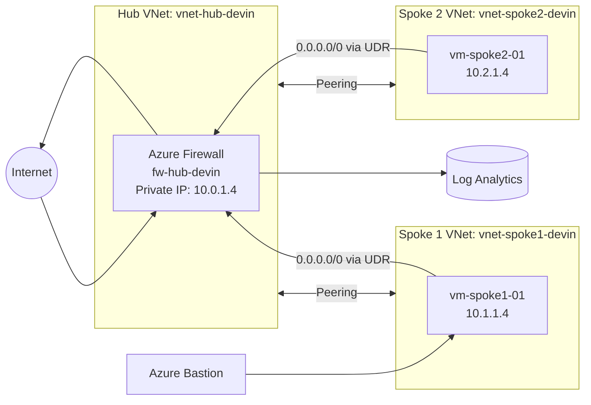

# Week 17: Azure Hub-and-Spoke Firewall Lab

This lab implements a hub-and-spoke network topology in Azure using Terraform, with Azure Firewall centralized in the hub virtual network, user-defined routes forcing spoke egress through the firewall, Bastion for secure VM access, and Log Analytics for visibility into allowed and denied traffic.

## Architecture

The environment uses one hub VNet and two spoke VNets, with peering connecting the spokes to the hub so shared services such as Azure Firewall and Bastion can be centralized. User-defined routes in the spoke subnets send default outbound traffic to the firewall’s private IP, allowing egress filtering and logging through a single control point.



## Objectives

- Deploy a hub-and-spoke Azure network with Terraform.
- Centralize outbound filtering with Azure Firewall.
- Use VNet peering and route tables to steer spoke traffic through the hub.
- Access a private Linux VM using Azure Bastion.
- Validate firewall behavior with Log Analytics by showing both allowed and denied traffic.

## Technologies Used

- Terraform
- Microsoft Azure
- Azure Virtual Network peering
- Azure Firewall and Firewall Policy
- Azure Bastion
- Linux virtual machines
- User-defined routes
- Log Analytics / Azure Monitor
- Network Watcher Connection Monitor

## Deployment Overview

The lab resources were deployed into the `rg-wk17-hub-spoke-devin` resource group in East US, with Terraform creating the hub network, spoke networks, firewall, policy, route tables, and workload VMs.

## Build Screenshots

### 1. Resource group

The resource group contains the lab resources that make up the hub-and-spoke environment.


### 2. Firewall overview

Azure Firewall was deployed in the hub VNet and configured as the centralized security control for outbound traffic.


### 3. Firewall policy

Azure Firewall is associated with the `fwp-hub-devin` firewall policy, which is where the network and application filtering rules are managed.


### 4. VNet peering

The hub VNet is peered to both spoke VNets, enabling routed connectivity between the spokes and the centralized services hosted in the hub.


### 5. Route table and forced egress

A user-defined route sends `0.0.0.0/0` traffic from the spoke subnet to the firewall private IP `10.0.1.4`, forcing internet-bound traffic through Azure Firewall for inspection.


### 6. VM private IPs

The workload VMs use private addressing only, with `vm-spoke1-01` at `10.1.1.4` and `vm-spoke2-01` at `10.2.1.4`, which supports a private-only spoke design.


### 7. Diagnostic settings and log collection

Azure Firewall diagnostic settings were configured to send logs to the Log Analytics workspace so firewall activity could be queried and validated.


## Validation Steps

Traffic validation was performed from `vm-spoke1-01` using Azure Bastion, which provides browser-based SSH access to private VMs without exposing them directly to the internet. Test requests were sent to multiple public sites to generate firewall log entries and verify rule behavior.

### 1. Bastion access and curl testing

A Bastion SSH session was opened to `vm-spoke1-01`, and `curl` requests were issued to `www.microsoft.com`, `www.bing.com`, and `example.com`. The Microsoft and Bing requests returned successful HTTP responses, while `example.com` remained denied, demonstrating selective application rule enforcement.


### 2. Application rule collection

An Azure Firewall application rule collection named `app-allow-web` was created with priority `100` and action `Allow`, scoped to source IP `10.1.1.4` and destination FQDNs used during validation.


### 3. Network Watcher validation

Network Watcher Connection Monitor was also configured as an additional validation point for connectivity testing between spokes.


### 4. Firewall log analysis

Azure Firewall logs were queried in Log Analytics using the `AzureDiagnostics` table and the `AzureFirewallApplicationRule` category to identify requests originating from `10.1.1.4`. The results showed `Allow` decisions for `www.microsoft.com` and `www.bing.com`, and `Deny` entries for `example.com`, confirming that firewall policy decisions were being enforced and logged correctly.


## Example KQL Query

The following query was used to isolate Azure Firewall application rule logs for the spoke VM at `10.1.1.4`.

```kusto
AzureDiagnostics
| where Category == "AzureFirewallApplicationRule"
| where TimeGenerated > ago(30m)
| where msg_s has "10.1.1.4"
| project TimeGenerated, msg_s
| order by TimeGenerated desc
```

## Key Outcomes

- The hub-and-spoke network deployed successfully with centralized routing through Azure Firewall.
- Private spoke VMs were reachable securely through Azure Bastion without public IP exposure.
- Firewall application rules allowed specific destinations while denying unmatched traffic, which was verified through `curl` testing and Log Analytics queries.
- The lab demonstrated how Azure Firewall, route tables, Bastion, and monitoring services work together in a practical segmented network design.

## Lessons Learned

This lab reinforced how hub-and-spoke designs simplify centralized security controls by moving egress inspection into the hub rather than duplicating controls in every spoke. It also showed that validation matters as much as deployment: route tables, Bastion access, firewall policies, and Log Analytics all need to align before traffic behaves as intended.

## File Structure

```text
week-17-hub-spoke-azure-firewall/
├── terraform/
│   ├── main.tf
│   ├── provider.tf
│   ├── variables.tf
│   ├── outputs.tf
│   └── terraform.tfvars
├── diagrams/
├── screenshots/
└── README.md
```