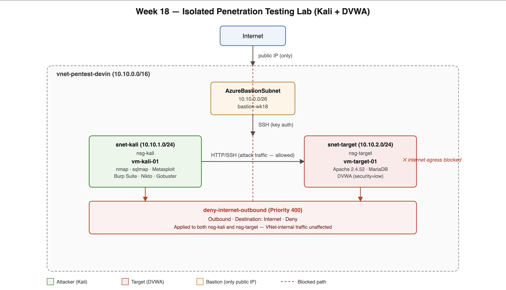

# Isolated Penetration Testing Lab — Kali Linux + DVWA on Azure


## Project Overview

This project builds a fully isolated, Terraform-managed penetration testing environment in Azure: a Kali Linux attacker VM and a DVWA (Damn Vulnerable Web Application) target VM, segmented into their own subnets with independently managed NSGs, reachable only through Azure Bastion — no public IPs anywhere on the workload tier.

The environment supports a real, two-phase network posture: **open during setup** (so packages and DVWA dependencies can be installed) and **fully locked down during active testing** (all outbound internet access denied, verified both by the block itself and by confirming internal Kali → Target traffic remains unaffected).

Attacks were executed and documented using three distinct techniques — automated SQL injection (`sqlmap`), a Metasploit-driven service fingerprint scan, and manual HTTP interception (Burp Suite) — each chosen deliberately for what it demonstrates, not just run for the sake of running it.

---

## Business and Security Problem

Security teams need people who can do more than run a scanner and read the output. This lab was built to demonstrate the full loop: **stand up a target safely, isolate it correctly, attack it deliberately, and prove — with evidence, not assumption — that both the exploitation and the isolation actually worked.**

This architecture was designed to demonstrate:

- Genuine network isolation, verified in both directions (blocked externally, functional internally)
- Deliberate target configuration, not "it happened to be vulnerable by default"
- Multiple distinct exploitation techniques, chosen for what each one proves
- Evidence-based validation at every step — status codes and page content checked, not assumed
- Infrastructure as Code for the environment itself, with manual, documented work for everything built on top of it
- Real security findings, including one produced incidentally by a reconnaissance tool (a weak SSH host-key algorithm), with a concrete remediation

---

## Architecture



One VNet, three subnets: `AzureBastionSubnet`, `snet-kali`, and `snet-target`, each with its own NSG. Azure Bastion is the only resource in the environment with a public IP. Kali reaches the target directly over the VNet; both VMs are blocked from reaching the public internet via an explicit, low-priority `Deny` rule on outbound traffic to the `Internet` service tag — scoped narrowly enough that VNet-internal traffic (Kali ↔ Target) is never affected by it.

### Technologies Used

| Technology                             | Purpose                                                                   |
| -------------------------------------- | ------------------------------------------------------------------------- |
| Terraform                              | Infrastructure as Code for VNet, subnets, NSGs, VMs, Bastion              |
| Microsoft Azure                        | Cloud platform                                                            |
| Azure Bastion                          | Browser/CLI-based administrative access, zero public IPs on workloads     |
| Network Security Groups                | Subnet-level isolation and forced-egress-deny                             |
| Kali Linux                             | Attacker platform — nmap, sqlmap, Metasploit, Burp Suite, Nikto, Gobuster |
| DVWA (Damn Vulnerable Web Application) | Intentionally vulnerable target, security level explicitly configured     |
| Apache / MariaDB / PHP                 | Target web stack                                                          |
| Azure CLI native-client tunneling      | SOCKS-proxied pivot from local workstation through Kali to the target     |
| Burp Suite                             | Manual HTTP interception via SOCKS-chained proxy                          |

---

## Environment Details

| Resource       | Name                                | Purpose                                              |
| -------------- | ----------------------------------- | ---------------------------------------------------- |
| Resource Group | `rg-wk18-pentest-devin`             | Contains all lab resources                           |
| VNet           | `vnet-pentest-devin` (10.10.0.0/16) | Network boundary                                     |
| Bastion Subnet | `AzureBastionSubnet` (10.10.0.0/26) | Bastion host                                         |
| Kali Subnet    | `snet-kali` (10.10.1.0/24)          | Attacker VM                                          |
| Target Subnet  | `snet-target` (10.10.2.0/24)        | DVWA target VM                                       |
| Bastion Host   | `bastion-wk18`                      | Only public IP in the environment                    |
| Attacker VM    | `vm-kali-01` (10.10.1.4)            | Kali Linux, cloud image                              |
| Target VM      | `vm-target-01` (10.10.2.4)          | Ubuntu 22.04, Apache/MariaDB/PHP/DVWA                |
| NSG (Kali)     | `nsg-kali`                          | SSH inbound from VNet; internet outbound denied      |
| NSG (Target)   | `nsg-target`                        | SSH/HTTP inbound from VNet; internet outbound denied |

---

## Security Controls

**Zero public IPs on workload VMs.** All administrative access runs through Azure Bastion; Kali and the target are only reachable from inside the VNet.

**Two-phase network posture.** The environment is provisioned with outbound internet access available for setup (package installs, DVWA dependencies), then explicitly locked down before any exploitation testing begins. The lockdown is a single, narrowly-scoped NSG rule — `deny-internet-outbound`, priority 400, destination `Internet` service tag — placed below Azure's default allow rule so it takes precedence, without needing a second rule to re-permit VNet-internal traffic.

**Isolation verified in both directions, not asserted.** A `curl` to an external host after lockdown returns a connection timeout (screenshots 12, 19); a `curl` to the target over the VNet in the same state returns `200 OK` (screenshot 13) — proving the rule is selective, not just "the network is broken."

**SSH key authentication only** — no password auth on either VM.

**Deliberate target configuration.** DVWA's security level was explicitly set to `low` via an authenticated, scripted request sequence (screenshot 14) — not attacked in whatever state it happened to ship in. The database initialization step was also confirmed explicitly, after discovering DVWA silently redirects every request to its setup page until the database exists (see Challenges, below).

**Infrastructure as Code, validated.** The network/isolation layer is Terraform-managed; `terraform plan` was run immediately after applying the isolation lockdown and returned "No changes," confirming the deployed state matches configuration exactly.

---

## Validation

Full evidence set is in [`/screenshots`](./screenshots). Grouped by what each proves:

**Environment & segmentation**
`01` resource group overview · `02` VNet/subnet CIDR layout · `03` target NSG rules (pre-lockdown) · `04` Bastion admin access config

**Connectivity**
`05` attacker private addressing (10.10.1.4) · `06` Kali → target ping/SSH · `07` initial nmap recon (pre-install baseline) · `08` LAMP stack install on target · `09` DVWA HTTP validation

**Attacker platform**
`10` Kali OS/private IP confirmation · `11` full toolset validation (nmap, sqlmap, Metasploit, Burp, Nikto, Gobuster, curl, git — each confirmed present and versioned)

**Isolation, proven both directions**
`12` internet egress blocked (`curl` timeout) · `13` internal Kali → target access still functional post-lockdown

**Deliberate configuration & corrected recon**
`14` DVWA security level set to `low`, confirmed via page content (not just status code) · `15` corrected nmap scan post-Apache-install (port 80 now visible, superseding the stale pre-install scan)

**Exploitation**
`16` sqlmap SQL injection — actual extracted database names (`dvwa`, `information_schema`), not just "parameter appears injectable" · `17` Metasploit SSH fingerprint scan against the real target, surfacing a genuine finding (weak elliptic curve host key algorithm)

**Manual interception**
`18` Burp Suite HTTP history confirming intercepted, correctly-parsed traffic to the live target, routed through a Bastion → SSH → SOCKS pivot chain

**Closing validation**
`19` final NSG ruleset, confirming the isolation rule remained intact throughout all testing

---

## Challenges and Troubleshooting

**DVWA silently redirects to setup until the database exists.** Early login attempts consistently returned `HTTP 200` with no visible error — but the page title revealed every request was landing on `setup.php`, not the login flow. DVWA checks for its database tables on every request and redirects unconditionally until they exist. The fix was explicit: submit the "Create / Reset Database" action first, verify the confirmation string in the response body, then retry login. This reinforced a recurring lesson throughout the lab — an HTTP 200 status code confirms a valid response, not that the response is the one you expected.

**CSRF token staleness.** DVWA issues a fresh, single-use `user_token` per form. An early login attempt failed silently (200 OK, but bounced back to a non-dashboard page) because the token was fetched and submitted as two separate manual steps with a gap between them. The fix was collapsing token-fetch and token-use into a single script execution, removing the gap entirely.

**Path assumptions.** Several early scripted requests targeted the web root (`/login.php`) rather than DVWA's actual install path (`/dvwa/login.php`), returning `404` errors that weren't immediately visible because the requests weren't checking status codes explicitly. Adding `-w "%{http_code}"` to every `curl` call going forward made failures visible instead of silent.

**Layered-tunnel instability with Burp Suite.** Manual replay through Burp's Repeater tool was unreliable across a triple-layered pivot (Azure Bastion native-client tunnel → SSH → local SOCKS proxy), with the SSH session periodically dropping during idle periods between UI interactions. Adding `ServerAliveInterval`/`ServerAliveCountMax` keepalive flags improved stability, but Repeater replay remained intermittent. **HTTP history — which captured multiple successful, correctly-parsed requests to the live target — was used as the interception evidence instead**, since the actual goal (proving Burp intercepted real target traffic) was already satisfied without a live manual replay.

**Bastion SKU limitations.** Azure CLI's native-client tunneling (`az network bastion tunnel`) requires Bastion's **Standard** SKU with tunneling explicitly enabled — Basic SKU only supports browser-based portal connections. Discovered mid-lab; the Bastion instance was upgraded in place. Also discovered afterward: **Bastion SKU downgrades are not supported by Azure** — once upgraded, the only path back to Basic is deleting and recreating the resource, which is a real cost consideration worth planning for before upgrading in future labs.

---

## Security Considerations

This project follows the same practices established in the Hub-and-Spoke Firewall lab, applied here to an offensive-testing context:

- No workload VM has a public IP; all access is Bastion-brokered
- Outbound internet access is explicitly denied at the NSG layer, tested in both directions
- SSH key authentication only, no password auth
- Terraform state and local `.tfvars` excluded from source control
- All exploitation was conducted against infrastructure the author owns and controls, in a network with no path to production or third-party systems

**A concrete finding produced during testing:** Metasploit's `ssh_version` scanner flagged `ecdsa-sha2-nistp256` as an offered host-key algorithm on the target's OpenSSH server, alongside stronger alternatives (`ssh-ed25519`, `rsa-sha2-512`) that are already available on the same host. Recommended remediation: restrict `sshd_config`'s `HostKeyAlgorithms` directive to exclude the weaker NIST curve, retaining only the modern algorithms.

For a production environment, additional improvements could include:
- Remote Terraform state with locking (carried over from the Hub-and-Spoke lab's own noted gap)
- Automated container/image scanning ahead of any exploitation testing
- Centralized logging of attacker-side tool activity, not just target-side NSG/firewall logs

---

## Cost Considerations

Azure Bastion, even on Basic SKU, is a billable, always-on resource. This lab temporarily required a **Standard SKU upgrade** to unlock native-client tunneling for Burp Suite pivoting — a real cost tradeoff worth planning for in advance, since **Bastion SKU downgrades are not supported**; reverting to Basic requires deleting and recreating the Bastion resource entirely.

For temporary testing environments:
- Deploy only when actively testing
- If native-client tunneling is needed, budget for Standard SKU for the full session rather than upgrading reactively mid-lab
- Destroy unused resources promptly — do not leave Bastion or VMs running idle

## Cleanup

```bash
az group delete --name rg-wk18-pentest-devin --yes --no-wait
```

---

## Key Outcomes

This project demonstrated the ability to:

- Design and deploy an isolated, Bastion-brokered attacker/target environment with Terraform
- Implement and *verify* — in both directions — a two-phase network isolation posture
- Deliberately configure an intentionally vulnerable target rather than attacking a default state
- Execute and evidence three distinct exploitation techniques for three distinct reasons
- Diagnose multi-layered bugs (stale CSRF tokens, wrong paths, an uninitialized database, an unstable pivot chain) by checking actual response content instead of trusting status codes alone
- Build and use a legitimate SOCKS-proxied pivot chain (Bastion → SSH → local proxy → Burp) to reach a private target from a local workstation
- Produce and document a real, actionable security finding from tooling, not just a passive tool run
- Recognize and work around real Azure platform constraints (Bastion SKU tunneling requirements, non-reversible SKU downgrades)

## Skills Demonstrated

Azure Networking · Azure Bastion · Network Security Groups · Terraform · Infrastructure as Code · Kali Linux · Nmap · sqlmap · Metasploit Framework · Burp Suite · SOCKS Proxy Pivoting · DVWA · SQL Injection · CSRF Token Handling · Linux/Bash Scripting · curl-based HTTP Session Management · Cloud Security · Git · GitHub Actions

---

## Repository Structure

```
.
├── diagrams/
│   ├── wk18-diagram.png
│   └── wk18-diagram.svg
├── screenshots/
│   ├── 01-resource-group-overview.png
│   ├── 02-vnet-subnet-segmentation.png
│   ├── 03-target-nsg-rules.png
│   ├── 04-bastion-attacker-access.png
│   ├── 05-attacker-private-network-validation.png
│   ├── 06-attacker-to-target-connectivity.png
│   ├── 07-nmap-initial-reconnaissance.png
│   ├── 08-target-lamp-installation.png
│   ├── 09-dvwa-http-validation.png
│   ├── 10-kali-os-private-ip-validation.png
│   ├── 11-kali-security-toolset-validation.png
│   ├── 12-kali-internet-egress-blocked.png
│   ├── 13-kali-dvwa-internal-access-validation.png
│   ├── 14-dvwa-security-level-configuration.png
│   ├── 15-nmap-post-install-verification.png
│   ├── 16-sqlmap-sql-injection-exploit.png
│   ├── 17-metasploit-ssh-fingerprint-scan.png
│   ├── 18-burpsuite-http-interception.png
│   └── 19-nsg-final-ruleset-validation.png
├── terraform/
│   ├── .terraform.lock.hcl
│   ├── main.tf
│   └── terraform.tfvars.example
├── .gitignore
└── README.md
```